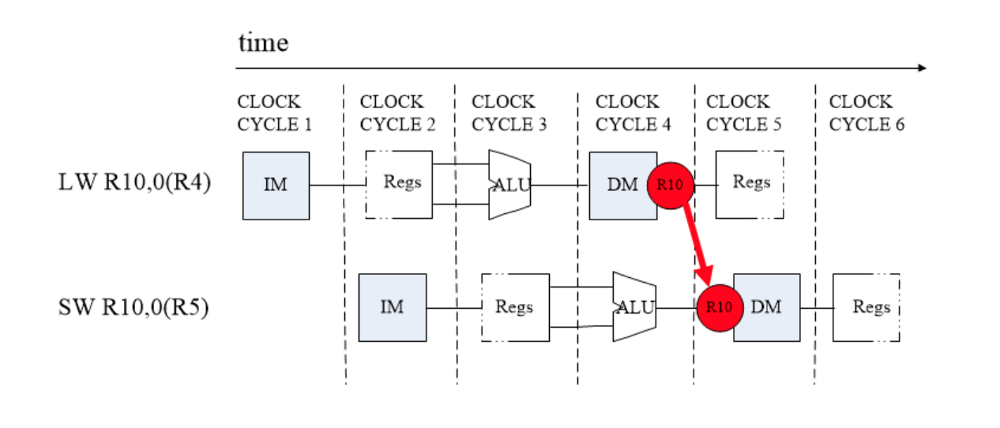

# Topic1——Pipelined CPU supporting RISC-V RV32I Instructions

> 课程名称: 计算机体系结构
>
> 实验类型: 综合
>
> 实验项目名称: Pipelined CPU supporting RISC-V RV32I Instructions
>
> 学生姓名: 李云帆
>
> 学号: 3200102555
>
> 实验地点: 曹光彪西楼

## 实验环境

Win11 + Vivado

## 实验目的

- Understand RISC-V RV32I instructions

- Master the design methods of pipelined CPU executing RV32I instructions

- Master the method of Pipeline Forwarding Detection and bypass unit design

- Master the methods of 1-cycle stall of Predict-not-takenbranch design

- Master methods of program verification of Pipelined CPU executing RV32I instructions

## 实验过程及原理

基于框架基础补全代码

### 补全 `cmp_32.v`

cmp_32.v 有 3 个输入，分别为 32 位的 a 和 b，2 位的 ctrl，我们需要做的是 判断 ab 是否满足 ctrl 的要求，在 ID 时期判断 B 指令是否满足来决定是否跳转

```verilog
assign c = (EQ & res_EQ) | (NE & res_NE) | (LT & res_LT) | (LTU & res_LTU) | (GE & res_GE) | (GEU & res_GEU);          

```

EQ = ctrl == cmp_EQ ;表明当 B 指令为 beq 时，EQ=1

 res_EQ = a == b; a,b 满足 eq 关系时，res_EQ=1

c 是六种情况的或，只要满足 EQ/NE/...六种中的一种时，c=1 进行跳转

### 补全`CtrlUnit.v`

####

如果 Bop=1 则说明是 B 指令，那么就可以通过 funct3 来判断指令类型了，其中 funct3_0 为 1 表示 funct3 为 0;类似的，Lop=1 表示为 I 类型指令，同样通过 funct3 判断具体指令;LUI，AUIPC...直接判断 opcode 即可

```verilog
    wire BEQ  = Bop & funct3_0;   
    wire BNE  = Bop & funct3_1;   
    wire BLT  = Bop & funct3_4;   
    wire BGE  = Bop & funct3_5;   
    wire BLTU = Bop & funct3_6;   
    wire BGEU = Bop & funct3_7;   

		wire LB  = Lop & funct3_0;   
    wire LH  = Lop & funct3_1;   
    wire LW  = Lop & funct3_2;   
    wire LBU = Lop & funct3_4;   
    wire LHU = Lop & funct3_5;   

		wire SB = Sop & funct3_0;   
    wire SH = Sop & funct3_1;   
    wire SW = Sop & funct3_2;   

		wire LUI   = (opcode == 7'b0110111);   
    wire AUIPC = (opcode == 7'b0010111);   
    
    wire JAL    = (opcode == 7'b1101111);   
    assign JALR = (opcode == 7'b1100111);   

```

####  

Branch 用于表示是否跳转，当 Branch 为 1 时表示进行跳转。其中需要跳转 的情况为 JAL/JALR/满足条件的 B 指令

```verilog
assign Branch = (Bop & cmp_res) | JAL | JALR ;
```

####  

当指令为 BEQ 时，将 cmp_EQ 的值赋给 cmp_ctrl;当指令为 BNE 时，将 cmp_NE 的值赋给 cmp_ctrl;其余四种情况以此类推

####  

ALUSrc_A 和 ALUSrc_B 用于标记 ALU 输入的值，为 0 时输入为寄存器，为 1 标记为 PC/IMM

``` verilog
assign cmp_ctrl = (cmp_EQ & {3{BEQ}}) | (cmp_NE &{3{BNE}}) | (cmp_LT & {3{BLT}}) | (cmp_LTU & {3{BLTU}}) | (cmp_GE & {3{BGE}}) | (cmp_GEU & {3{BGEU}});
```

####  

rs1use 和 rs2use 用于标记是否使用了 rs1 和 rs2 寄存器

```verilog
		assign rs1use =  R_valid | S_valid | L_valid | I_valid | B_valid ;                       

    assign rs2use = R_valid | B_valid ;
```

####  

确定 hazard_opcode 用于标识什么类型的指令，若要知道该指令是 S 还是 L 还是 B/J 还是其他，可以通过 DatatoReg 和 mem_w 和 Branch 这两个变量来区分。 若 DatatoReg=1 说明指令为 L 指令，mem_w=1，指令为 S，branch=1 说明为 B/J。 这样就可以完全取缔 hazard_optype，因此在 HazardDectectionUnit 中我们并不使 用它。

### 补全`HazardDetectionUnit.v`

#### `Forward_ctrl_A/B`

forward_ctrl_A/B 控制 rs1/2_data_ID 的值，通过分类得出 hazard 类型。其中 foward_ctrl 为 0 时表示正常;1 时表示 ALU 输入来源先于前一个指令 EXE 阶段 的结果;2 时表示 ALU 的输入来源与前一个指令 MEM 阶段时的 ALU 数据;3 表 示 ALU 输入来源于前指令 MEM 中读出且要写会寄存器的数据。

 

```verilog
if (rs1use_ID && rs1_ID)
      begin
        if (rd_EXE == rs1_ID && RegWrite_EXE)
          begin
            forward_ctrl_A_ <= 2'b01;
          end
        else if (rd_MEM == rs1_ID && RegWrite_MEM && ~DatatoReg_MEM)
          begin
            forward_ctrl_A_ <= 2'b10;
          end
        else if (rd_MEM == rs1_ID && RegWrite_MEM && DatatoReg_MEM)
          begin
            forward_ctrl_A_ <= 2'b11;
          end
        else
          begin
            forward_ctrl_A_ <= 0;
          end
      end
    else
      begin
        forward_ctrl_A_ <= 0;
      end
```

#### `forward_ctrl_ls : SW after LW`

forward_ctrl_ls 为 0 时 sw 存储的就是 rs2 的值，1 表示 sw after lw，此时 sw 要存储 的值时上条 L 指令读出的值 Datain_MEM



```verilog
if (mem_w_EXE && rs2_EXE == rd_MEM && RegWrite_MEM && DatatoReg_MEM)
      begin
        forward_ctrl_ls_ <= 1'b1;
      end
    else
      begin
        forward_ctrl_ls_ <= 0;
      end

```

#### `stall`

1. 若当前指令前一条为 L 指令，并且该指令也要使用相同的寄存器，就需要 stall 一次。即在 ID 与 EXE 之间插入一个 bubble
   ```verilog
   if (rs1use_ID && rs1_ID && rd_EXE == rs1_ID && RegWrite_EXE && DatatoReg_EXE)
         begin
           PC_EN_IF_ <= 0;
           reg_FD_stall_ <= 1;
           reg_DE_flush_ <= 1;
           reg_FD_flush_ <= 0;
         end
   ```

2. 若出现跳转指令，则需要清空跳转指令后的指令，直到计算出需要跳转的地址
   ```verilog
   else if (rs2use_ID && rs2_ID && rd_EXE == rs2_ID && RegWrite_EXE && DatatoReg_EXE)
         begin
           PC_EN_IF_ <= 0;
           reg_FD_stall_ <= 1;
           reg_DE_flush_ <= 1;
           reg_FD_flush_ <= 0;
         end
   ```

   

### 补全`RV32core.v`

#### IF阶段

Branch_ctrl 控制 next_PC_IF 的值，为 0 时为+4 后 PC;为 1 时为跳转后的地址 jump_PC_ID

```verilog
MUX2T1_32 mux_IF(.I0(PC_4_IF),.I1(jump_PC_ID),.s(Branch_ctrl),.o(next_PC_IF));
    ROM_D inst_rom(.a(PC_IF[8:2]),.spo(inst_IF));
```

#### ID阶段

forwardA 对于 rs1 而言，rs1 的数据来源:rs1 本身(I0)，exe 的结果(I1)，输入 mem 的值(I2)，mem 中读出的的结果(I3)

forwardB 对于 rs2 而言，来源类似

```verilog
MUX4T1_32 mux_forward_A(.I0(rs1_data_reg),.I1(ALUout_EXE),.I2(ALUout_MEM),.I3(Datain_MEM), .s(forward_ctrl_A),.o(rs1_data_ID));
MUX4T1_32 mux_forward_B(.I0(rs2_data_reg),.I1(ALUout_EXE),.I2(ALUout_MEM),.I3(Datain_MEM), .s(forward_ctrl_B),.o(rs2_data_ID));
```

#### EXE阶段

mux_A_EXE

ALUSrc_A 为 1 时，输入为 PC 值，用于计算地址偏移，为 0 时输入为 rs1 的 data, mux_B_EXE

ALUSrc_B 为 0 时，输入为 RS2 值，为 1 时输入 Imm

```verilog
MUX2T1_32 mux_A_EXE(.I0(PC_EXE),.I1(rs1_data_EXE),.s(ALUSrc_A_EXE),.o(ALUA_EXE));
MUX2T1_32 mux_B_EXE(.I0(rs2_data_EXE),.I1(Imm_EXE),.s(ALUSrc_B_EXE),.o(ALUB_EXE));

```

mux_forward_EXE 用于处理 sw after lw

```veri
MUX2T1_32 mux_forward_EXE(.I0(rs2_data_EXE),.I1(Datain_MEM),.s(forward_ctrl_ls),.o(Dataout_EXE));
```

## 实验结果


经检验, 符合预期