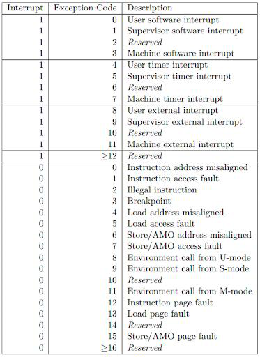
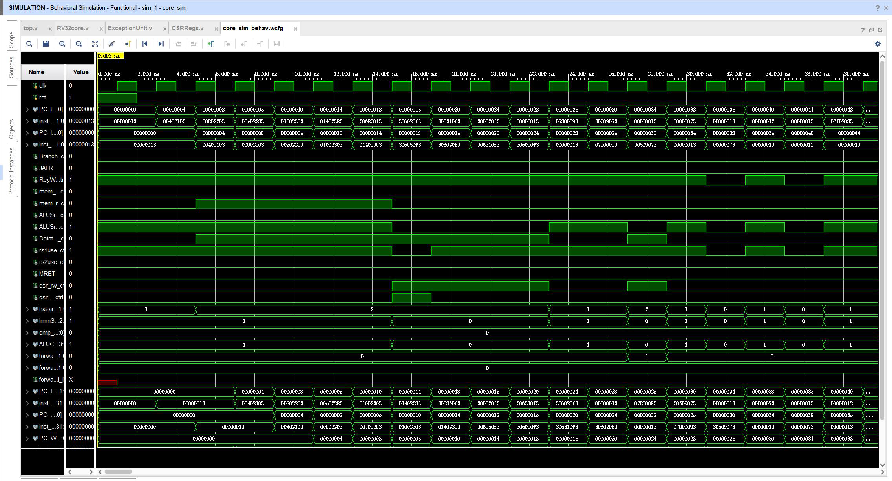
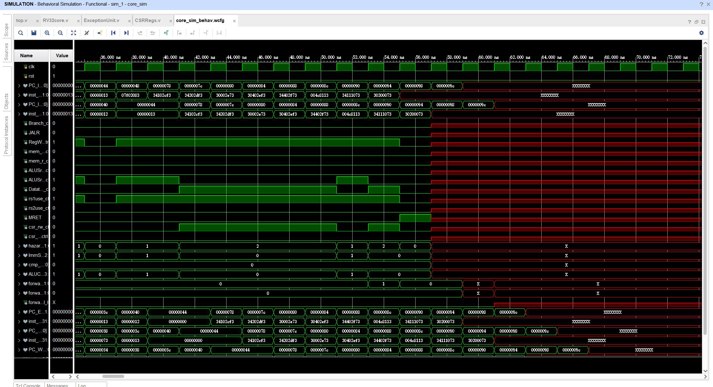

# Topic 2 Pipelined CPU supporting exception & interrupt

> 课程名称: 计算机体系结构
>
> 实验类型: 综合
>
> 实验项目名称: Topic 2 Pipelined CPU supporting exception & interrupt
>
> 学生姓名: 李云帆
>
> 学号: 3200102555
>
> 实验地点: 曹光彪西楼

## 一 实验环境

Windows1+Vivado2022

## 二 实验目的

- Understand the principle of CPU exception & interrupt and its processing procedure.
- Master the design methods of pipelined CPU supporting exception & interrupt.
- Master methods of program verification of Pipelined CPU supporting exception & interrupt.

## 三 操作方法与实验步骤

### 1 补全`exceptionunit.v`

我们需要对于 machine external interrupt,以及几种异常分别修改 `mcause`
寄存器和 `mepc` 寄存器;对于中断,`mepc` 为下一条指令,对于异常,`mepc` 为当前
指令。

1. `mtvec`(Machine Trap Vector)它保存发生异常/中断时处理器需要跳转到的地址
2. `mepc`(Machine Exception PC)它指向发生异常/中断的指令
3. `mcause`(Machine Exception Cause)它指示发生异常/中断的原因(类型)
4. `mtval`(Machine Trap Value)它保存了陷入(trap)的附加信息:page fault 中出错的地址、发生非法指令例外的指令本身,对于其他异常,它的值为0
5. `mstatus`(Machine Status)它保存全局中断使能,以及许多其他的状态,其中 MIE 为 1 时才会中断



```verilog
if (interrupt & mstatus[3]) // MIE & interrupt
        begin
            mepc <= epc_next; // pc+4
            mcause <= 32'h8000000B; // machine external interrupt
            mtval <= 0; //
        end
    else if (illegal_inst & mstatus[3]) // exception, mepc = pc
        begin
            mepc <= epc_cur;
            mcause <= 2; // Illegal instruction
            mtval <= 0;
        end
    else if (l_access_fault & mstatus[3])
        begin
            mepc <= epc_cur;
            mcause <= 5; // load assess fault
            mtval <= 0;
        end
    else if (s_access_fault & mstatus[3])
        begin
            mepc <= epc_cur;
            mcause <= 7; // store access fault
            mtval <= 0;
        end
    else if (ecall_m & mstatus[3])
        begin
            mepc <= epc_cur;
            mcause <= 11;// environmental call from M-mode
            mtval <= 0;
        end
    else if (mret) // machine mode,
    begin
        mepc <= 0;
        mcause <= 0; //
        mtval <= 0;
	end

```

然后根据是否需要trap修改对应寄存器

```verilog
if (trap) //
    begin
        reg_FD_flush_ = 1;
        reg_DE_flush_ = 1;
        reg_EM_flush_ = 1;
        reg_MW_flush_ = 1;
        RegWrite_cancel_ = 1;
    end
else
    begin // set pc to base
        reg_FD_flush_ = 0;
        reg_DE_flush_ = 0;
        reg_EM_flush_ = 0;
        reg_MW_flush_ = 0;
        RegWrite_cancel_ = 0;
    end
end

```

### 2 修改`CSRegs.v`

对于trap和mret修改对应寄存器

```Verilog
if (is_trap)
    begin
        CSR[9] <= mepc;
        CSR[10] <= mcause;
        CSR[11] <= mtval;
    	if (CSR[0][3]) //MIE
            begin
                CSR[0][7] <= 1'b1;
                CSR[0][3] <= 1'b0;
            end
    	else
            begin
                CSR[0][7] <= 1'b0;
                CSR[0][3] <= 1'b0;
            end
        CSR[0][12:11] <= 2'b11;
    end
    else if (is_mret)
        begin
            CSR[9] <= mepc;
            CSR[10] <= mcause;
            CSR[11] <= mtval;
            CSR[0][3] <= CSR[0][7];
        end
end

```

## 四 实验结果与分析



