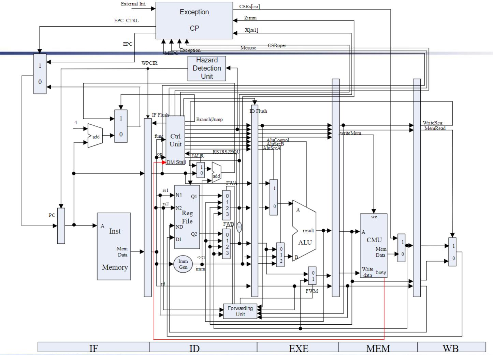
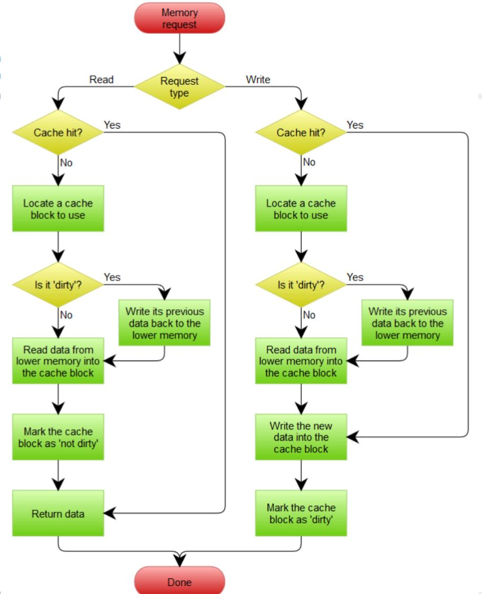
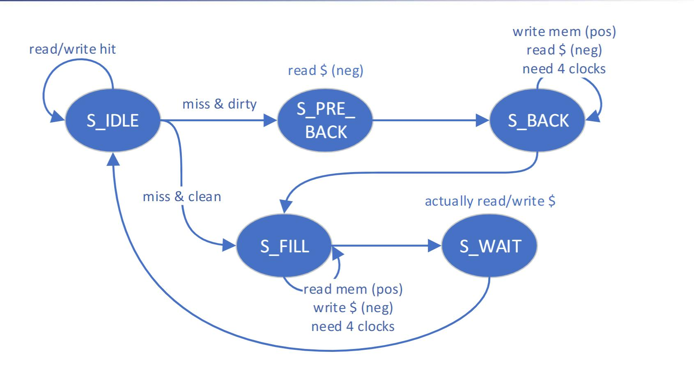
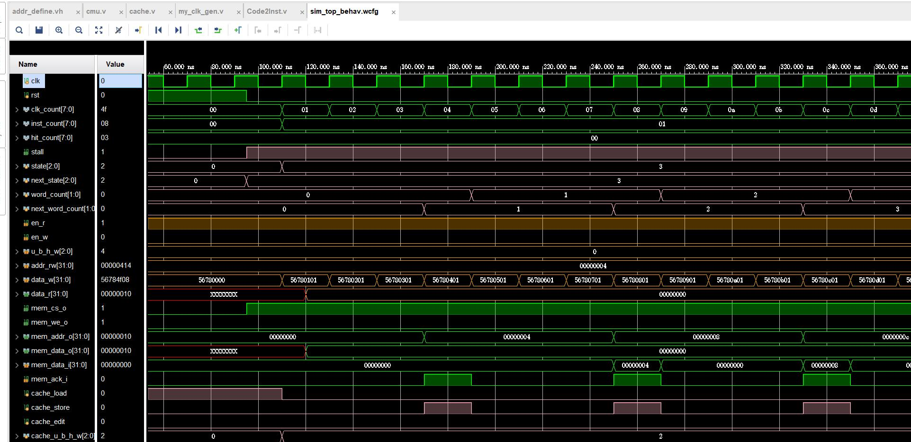
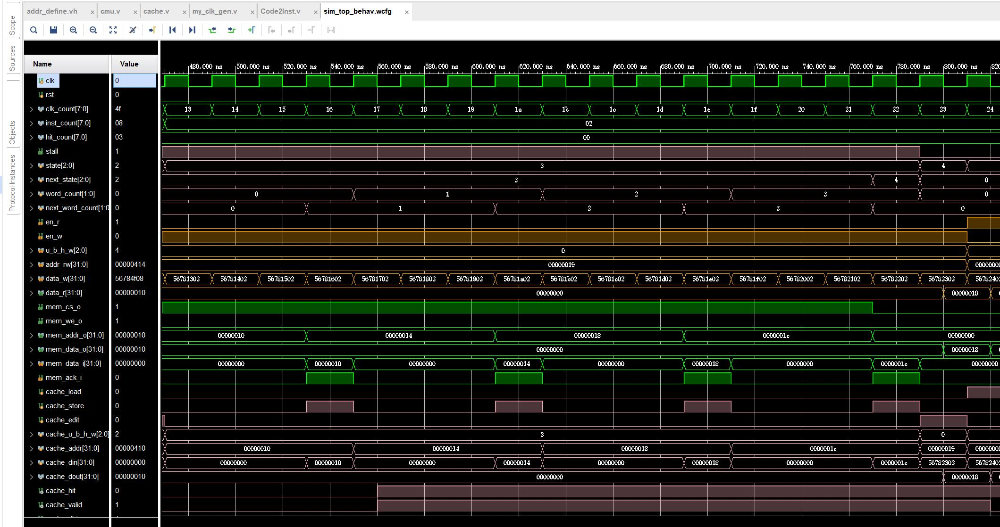
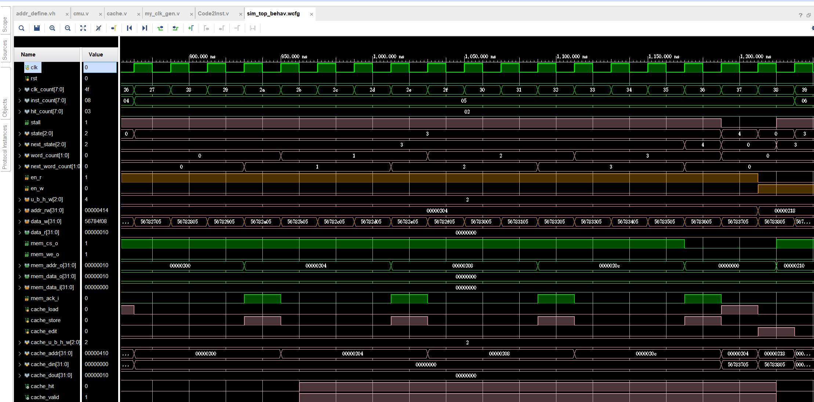
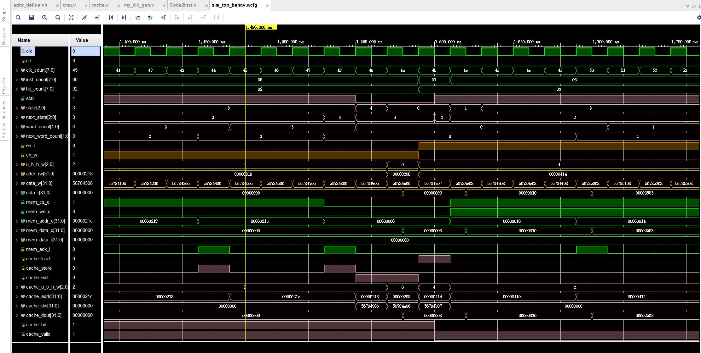

# Topic 4 Pipelined CPU with Cache

> 课程名称：计算机体系结构
>
> 姓名：李云帆
>
> 学号：3200102555
>
> 学院：计算机学院
>
> 专业：计算机科学与技术

## 一 实验环境

Windows+Vivado

## 二 实验目的

• Understand the principle of Cache Management Unit (CMU) and State Machine of CMU
• Master the design methods of CMU and Integrate it to the CPU
• Master verification methods of CMU and compare the performance of CPU when it has cache or not

## 三 实验原理及过程

本实验基于框架的基础上补全代码，仅需要将 lab3 里的 cache.v 放进来，
然后补全 cmu.v 中的代码即可。





上图即为 cache 操作的流程，首先判断是 write 操作还是 read 操作，以 read
操作为例。如果 hit，即访问的存储内容已经在 cache 里了，那么就可以直接
return data，如果 miss 就需要对 cache 进行操作。此时需要判断 block 是否
dirty，如果是的话把变化写回 memory，如果不是 dirty 就不执行写回操作，然
后把访问的存储内容写进 cache.



cmu.v 的设计根据上图的状态机转移过程即可
以 S_IDLE 为例，如果 hit，next 状态为 S_IDLE；如果 miss/dirty，状态为 S_PRE_BACK，否则为 S_FILL

```verilog
S_IDLE: begin
    if (en_r || en_w) begin
        if (cache_hit)
        	next_state = S_IDLE;
        else if (cache_valid && cache_dirty)
        	next_state = S_PRE_BACK;
        else
        	next_state = S_FILL;
    end
    next_word_count = 2'b00;
end
```

对于 S_PRE_BACK，next state 为 S_BACK

```verilog
S_PRE_BACK: begin
    next_state = S_BACK;
    next_word_count = 2'b00;
end
```

其他状态类似

```verilog
S_BACK: begin
                    if (mem_ack_i && word_count == {ELEMENT_WORDS_WIDTH{1'b1}})    // 2'b11 in default case
                        next_state = S_FILL;
                    else
                        next_state = S_BACK;

                    if (mem_ack_i)
                        next_word_count = word_count + 2'b01;
                    else
                        next_word_count = word_count;
                end

                S_FILL: begin
                    if (mem_ack_i && word_count == {ELEMENT_WORDS_WIDTH{1'b1}})
                        next_state = S_WAIT;
                    else
                        next_state = S_FILL;

                    if (mem_ack_i)
                        next_word_count = word_count + 2'b01;
                    else
                        next_word_count = word_count;
                end
```

## 四 仿真结果







