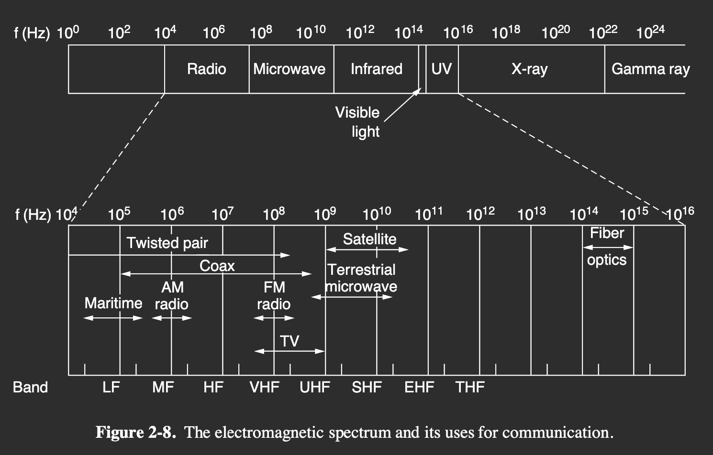

#notes #in-class
dia

### 2.1.1 Persistent Storage

> Never underestimate the bandwidth of a station wagon full of tapes hurtling down the highway.

### 2.1.2 Twisted Pairs

> A signal is usually carried as the difference in voltage between the two wires in the pair. **Transmitting the signal as the difference between the two voltage levels**, as opposed to an absolute voltage, provides better immunity to external noise because **the noise tends to affect the voltage traveling through both wires in the same way, leaving the differential relatively unchanged**. 使用电压差值, 这样外界影响会被抵消

- **Category 5e cabling**: also known as **Cat 5e**
- **full-duplex links**: links can be used in both directions at the same time
- **half-duplex links**: links can only be used in one direction at a time
- **simplex links**: links only allow one direction

### 2.1.3 Coaxial Cable

- 50-ohm cable, for digital transmission from the start
- 75-ohm cable, for analog transmission and cable television

wide bandwidth with up to 6GHz

### 2.1.4 Power Lines

The data signal is superimposed on the low-frequency power signal (on the active or ‘‘hot’’ wire) as both signals use the wiring at the same time.

Despite these difficulties, it is practical to send at least 500 Mbps short distances over typical household electrical wiring by using communication schemes that resist impaired frequencies and bursts of errors.

### 2.1.5 Fiber Optics

> the achievable bandwidth with fiber technology is in excess of 50,000 Gbps (50 Tbps) and we are nowhere near reaching these limits. The current practical limit of around 100 Gbps is simply due to our inability to convert between electrical and optical signals any faster. To build higher-capacity links, many channels are simply carried in parallel over a single fiber.

## 2.2 Wireless Transmission

### 2.2.1 The Electromagnetic Spectrum

$$
\lambda*f=c
$$

when ƛ is meters and f is MHz, ƛ*f=300

### 2.2.2 Frequency Hopping Spread Spectrum

> In **frequency hopping spread spectrum**(调频扩频, FHSS), a transmitter hops from frequency to frequency hundreds of times per second. It is popular for military communication because it makes transmissions hard to detect and next to impossible to jam. It also offers good resistance to fading due to signals taking different paths from source to destination and interfering after recombining. It also offers resistance to narrowband interference because the receiver will not be stuck on an impaired frequency for long enough to shut down communication.

### 2.2.3 Direct Sequence Spread Spectrum

- code division multiple access

### 2.2.4 Ultra-Wideband Communication

- UWB, Ultra-WideBand, have a bandwidth of at least 500 MHz or at least 20% of the center frequency of their frequency band.

## 2.3 Using the Spectrum for Transmission

### 2.3.1 Radio Transmission

- easy to generate, travel long distances, penetrate buildings
- path loss with 1/r^2

### 2.3.2 Microwave Transmission

- travel in nearly straight line, narrowly focused
- **directional**: travel in straight line so the earth will get in the way if too far apart, needs repeaters(中继器)
- do not pass the buildings well
- **multipath fading**, the delayed waves may arrive out of phase with the direct waveandthus cancel the signal
- do not need the **right of way** compared to the fiber

### 2.3.3 Infrared Transmisssion

红外传播
- can not pass through solid walls

### 2.3.4 Light Transmission

## 2.4 From Waveforms to Bits

### 2.4.1 The Theoretical Basis for Data Communication

#### Fourier Analysis
![[Pasted image 20221018182404.png]]
