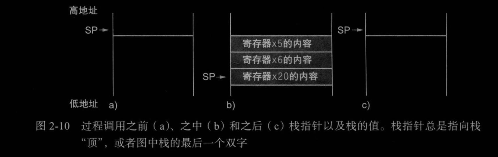
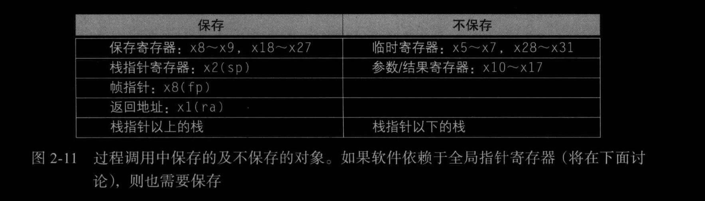
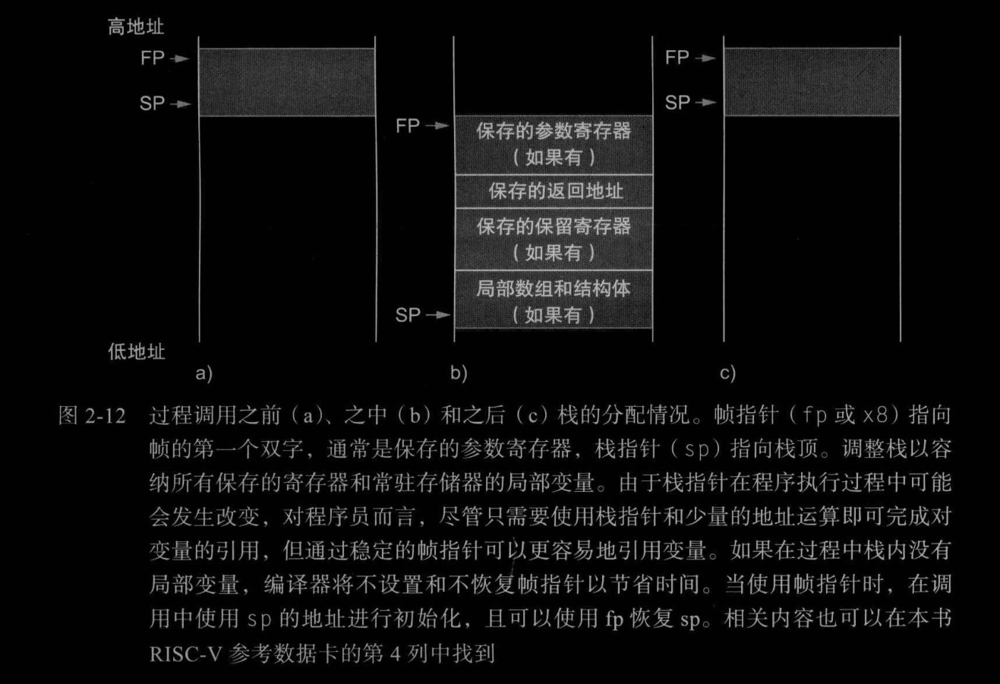
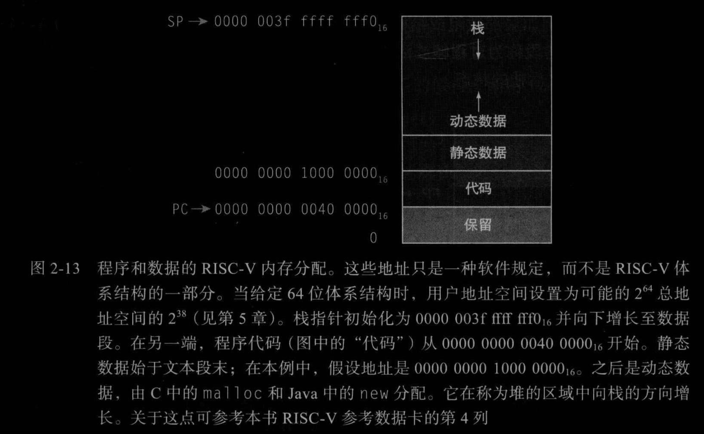
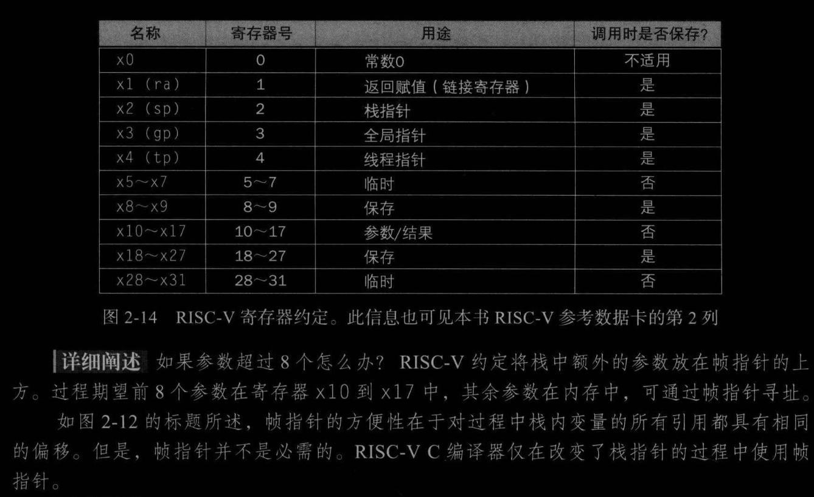
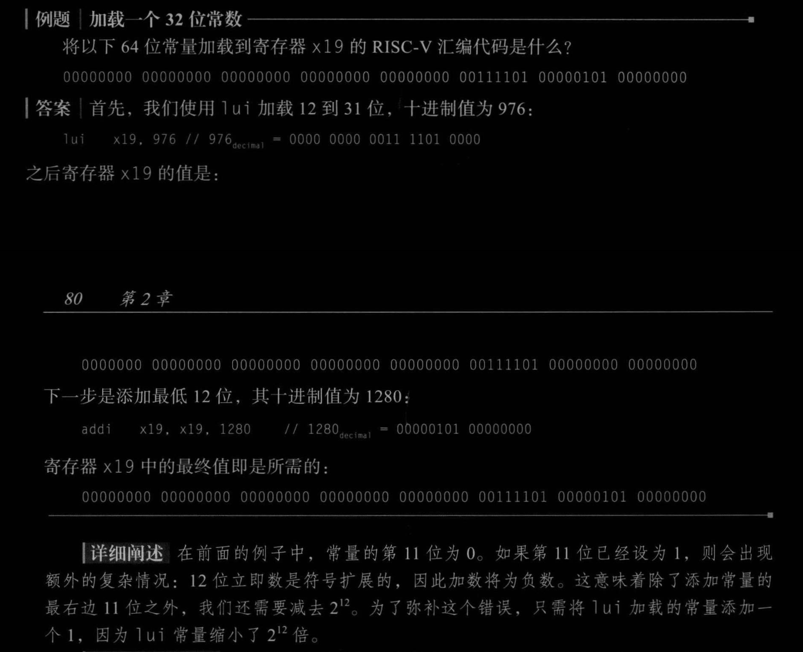
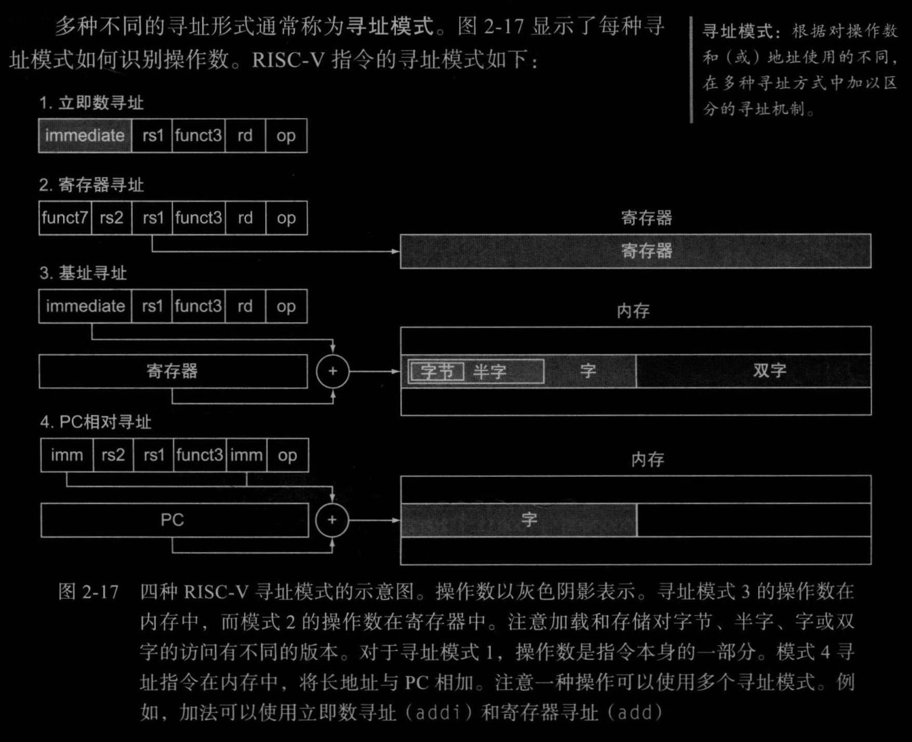
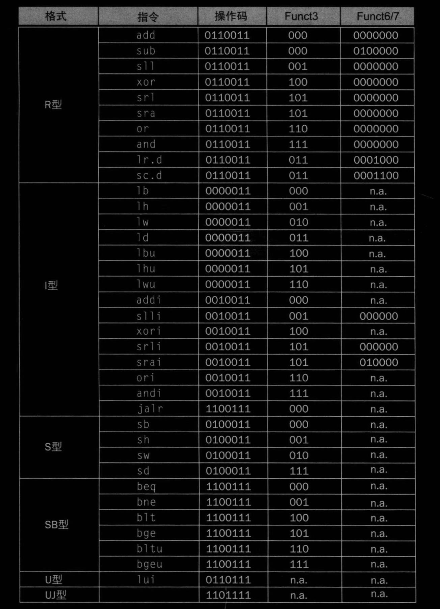
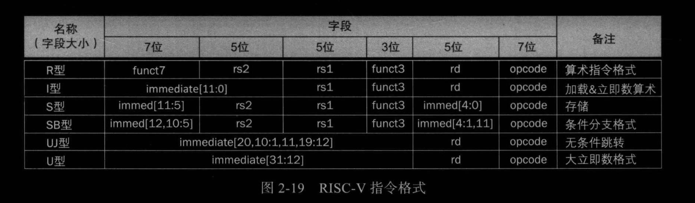
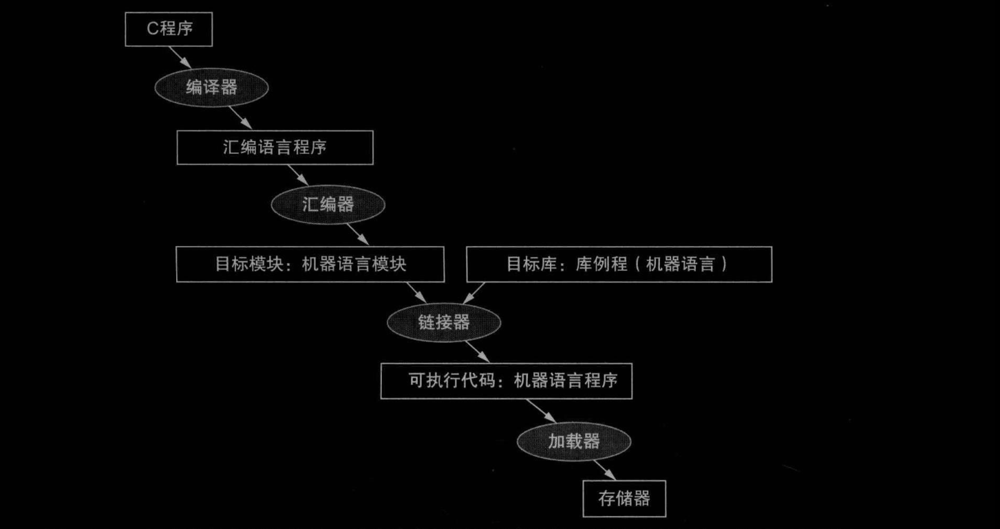

# Chap.1 Introduction

### 1.6 性能
CPU执行时间=CPU时钟周期数 * 时钟周期长度
CPU时钟周期数 = 程序的指令数 * 指令平均时钟周期数(CPI)

CPU时间 = 指令数 * CPI * 时钟周期长度 = 指令数 * CPI / 时钟频率


# Chap.2 Instructions

## 2.5 计算机中的指令表示
- 指令格式：由二进制数字字段组成的指令表示形式
- 机器语言：用于计算机系统内通信的二进制表示
- RISC-V字段(R型)
  ![[attachments/Pasted image 20221112162747.png]]
- I型
  ![[attachments/Pasted image 20221112162852.png]]
- S型
  ![[attachments/Pasted image 20221112163131.png]]
## 2.6 逻辑操作
![[attachments/Pasted image 20221112165314.png]]
```riscv
slli x11,x19,4    //reg x11 = reg x19 << 4 bits
```
`srai`算数右移不是用0填充左边的位，而是用原来的符号位填充
为了保持三操作数格式，使用`xor`来取代`not`
`not == xor 1111...1111`

## 2.7 用于决策的指令
```riscv
beq rs1,rs2,L1 //if rs1==rs2, goto L1

bnq rs1,rs2,L1 //if rs1!=rs2, goto L1
```

### 循环
> 以分支结尾的指令序列称为**基本块**: 除了在序列起始处, 没有分支目标和分支标签

边界检查:
为了检查是否0 <= x < y(检测数组下标是否越界)
```riscv
begu x20,x11, IndexOutOfBounds// if x20>= x11 or x20<0, goto IndexOutOfBounds
```

case/switch语句使用编码形成指令序列的地址表的方式实现
分支地址表： 包含了不同指令序列地址的表

## 2.8 计算机硬件对过程的支持
执行过程的六个步骤
1. 将参数放在构成可以访问到的位置
2. 将控制转交给过程
3. 获取过程所需的存储资源
4. 执行所需的任务
5. 将结果值放在调用程序可以访问到的位置
6. 将控制返回到初始点，因为过程可以从程序的多个点调用
>RISCV软件为过程调用分配寄存器时：
>    `x10-x17`:八个参数寄存器，用于传递参数或返回值
>    `x1`：一个返回地址寄存器，用于返回初始点

RISCV还包含一个仅作用于过程的指令：跳转到某个地址的同事将下一条指令的地址保存到目标寄存器`rd`
- 跳转-链接指令`jal`
```riscv
jal x1,ProcedureAddress //jump to ProcedureAddress and write return address to x1
```
为了支持`case`跳转，使用简洁跳转
```riscv
jalr x0,0(x1)
```

> 需要一个寄存器来保存当前执行指令的地址，由于历史原因被称为PC(program counter),实际上称为IR(instruction register)更为合适

`jal`指令实际上将`PC+4`保存在制定寄存器（通常为`x1`）中

> 通过使用`x0`作为目标寄存器,`jal`指令也可以实现过程内的无条件跳转，由于`x0`硬连线为0，效果为丢弃返回地址
> `jal x0,Lable	//unconditionally branch to Lable`

### 使用更多Regs

- 寄存器不够用，可以使用栈（stack）
- 栈指针为`x2`，也称为`sp`
- 栈按照从高到低的顺序“增长”，可以通过减`sp`进行压栈，通过增加`sp`进行弹栈

```assembly
addi sp, sp, -24     // adjust stack to make room for 3 items 
sd x5, 16(sp)     // save register x5 for use afterwards 
sd x6, 8(sp)     // save register x6 for use afterwards 
sd x20, 0(sp)     // save register x20 for use afterwards 
```



在一个过程完成后，调用者所需的所有寄存器都必须恢复到调用该过程之前的值，为了避免保存和恢复一个从未被使用过的寄存器，将19个寄存器分为两组：

- `x5~x7`，`x28~x31`: 临时寄存器，在过程调用中不被 被调用者 保存
- `x8~x9`, `x18~x27`: 保存寄存器（saved register），在过程调用中必须被保存，一旦使用，由被调用者保存并恢复

### 嵌套过程



栈中包含过程所保存的寄存器和局部变量的段称为**过程帧**或**活动记录**



- **帧指针`fp`**(通常为寄存器`x8`): 指向过程帧的第一个双字， 在过程中为局部标量引用提供一个稳定的基址寄存器

### 在堆中为新数据分配空间

栈从用户地址空间的高端开始向下拓展。

低端内存的第一部分是保留的，之后是RISCV机器代码，通常称为代码段（text segment）。

在此之上是*静态数据段*（static data segment），用于存放常量和其他静态变量

存放动态数据结构的段通常称为*堆*（heap）。

栈和堆相向生长，以达到内存的高效使用



C通过显式函数调用`malloc()`和`free()`来分配和释放堆上的空间

> RISCV的寄存器约定
> 

## 2.10 对大立即数的RISCV编址和寻址

### 2.10.1 大立即数

RISCV使用`lui`(load upper immediate, 取立即数高位)，用于将20位常数加载到寄存器的第31位到第12位。将第31位的值复制填充到最左边32位，最右边的12位用0填充

> `lui`使用新的指令格式：U型，因为其他格式不能支持如此大的常量

这条指令可以使用两条指令创建32位常量



### 2.10.2 分支中的寻址

RISCV分支指令使用SB型指令格式，可以表示从-4096~4094的分支地址，以2的倍数表示，只能跳转到偶数地址

`bne x10,x11,2000 //if x10!=x11 goto location 2000=0b0111 1101 0000`

可以组装为


无条件跳转-链接指令`jal`是唯一使用UJ型格式的指令，不能编码奇数地址，所以

`jal x0,2000 // goto location 2000=0b0111 1101 0000`

被组装为


寻址模式：



PC相对偏移表示分支和目标指令之间的*半字*数，因为想要支持只有两个字节长的指令，`jal`指令中的20位地址字段可以编码位距当前PC+/- 2^19个半字或+/-1 MiB的距离

条件分支指令中的12位立即数字段也是半字地址，表示13位的字节地址

### 机器语言译码





## 2.11 指令与并行性：同步

- [ ] 没读懂，需要回看

## 2.12 翻译并启动程序



### 汇编器

可以处理机器指令的常见变体，硬件不需要实现这些指令，但是这些指令简化了程序转换和编程，称为**伪指令**

```riscv
li x9,123
# equals to 
addi x9,x0,123

mv x10,x11
# equals to
addi x10,x11,0

j Lable
# equals to
jal x0,Lable
```

汇编器将汇编语言程序转换为目标文件（object file），是机器指令，数据和将指令正确放入内存所需信息的组合

为了在汇编语言程序中产生每条指令的二进制版本，必须确定所有标签对应的地址，汇编器会跟踪分支中使用的标签和符号表中的数据传输指令。

> UNIX系统的目标文件通常包含六个不同的部分
>
> - 目标文件头，描述了目标文件的其他部分的大小和位置
> - 代码段，包含机器语言代码
> - 静态数据段，包含在程序生命周期内分配的数据
> - 重定位信息，标记了在程序加载到内存时依赖于绝对地址的指令和数据
> - 符号表，包含剩余的未定义的标签，例如外部引用
> - 调试信息，包含有关如何编译目标模块的简明描述，以便于调试器可以将机器指令与C源文件相关联并使数据结构可读

### 链接器

1. 将代码和数据模块按符号特征放入内存
2. 决定数据和指令标签的地址
3. 修正内部和外部引用

链接器使用每个对象模块中的重定位信息和符号表来解析所有未定义的标签。这些引用发生在分支指令和数据地址中，它找到旧地址并用新地址替换它们

如果解析了所有的外部引用，则链接器接下来将确定每个模块占用的内存位置。当链接器将模块放入内存时，必须*重定位*所有的绝对引用（与寄存器无关的内存地址）以反映其真实地址

链接器生成可在计算机上运行的可执行文件，通常具有与目标文件相同的格式，但不包含任何未解析的引用（库程序除外）

### 加载器

1. 读取可执行文件首部以确定正文段和数据段的大小
2. 为正文和数据创建足够大的地址空间
3. 将可执行文件中的指令和数据复制到内存中
4. 将主程序的参数复制到栈顶
5. 初始化处理器寄存器并将栈指针指向第一个控线位置
6. 跳转到启动例程,将参数复制到参数寄存器中并调用程序的主例程. 主例程返回时, 启动例程通过`exit`系统调用终止程序

### 动态链接库

- dynamically linked libraries, DLL
- 库例程在程序运行之前不会被链接和加载
- 需要额外的空间来存储动态链接所需的信息, 不要求复制或链接整个库. 在第一次调用例程时会付出大量的开销, 之后只需要一个简介跳转


# Chap.4 The Processor

## 4.1 Introduction

### A Basic RISC-V Implementation
- memory access instruction `ld`, `sd`
- 算数指令`add, sub, and, or`
- conditional branch instruction *branch if equal* `beq`

### An overview of implementation
执行以上指令的大部分工作相同
1. 程序计数器`PC`发送到指令所在的存储单元，并取出指令
2. 根据指令的某些字段选择需要读取的一个/两个寄存器
3. 剩余操作取决于指令类别

## 4.2 Logic Design Conventions

两种不同的逻辑单元
- 组合逻辑：处理数据值的单元
- 状态单元(*sequential*)：有内部存储功能，包含状态
    - 一个状态单元至少有
    - 两个输入：
        - 写入状态单元的数据值
        - 决定何时写入的时钟信号
    - 一个输出：
        - 在前一个时钟周期写入单元的数据值
    - 何时被写入由时钟确定，但是可以随时被读

### Clocking Methodology

时钟同步方法规定了信号可以读出和写入的时间

我们采用边沿触发的时钟（edge-triggered clocking），即仅在时钟边沿更新；如果状态单元在每个有效的时钟边沿都进行写入，则可忽略写控制信号，反之则需要；仅当时钟边沿到来且写控制信号有效时，状态单元改变状态


## 4.3 Building a Datapath

### R-type

- 读取两个寄存器，对他们的内容执行ALU操作，再将结果写回寄存器
- 被称为R型指令或者算数逻辑指令（*arithmetic-logical instructions*）

为写入一个数据字，需要
- 指定要写的寄存器号
- 要写入寄存器的数据
总共需要四个输入,未标注的为64位宽
![[Pasted image 20221105101854.png]]
### 存取指令

不仅需要寄存器堆和ALU，还需要单元将指令中的12位偏移量符号拓展为64位
![[./attachments/Pasted image 20221105102302.png]]

`beq`指令有三个操作数，两个寄存器用于比较是否相等，另一个是12位偏移量
    `beq x1,x2,offset`

- 计算分值目标地址的基址是分支指令所在地址
- 计算分支目标地址时，将偏移量左移1位以表示半字为单位的偏移量，这样偏移量的有效范围就扩大到两倍
分支指令的数据通路需要执行:
- 计算分支目标地址
- 检测分支条件
![[attachments/Pasted image 20221120225610.png]]

