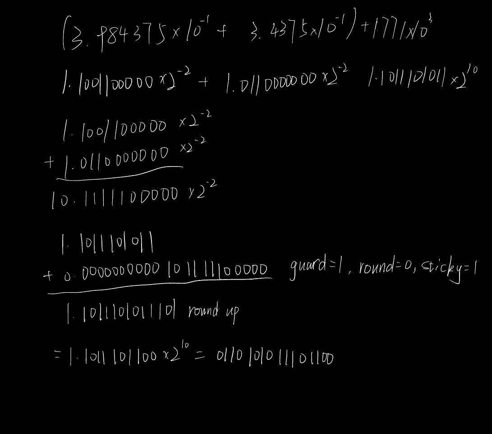

## 3.7

Neither.

## 3.20

12*16^6=201,326,592

## 3.26

$-1.5625*10^{-1}= -0.101*2^{-2}$

1111 1111 1110 1011 0000 0000 0000 0000 0000

## 3.27

$-1.5625*10^{-1} = -0.15625 * 10^0 = -0.00101 *2^0 = -1.01*2^{-3}$

1011 0001 0000 0000

## 3.32

