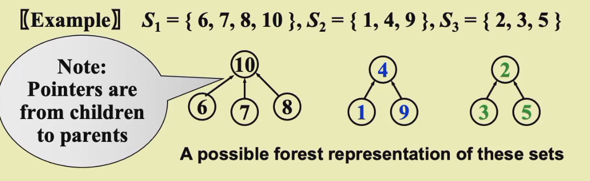
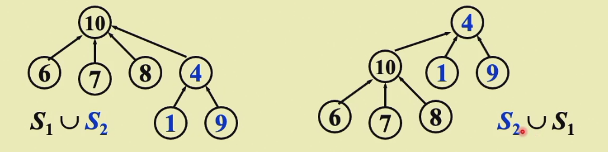
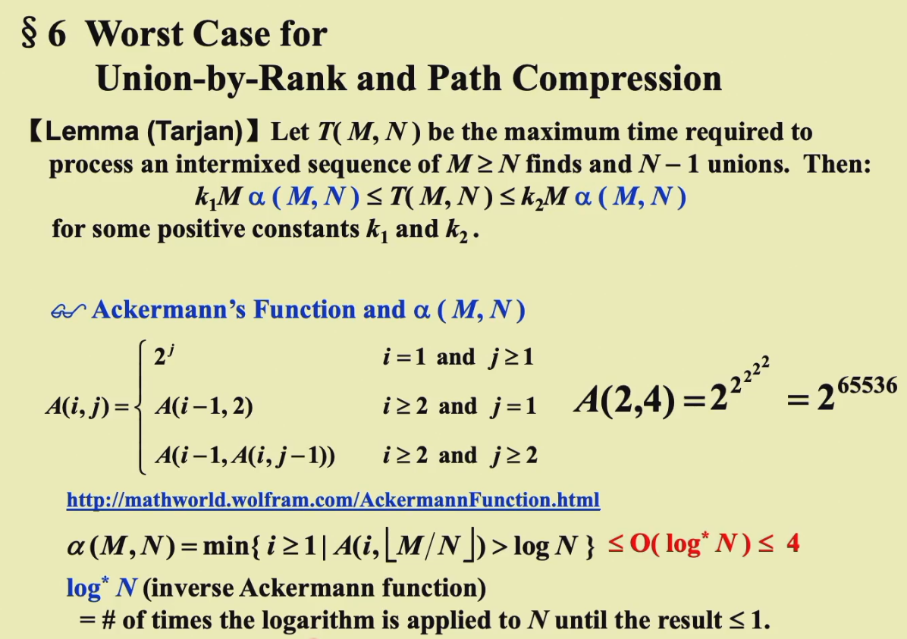

# Chap.3 Lists, Stacks and Queues
## 1 Abstract Data Type

- Definition: **Data Type = {Objects}∪{Operations}**

## 2 The List ADT

- **Objects**:(item_0, item_1, ... , item_n-1)
- **Operations**:
    - Finding the length
    - Printing
    - Making an empty list
    - Find the k-th
    - Inserting after the k-th
    - Deleting an item
    - Finding next of the current item
    - Finding previous of the current

### Simple Array implementations

- Find_Kth takes O(1) time
- MaxSize has to be estimated
- Insertion and Deletion not only take O(N) time, but also involve a lot of data movements which takes time

### Linked Lists

```c
//Initialization
typedef struct list_node *list_ptr;
typedef struct list_node {
  char data [4];
  list_ptr next;
};
list_ptr ptr;
```

> Add a dummy head node to a list

### Doubly Linked Circular Lists

###  

### Cursor Implementation of Linked Lists

Features that a linked list must have:

- The data are store in a collection of structures. Each structure contains data and a pointer to the next structure.
- A new structure can be obtained from the system's global memory by a call to malloc and released by a call to free.


![[Pasted image 20221020023526.png]]
## 3 The Stack ADT
### ADT
- LIFO: Last-In-First-Out
- Insertions and deletions at the **top** only
- Objects: A finite ordered list with zero or more elements
- Operations:
	- Int IsEmpty(Stack S)
	- Stack CreateStack()
	- DisposeStack(Stack S)
	- MakeEmpty(Stack S)
	- Push(ElementType X, Stack S)
	- ELementType Top(Stack S)
	- Pop(Stack S)

### Implementations
#### Linked List Implementation(with a header node)
```c
Push(int x, Stack S)
{
	TmpCell->Next = S->Next;
	S->Next=TmpCell;
}

int Top(Stack S)
{
	return S->Next->Element;
}

int Pop(Stack S)
{
	FirstCell=S->Next
}
```

> calls to malloc() and free() are expensive->keep another stack as a recycle bin

#### Array Implementation
```c
struct StackRecord{
    int Capacity;//size
    int TopofStack;//top pointer
    ElementType *Array;//array for stack elements
}
```
> The stack model must be well **encapsulated**
> Error check must be done before Push and Pop(Top)
### Applications
- Balancing Symbols(check if brackets are balanced)
- Postfix Evaluation
  ![[Pasted image 20221020033536.png]]
  >Infix to Postfix Conversion
  >    The order of operands is the same in infix and post fix
  >    Operators with higher precedence appear before those with lower precedence
  
  Solutions
  - Never pop a `(` from a stack except when processing a `)`
  - Observe that when `(` is not in the stack, its precedence is the highest; but when it is in the stack, its precedence is the lowest. Define in-stack precedence and incoming precedence for symbols, and each time use the corresponding precedence for comparison
## 4 The Queue ADT
### ADT
First-In-First-Out, an ordered list in which insertions take place at one end and deletions take place at the opposite end
- Objects: A finite ordered list with zero or more elements
- Operations:
    - `int IsEmpty(Queue Q);`
    - `Queue CreateQueue();`
    - `DisposeQueue(Queue Q);`
    - `MakeEmpty(Queue Q);`
    - `Enqueue(ElementType X, Queue Q);`
    - `ElementType Front(Queue Q);`
    - `Dequeue(Queue Q);`
### Implementation
#### Linked List Implementation
#### Array Implementation
```c
struct QueueRecord{
    int Capacity;//max size of queue
    int Front;//the front pointer
    int Rear;//the rear pointer   
    int Size;//Optional-the current size of queue
    ElementType *Array;//array for queue elements
}
```
#### Circular Queue
![[Pasted image 20221024060814.png]]
最多n-1个，因为rear=front-1的时候为空
# Chapter 4 Trees
## 1 Preliminaries
- Definition: A tree is a collection of nodes. The collection can be empty; otherwise, a tree consists of
    - a distinguished node r, called the root
    - and zero or more nonempty (sub)trees T1, ... , Tk, each of whose roots are connected by a directed edge from r
    >Subtrees must not connect together. Therefore every node in the tree is the root of some subtree
    >There are N-1 edges in a tree with N nodes
    >Normally the root is drawn at the top
- degree of a node: = the number of the subtrees of the node
- degree of a tree : = max{degree(node)}
- parent: a node that has subtrees
- children: the roots of the subtrees of a parent
- siblings: children of the same parent
- leaf(terminal node): a node with degree 0(no siblings)
- path from $n_1$to $n_k$: a (unique) sequence of nodes $n_1, n_2, ... , n_k$ such that $n_i$ is the parent of $n_{i+1}$ for 1 <= i <= k
- length of path: number of edges on the path
- depth of $n_i$: length of the unique path from the root to $n_i$
- height of $n_i$: length of the longest path from $n_i$ to leaf
- height(depth) of a tree: height(root)=depth(deepest leaf)
- ancestors of a node: all the nodes along the path from the node up to the root
- descendats of a node: all the nodes in its subtrees
### Representation
![[Pasted image 20221024153353.png]]
## 2 Binary Trees
- Definition: A tree in which no node with more than two children
### Expression Trees
### Properties of Binary Trees
- The maximum number of nodes on level i is $2^{i-1},i\geq1$
- The maximum number of nodes in a binary tree of depth k is $2^k-1,k \geq1$
- ![[Pasted image 20221026164649.png]]

### Tree Traversals
> visit each node exactly once
- Preorder Traversal
```c
void preorder(tree_ptr tree)
{
    if(tree){
        visit(tree);
        for(each child C of tree)
            preorder(C);
    }
}
```
- Postorder Traversal
```c
void postorder(tree_ptr tree)
{
    if(tree){
        for(each child C of tree)
            postorder(C);
        visit(tree);
    }
}
```
- Levelorder Travelsal
```c
void levelorder(tree_ptr tree)
{
    enqueue(tree);
    while(queue is not empty){
        visit(T=dequeue());
        for(each child C of T)
            enqueue(C);
    }
}
```
![[Pasted image 20221025063028.png]]
- Inorder Traversal(Binary tree only)
```c
void Inorder(tree_ptr tree)
{
    if(tree){
        inorder(tree->Left);
        visit(tree->Element);
        inorder(tree->Right);
    }
}
```

```c
//Iterative Program
void iter_inorder(tree_ptr tree)
{
    Stack S=CreateStack(MAX_SIZE);
    for(;;){
        for(;tree;tree=tree->Left)
            Push(tree, S);
        tree=Top(S); Pop(S);
        if(!tree) break;
        visit(tree->Element);
        tree=tree->Right;
    }
}
```
### Binary Search Trees
![[Pasted image 20221025193040.png]]
#### Definition
A binary tree that:
- Every node has a key which is an integer, and the keys are **distinct**
- The keys in a nonempty left subtree must be smaller than the key in the root
- The keys in a nonempty right subtree must be larger than the key in the root
- The left and right subtrees are also binary search trees
#### ADT
- Objects: A finite ordered list with zero or more elements
- Operations:
    - `SearchTree MakeEmpty( SearchTree T);`
    - `Position Find(ElementType X, SearchTree T);`
    - `Position FindMin(SearchTree T);`
    - `Position FindMax(SearchTree T);`
    - `SearchTree Insert(ElementType X, SearchTree T);`
    - `SearchTree Delete(ElementType X, SearchTree T);`
    - `ElementType Retrieve(Position P);`

#### Implementation
- Find
```c
//tail recursion
Position Find(ElementType X, SearchTree T)
{
	if(T == NULL)
		return NULL;
	if(X < T->Element)
		return Find(X,T->Left)
	else if(X > T->Element)
		return Find(X,T->Right)
	else
		return T;
}
//loop
Position Iter_Find(ElementType X, SearchTree T)
{
	while(T){
		if (X==T->Element)
			return T;
        if (X<T->Element)
            T=T->Left;
        else
            T=T->Right;
	}
	return NULL;
}
```
$$ T(N)=S(N)=O(d), d=depth(X)$$
- FindMin
```c
Position FindMin(SearchTree T)
{
	if (T==NULL)
		return NULL;
	else 
    	if (T->Left==NULL) return T;
    	else return FindMin(T->Left);
}
//loop
Position Iter_FindMin(SearchTree T)
{
    while(T)
    {
        if(T->Left==NULL)
            return T;
        else
            T=T->Left;
    }
    return NULL;
}
```
- FindMax
```c
Position FindMax(SearchTree T)
{
    if(T!=NULL)
        while(T->Right!=NULL)
            T=T->Right;
    return T;
}
```

- Insert
```c
SearchTree Insert(ElementType X, SearchTree T)
{
    if(T==NULL)
    {
        T=malloc(sizeof(struct TreeNode));
        if(T==NULL)
            FatalError("Out of space!");
        else{
            T->Element=X;
            T->Left=T->Right=NULL;
        }
    }
    else
        if(X<T->Element)
            T->Left=Insert(X,T->Left);
        else
            if(X>T->Element)
                T->Right=Insert(X,T->Right);
    return T;
}
```

- Delete
    - Delete a leaf node: Reset its parent link to NULL
    - Delete a degree 1 node: Replace the node by its single child
    - Delete a degree 2 node: 
        1. Replace the node by the **largest** one in its left subtree or the smallest one in its right subtree
        2. Delete the replacing node from the subtree
```c
SearchTree Delete(ElementType X, SearchTree T)
{
    Position tmp;
    if(T==NULL)
        Error("Element not found");
    else if(X<T->Element)
        T->Left=Delete(X,T->Left);
    else if(X>T->Element)
        T->Right=Delete(X,T->Right);
    else//Found element to be deleted
        if(T->Left&&T->Right){//two chirldren
            tmp=FindMin(T->Right);
            T->Element=tmp->Element;
            T->Right=Delete(T->Element,T->Right);
        }
        else{//one or zero child
            tmp=T;
            if(T->Left==NULL)
                T=T->Right;
            else
                T=T->Left;
            free(tmp);
        }
    return T;
}
```
$T(N)=O(h)$ where h is the height of the tree
#### Average-Case Analysis
The height depends on the order of insertion
# Chap.5 Priority Queues(Heaps)
>delete the element with the highest/lowest priority

## 1 ADT Model
- Objects: A finite ordered list with zero or more elements
- Operations:
    - `PriorityQueue Initialize(int MaxElements)`
    - `void Insert(ElementType X, ProrityQueue H)`
    - `ElementType DeleteMin(PriorityQueue H)`
    - `ElementType FindMin(PriorityQueue H)`
## 2 Simple Implementations

### Array
- Insertion: O(1)
- Deletion: find->O(n)+remove and shift array->O(n)
### Linked List(Better)
- Insertion: O(1)
- Deletion: find->O(n)+remove->O(1)
### Ordered Array
- Insertion: find->O(n)+shift array and add->O(n)
- Deletion: O(1)
### Ordered Linked List
- Insertion: find->O(n)+add->O(1)
- Deletion: O(1)
### Binary Search Tree

## Binary Heap
Structure Property
### Complete Binary tree
- Definition: A binary tree with n nodes and height h is complete iff its nodes correspond to the nodes numbered from 1 to n in the perfect binary tree of height h
- A complete binary tree of teight h has between $2^h - 2^{h+1}$ nodes
#### Array Representation
![[attachments/Pasted image 20221116063743.png]]
BT[0] is sentinel(哨兵)
![[attachments/Pasted image 20221116070254.png]]

Heap Order Property
### Min Heap
- Definition: A min tree is a tree in which the key value in each node is no larger than the key values in its children (if any). 
- A min heap is a complete binary tree that is also a min tree.
### Basic Heap
- Insertion
新插入的节点和父节点比较并一路交换上去到合适的位置（如果必要）
```c
void Insert(ElementType X,PriorityQueue H)
{
    int i;
    if(IsFull(H)){
        Error("Priority queue is full");
        return;
    }
    for(i=++H->Size;H->Elements[i/2]>X;i/=2)//Percolate up
        H->Elements[i]=H->Elements[i/2];//Faster than swap
    H->Elements[i]=X;
}
```
T(N)=O(log N)
- DeleteMin
```c
ElementType DeleteMin(PriorityQueue H)
{
    int i,Child;
    ElementType MinElement,LastElement;
    if(IsEmpty(H))
    {
        Error("PriorityQueue is empty");
        return H->Elements[0];
      }
    MinElement=H->Elements[1];//save the min element
    LastElement=H->Elements[H->Size--];//take last and reset size
    for(i=1;i*2<=H->Size;i=Child)
    {
        Child=i*2;
        if(Child!=H->Size&&H->Elements[Child+1]<H->Elements[Child])
            Child++;
        if(LastElement>H->Elements[Child])//Percolate one level
            H->Elements[i]=H->Elements[Child];
        else
            break;//find the proper position
    }
    H->Elements[i]=LastElement;
    return MinElement;
  }
```
### Other Heap Operations
> Finding any key except the minimum one will have to tak a linear scan through the entire heap

- DecreaseKey(P,Delta,H)
- IncreaseKey(P,Delta,H)
- Delete(P,H)
  - DecreaseKey(P,INF,H);DeleteMIn(H)
- BuildHeap(H)
  - Place all elements into an empty heap directly
  - then PercolateDown every node that is not a leaf node(所有非叶节点)
  - T(N)=O(N)

**Theorem**: For the perfect binary tree of height h containing $2^{h+1}-1$ nodes, the sum of the heights of the nodes is $2^{h+1}-1-(h+1)$.
## 4 Applications of Priority Queues

- Given a list of N elements and an integer k. Find the kth largest element.

## d-Heaps

All nodes have d children
- DeleteMin will take d-1 comparisons to find the smallest child. Hence the total time comlexity would be $O(d \log_{d}{N})$
- *2 or /2 is merelt a bit shift, but *d or /d is not
- When the priority queue is too large to fit entirely in main memory, a d-heap will become interesting

# Chap.8 The Disjoint Set ADT

不相交集

## 1 Equivalence Relations

- Definition: A *relation R* is defined on a set S if for every pair of elements(a,b),a,b∈S, a R b is either true or false. If a R b is true, then we say that a is related to b
- A relation ~ over a set S is said to be an equivalence relation(等价关系) over S iff it is symmetric, reflexive and transitive over S
  - refexive: any a∈S, a~a
  - symmeric: any a,b∈S, a~b iff b~a
  - transitive: any a,b,c∈S, a~b and b~c -> a~c 
- Two members x and y of a set S are said to be in the same equivalence class(等价类) iff x~y

## 2 The Dynamic Equivalence Problem

Given an quivalence relation ~, decide for ant a and b if a~b

```pseudocode
{
    //step1: read the relations in
    Initialize N disjoint sets;
    while(read in a~b)
    {
        if(!(Find(a)==Find(b)))
            Union the two sets;
    }
    //step2: decide if a~b
    while(read in a and b)
        if(Find(a)==Find(b))
            output(true);
        else
            output(false);
}
```
- Elements of the sets: 1,2,3, ..., N
- Sets: S1, S2, ... and Si ∩ Sj = ∅(if i!=j)



- Operations:
  - Union(i,j)::= Replace Si and Sj by S=Si∩Sj
  - Find(i)::= Find the set Sk which contains the element i

Union

Idea: Make Si a subtree of Sj or vice versa.


- Implementation 1: Linked lists

- Implementation 2: Array

  - `S[element] = the element's parent`
  - `S[root] = 0 and set name = root index`

  ```c
  void SetUnion(DisSet S, SetType Rt1, SetType Rt2)
  {
      S[Rt2]=Rt1;
  }
  ```

Find

- Linked lists

- Array

  ```c
  SetType Find(ElementType X, DisSet S)
  {
      for(;S[X]>0;X=S[X]);
      return X;
  }
  ```

### Analysis

Union and find are always paired. Thus we consider the performance of a sequence of union-find operations.

```pseudocode
{
//Suppose given N elements and k relations
	Initialize Si={i} for i=1,...,N;
	for(j=1;j<=k;j++){
		if(Find(i)!=Find(j))
			SetUnion(Find(i),Find(j));
	}
}
```

## 4 Smart Union Algorithm

#### Union-by-Size: 

Always change the smaller tree

`S[Root]=-size;` Initialized to be -1

**Lemma**: Let T be a tree created by union-by-size with N nodes, then $height(T) \leq \lfloor \log _2N \rfloor +1$

**Proof**: By induction. Each element can have its set name changed at most $\log_2N$ times

Time complexity of N Union and M Find operations is now $O(N+M\log_2N)$.

#### Union-by-Height

Always change the shallow tree

## 5 Path Compression

```c
SetType Find(ElementType X,DisjSet S)
{
    if(S[X]<=0)	return X;
    else return S[X] = Find (S[X],S);
}
```

```c
SetType Find(ElementType X, DisjSet S)
{
    ElementType root,trail,lead;
    for(root=X;S[root]>0;root=S[root]);//find the root
	for(trail=X;trail!=root;trail=lead){
        lead=S[trail];
        S[trail]=root;
    }//collapsing
    return root;
}
```



# Chap.9 Graph

## 1 Definitions

- G(V,E)
  where G::=graph, V=V(G)::=finite nonempty set of vertices and E = E(G)::= finite set of edges
- Undirected graph
  (vi,vj)=(vj,vi)::= the same edge
- Directed graph
  <vi,vj> ::= vi->vj, != <vj,vi>
- Restrictions:
  - Self loop is illegal
  - Multigraph is not considered
- Complete graph
  a graph that has the maximum number of egdes
  - Undirected: $E=C^2_n=\frac{n(n-1)}{2}$
  - Directed: $E=P^2_n=n(n-1)$
- vi--vj: vi and vj are **adjacent**(相邻的); (vi,vj) is **incident on**(关联于) vi and vj
- vi->vj: vi is adjacent to vj; vj is adjacent from vi;<vi,vj> is **incident on** vi and vj
- Subgraph $G' \subset G$
- Path from vp to vq
- Length of path
- Simple path: any nodes can't be passed twice, except it's a cycle
- Cycle: simple path with vp=vq
- vi and vj in an undirected G are **connected** if there is a path from vi to vj(and vice versa)
- G is **connected** if every pair of distince vi and vj are connected
- **(Connected) Component of an undirected G** ::= the maximal connected subgraph
- **A tree** ::= a graph is connected and *acyclic*(无环的)
- **A DAG** ::= a directed acyclic graph
- **Strongly connected directed graph G** ::= for every pair of vi and vj in V(G), there exist directed paths from vi to vj and from vj to vi. If the graph is connected without direction to the edges, then it is said to be **weakly connected**
- **Strongly connected component** ::= the maximal subgraph that is strongly connected
- **Degree(v)** ::= number of edges incident to v. For a directed G, we have **in-degree** and **out-degree**.
- Given G with n vertices and e edges, then
  $ e=(\sum_{i=0}^{n-1}d_i)/2$ where di = degree(vi)

### Representations of Graphs

Adjacency Matrix

`adj_mat[n][n]` is defined for G(V,E) with n vertices, n>=1

`adj_mat[i][j]=1 if (vi,vj) or <vi,vj> ∈ E(G), else =0`

> If G is undirected, then adj_mat[][] is symmetric. Thus we can save space by storing only half of the matrix.

$$degree(i) = \sum_{j=0}^{n-1}{adj\_mat[i][j]}\ (+\sum_{j=0}^{n-1}{adj\_mat[j][i]}, if\ G\  is\ directed)$$


