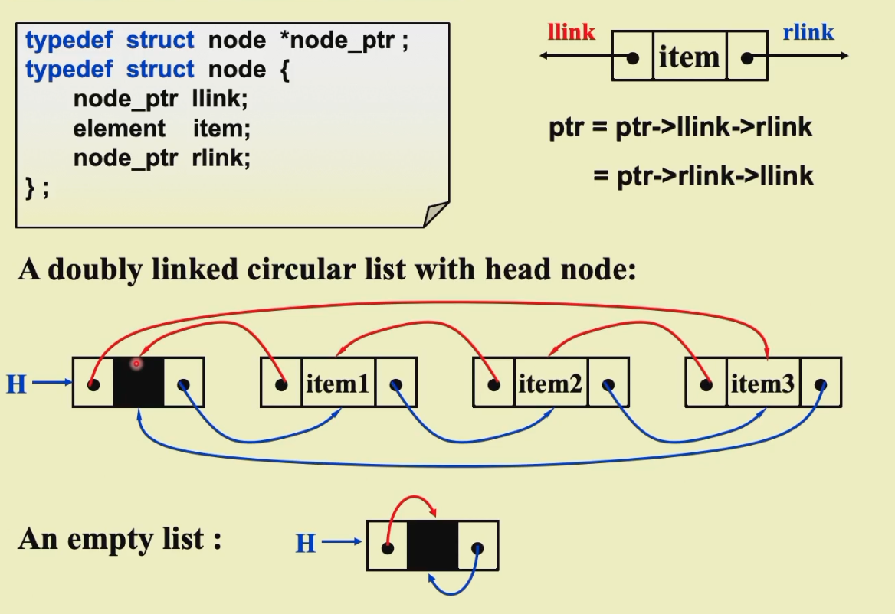
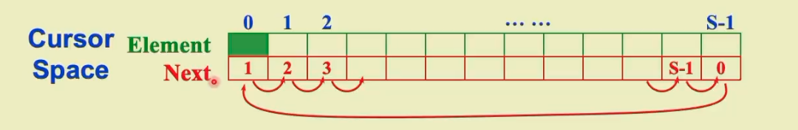

# Chap.3 Lists, Stacks and Queues
## 1 Abstract Data Type

- Definition: **Data Type = {Objects}∪{Operations}**

## 2 The List ADT

- **Objects**:(item_0, item_1, ... , item_n-1)
- **Operations**:
    - Finding the length
    - Printing
    - Making an empty list
    - Find the k-th
    - Inserting after the k-th
    - Deleting an item
    - Finding next of the current item
    - Finding previous of the current

### Simple Array implementations

- Find_Kth takes O(1) time
- MaxSize has to be estimated
- Insertion and Deletion not only take O(N) time, but also involve a lot of data movements which takes time

### Linked Lists

```c
//Initialization
typedef struct list_node *list_ptr;
typedef struct list_node {
  char data [4];
  list_ptr next;
};
list_ptr ptr;
```

> Add a dummy head node to a list

### Doubly Linked Circular Lists

###  

### Cursor Implementation of Linked Lists

Features that a linked list must have:

- The data are store in a collection of structures. Each structure contains data and a pointer to the next structure.
- A new structure can be obtained from the system's global memory by a call to malloc and released by a call to free.


![[Pasted image 20221020023526.png]]
## 3 The Stack ADT
### ADT
- LIFO: Last-In-First-Out
- Insertions and deletions at the **top** only
- Objects: A finite ordered list with zero or more elements
- Operations:
	- Int IsEmpty(Stack S)
	- Stack CreateStack()
	- DisposeStack(Stack S)
	- MakeEmpty(Stack S)
	- Push(ElementType X, Stack S)
	- ELementType Top(Stack S)
	- Pop(Stack S)

### Implementations
#### Linked List Implementation(with a header node)
```c
Push(int x, Stack S)
{
	TmpCell->Next = S->Next;
	S->Next=TmpCell;
}

int Top(Stack S)
{
	return S->Next->Element;
}

int Pop(Stack S)
{
	FirstCell=S->Next
}
```

> calls to malloc() and free() are expensive->keep another stack as a recycle bin

#### Array Implementation
```c
struct StackRecord{
    int Capacity;//size
    int TopofStack;//top pointer
    ElementType *Array;//array for stack elements
}
```
> The stack model must be well **encapsulated**
> Error check must be done before Push and Pop(Top)
### Applications
- Balancing Symbols(check if brackets are balanced)
- Postfix Evaluation
  ![[Pasted image 20221020033536.png]]
  >Infix to Postfix Conversion
  >    The order of operands is the same in infix and post fix
  >    Operators with higher precedence appear before those with lower precedence
  
  Solutions
  - Never pop a `(` from a stack except when processing a `)`
  - Observe that when `(` is not in the stack, its precedence is the highest; but when it is in the stack, its precedence is the lowest. Define in-stack precedence and incoming precedence for symbols, and each time use the corresponding precedence for comparison
## 4 The Queue ADT
### ADT
First-In-First-Out, an ordered list in which insertions take place at one end and deletions take place at the opposite end
- Objects: A finite ordered list with zero or more elements
- Operations:
    - `int IsEmpty(Queue Q);`
    - `Queue CreateQueue();`
    - `DisposeQueue(Queue Q);`
    - `MakeEmpty(Queue Q);`
    - `Enqueue(ElementType X, Queue Q);`
    - `ElementType Front(Queue Q);`
    - `Dequeue(Queue Q);`
### Implementation
#### Linked List Implementation
#### Array Implementation
```c
struct QueueRecord{
    int Capacity;//max size of queue
    int Front;//the front pointer
    int Rear;//the rear pointer   
    int Size;//Optional-the current size of queue
    ElementType *Array;//array for queue elements
}
```
#### Circular Queue
![[Pasted image 20221024060814.png]]
最多n-1个，因为rear=front-1的时候为空
# Chapter 4 Trees
## 1 Preliminaries
- Definition: A tree is a collection of nodes. The collection can be empty; otherwise, a tree consists of
    - a distinguished node r, called the root
    - and zero or more nonempty (sub)trees T1, ... , Tk, each of whose roots are connected by a directed edge from r
    >Subtrees must not connect together. Therefore every node in the tree is the root of some subtree
    >There are N-1 edges in a tree with N nodes
    >Normally the root is drawn at the top
- degree of a node: = the number of the subtrees of the node
- degree of a tree : = max{degree(node)}
- parent: a node that has subtrees
- children: the roots of the subtrees of a parent
- siblings: children of the same parent
- leaf(terminal node): a node with degree 0(no siblings)
- path from $n_1$to $n_k$: a (unique) sequence of nodes $n_1, n_2, ... , n_k$ such that $n_i$ is the parent of $n_{i+1}$ for 1 <= i <= k
- length of path: number of edges on the path
- depth of $n_i$: length of the unique path from the root to $n_i$
- height of $n_i$: length of the longest path from $n_i$ to leaf
- height(depth) of a tree: height(root)=depth(deepest leaf)
- ancestors of a node: all the nodes along the path from the node up to the root
- descendats of a node: all the nodes in its subtrees
### Representation
![[Pasted image 20221024153353.png]]
## 2 Binary Trees
- Definition: A tree in which no node with more than two children
### Expression Trees
### Properties of Binary Trees
- The maximum number of nodes on level i is $2^{i-1},i\geq1$
- The maximum number of nodes in a binary tree of depth k is $2^k-1,k \geq1$
- ![[Pasted image 20221026164649.png]]

### Tree Traversals
> visit each node exactly once
- Preorder Traversal
```c
void preorder(tree_ptr tree)
{
    if(tree){
        visit(tree);
        for(each child C of tree)
            preorder(C);
    }
}
```
- Postorder Traversal
```c
void postorder(tree_ptr tree)
{
    if(tree){
        for(each child C of tree)
            postorder(C);
        visit(tree);
    }
}
```
- Levelorder Travelsal
```c
void levelorder(tree_ptr tree)
{
    enqueue(tree);
    while(queue is not empty){
        visit(T=dequeue());
        for(each child C of T)
            enqueue(C);
    }
}
```
![[Pasted image 20221025063028.png]]
- Inorder Traversal(Binary tree only)
```c
void Inorder(tree_ptr tree)
{
    if(tree){
        inorder(tree->Left);
        visit(tree->Element);
        inorder(tree->Right);
    }
}
```

```c
//Iterative Program
void iter_inorder(tree_ptr tree)
{
    Stack S=CreateStack(MAX_SIZE);
    for(;;){
        for(;tree;tree=tree->Left)
            Push(tree, S);
        tree=Top(S); Pop(S);
        if(!tree) break;
        visit(tree->Element);
        tree=tree->Right;
    }
}
```
### Search Trees
![[Pasted image 20221025193040.png]]
#### Definition

### Implementation
- Find
```c
//tail recursion
Position Find(ElementType X, SearchTree T)
{
	if(T == NULL)
		return NULL;
	if(X < T->Element)
		return Find(X,T->Left)
	else if(X > T->Element)
		return Find(X,T->Right)
	else
		return T;
}
//loop
Position Iter_Find(ElementType X, SearchTree T)
{
	while(T){
		if (X==T->Element)
			return T;
		else if ()
	}
}
```
$$ T(N)=X(N)=O(d), d=depth(X)$$
- FindMin
```c
Position FindMin(SearchTree T)
{
	if (T==NULL)
		return NULL;
	else if (T->Left)
}
```
- FindMax