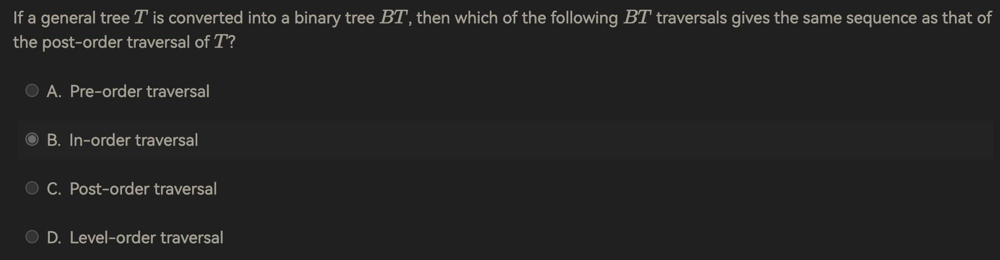
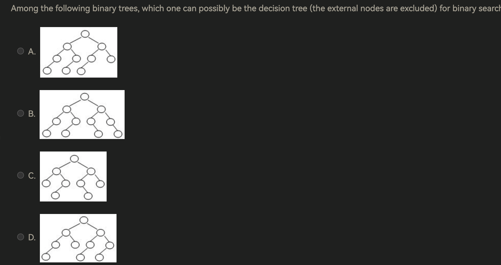
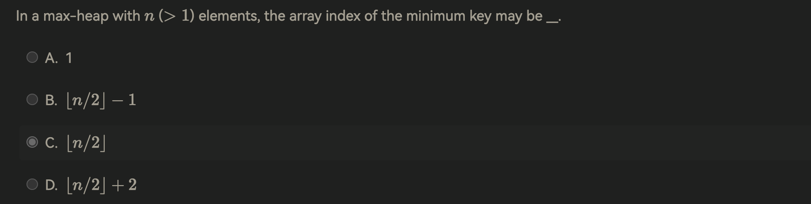
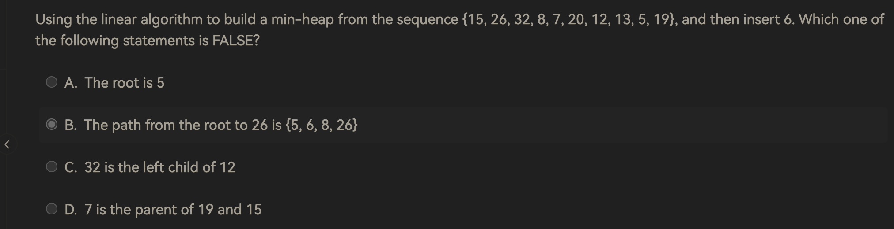

1. 
    According to https://www.geeksforgeeks.org/program-for-nth-fibonacci-number/. It's acctually $O(1.618^n)$
2. 
3. For a sequentially stored linear list of length N, the time complexities for deleting the first element and inserting the last element are O(1) and O(N), respectively. T or F? Why?

    > The statement is partially true and partially false, depending on the implementation details of the linear list:
    >
    > 1. **Deleting the first element**: The time complexity for deleting the first element in a sequentially stored linear list (like an array) is **O(N)**, not O(1). This is because when the first element is removed, all the subsequent elements need to be shifted one position to the left to maintain the sequential storage. This shifting operation requires moving N-1 elements, leading to a time complexity of O(N).
    > 2. **Inserting at the last element**: For inserting an element at the end of a sequentially stored linear list, the time complexity can vary:
    >     - If the list has enough space at the end to accommodate the new element (i.e., the array is not full), the insertion at the end is **O(1)** because it's a direct assignment operation.
    >     - However, if the list needs to be resized (like in the case of a dynamic array that's full), the time complexity becomes **O(N)** because a new, larger array has to be allocated and all existing elements need to be copied to the new array before inserting the new element.
    >
    > In summary, the statement is false because deleting the first element of a sequentially stored linear list is O(N) due to the shifting of elements, and inserting at the end can be either O(1) or O(N) depending on the current state of the list (whether it needs resizing or not).

4. To merge two singly linked ascending lists, both with *N* nodes, into one singly linked ascending list, the minimum possible number of comparisons is:

    A.1

    B.*N*

    C.2*N*

    D.*NlogN*

    > To merge two singly linked lists, both with *N* nodes, into one singly linked ascending list, the process typically involves comparing the head elements of both lists and picking the smaller one to add to the merged list. This process repeats until all elements from both lists have been merged.
    >
    > The minimum possible number of comparisons would be *N* comparisons, which happens in the ideal case where, at each step, the remaining elements of one list are all greater than the remaining elements of the other list. In such a scenario, you'd compare and move the head of one list *N* times, and then simply append the remaining elements of the other list without any further comparisons.
    >
    > So, the answer is:
    >
    > B. *N*
    >
    > This is the minimum number of comparisons needed in the best-case scenario. In a typical scenario, the number of comparisons would often be more, but it won't exceed 2*N* in any case.

5. Push 5 characters `ooops` onto a stack. In how many different ways that we can pop these characters and still obtain `ooops`?

    > 5. Draw the tree.

6. 
    https://blog.csdn.net/best_LY/article/details/121346561
    https://www.yuque.com/xianyuxuan/coding/hcr461#xPciw

7. Given a binary search tree with its preorder traversal sequence { 8, 2, 15, 10, 12, 21 }. If 8 is deleted from the tree, which one of the following statements is FALSE?

    A.

    One possible preprder traversal sequence of the resulting tree may be { 2, 15, 10, 12, 21 }

    B.

    One possible preprder traversal sequence of the resulting tree may be { 10, 2, 15, 12, 21 }

    C.

    One possible preprder traversal sequence of the resulting tree may be { 15, 10, 2, 12, 21 }

    D.

    It is possible that the new root may have 2 children

    > https://blog.csdn.net/HGGshiwo/article/details/109959641

8. 

9. 

10. 

    > linear Algorithm 是先填充再重排