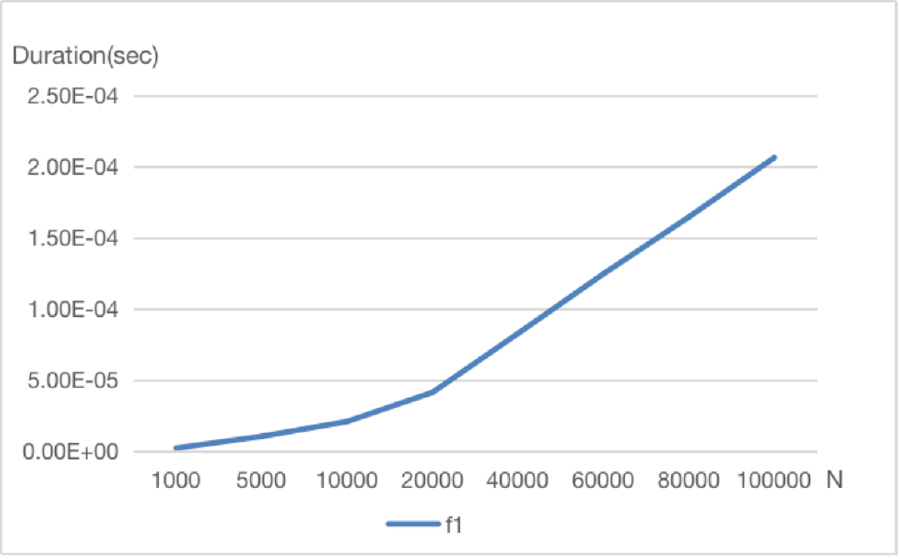
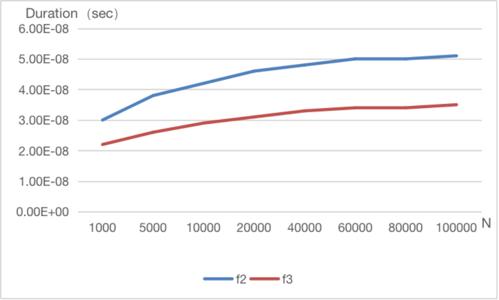

# **Normal Performance Measurement (POW)**


# 1. Introduction

There are at least two different algorithms that can compute $$X^N$$ for some positive integer *N*.

Algorithm 1 is to use *N*−1 multiplications.

Algorithm 2 works in the following way: if *N* is even, $$X^N=X^{N/2}×X^{N/2}$$; and if *N* is odd, $$X^N=X^{(N−1)/2}×X^{(N−1)/2}×X$$. Figure 2.11 in your textbook gives the recursive version of this algorithm.

Your tasks are:

- (1) Implement Algorithm 1 and an **iterative** version of Algorithm 2;
- (2) Analyze the complexities of the two algorithms;
- (3) Measure and compare the performances of Algorithm 1 and the iterative and recursive implementations of Algorithm 2 for *X*=1.0001 and *N* = 1000, 5000, 10000, 20000, 40000, 60000, 80000, 100000.

# 2. Algorithm Specification

**Algorithm1**: Using *N*−1 multiplications for computing $$X^N$$

**Input**: $$X$$∈$$R$$ , and $$N∈N^+$$

**Output**: The result and time cost

**Main Idea**: As mentioned above

**Pseudo Code**:

``` c
int f1(int n,double x)
{
  p=1
  for (i = 0; i < n; i++) {
     p*=x; 
  }
  return p
}
```

---

**Algorithm2**: Recursive version of computing $$X^N$$

**Input**: $$X$$∈$$R$$ , and $$N∈N^+$$

**Output**: The result and time cost

**Main Idea**: if *N* is even, $$X^N=X^{N/2}×X^{N/2}$$; and if *N* is odd, $$X^N=X^{(N−1)/2}×X^{(N−1)/2}×X$$. Figure 2.11 in your textbook gives the recursive version of this algorithm.

**Pseudo Code**:

``` c
int f2(int n, double x)
{
  if(n==0)
    return 1;
  else if(n is even)
    return f2(n/2,x)*f2(n/2,x);
  else
    return f2((n-1)/2,x)*f2((n-1)/2,x)*x;
}
//noticed that it could be optimized as follows:
int f2(int n, double x)
{
  if(n==0)
    return 1;
  else if(n is even)
    return f2(n/2,x*x);
  else
    return f2((n-1)/2,x*x)*x;
}
```

---

**Algorithm3**: Iterative version of computing $$X^N$$

**Input**: $$X$$∈$$R$$ , and $$N∈N^+$$

**Output**: The result and time cost

**Main Idea**: if *N* is even, $$X^N=X^{N/2}×X^{N/2}$$; and if *N* is odd, $$X^N=X^{(N−1)/2}×X^{(N−1)/2}×X$$. 

**Pseudo Code**:

``` c
int f3(int n, double x)
{
  p=1;
  while(n>0){
    if(n is odd) p*=x;
      x*=x;
      n/=2;
  }
}
```

# 3. Testing Results

| N                     | 1000     | 5000      | 10000     | 20000     | 40000     | 60000      | 80000      | 100000     |
| --------------------- | -------- | --------- | --------- | --------- | --------- | ---------- | ---------- | ---------- |
| Iterations(K) of f1   | 1e6      | 1e6       | 1e6       | 1e6       | 1e6       | 1e6        | 1e6        | 1e6        |
| Ticks of f1           | 2047     | 10278     | 20725     | 41247     | 82650     | 124542     | 164522     | 206263     |
| Total time(sec) of f1 | 2.047    | 10.278    | 20.725    | 41.247    | 82.650    | 124,542    | 164.522    | 206.263    |
| Duration(sec) of f1   | 2.047e-6 | 10.278e-6 | 20.725e-6 | 41.247e-6 | 82.650e-6 | 124.542e-6 | 164.522e-6 | 206.263e-6 |
| Iterations(K) of f2   | 1e6      | 1e6       | 1e6       | 1e6       | 1e6       | 1e6        | 1e6        | 1e6        |
| Ticks of f2           | 30.00    | 38.00     | 41.00     | 46.00     | 48.00     | 50.00      | 50.00      | 51.00      |
| Total time(sec) of f2 | 0.030    | 0.038     | 0.042     | 0.046     | 0.048     | 0.050      | 0.050      | 0.051      |
| Duration(sec) of f2   | 0.030e-6 | 0.038e-6  | 0.042e-6  | 0.046e-6  | 0.048e-6  | 0.050e-6   | 0.050e-6   | 0.051e-6   |
| Iterations(K) of f3   | 1e6      | 1e6       | 1e6       | 1e6       | 1e6       | 1e6        | 1e6        | 1e6        |
| Ticks of f3           | 22.00    | 26.00     | 29.00     | 31.00     | 33.00     | 34.00      | 34.00      | 35.00      |
| Total time(sec) of f3 | 0.022    | 0.026     | 0.029     | 0.031     | 0.033     | 0.034      | 0.034      | 0.035      |
| Duration(sec) of f3   | 0.022e-6 | 0.026e-6  | 0.029e-6  | 0.031e-6  | 0.033e-6  | 0.034e-6   | 0.034e-6   | 0.035e-6   |

---





# 4. Analysis and Comments

### Time complexity

- f1: $$O(N)$$
- f2: $$O(logN)$$
- f3: $$O(logN)$$

### Space complexity

- f1: $$O(1)$$
- f2: $$O(logN)$$ because every time to be recursived it would need an additional space of memory
- f3: $$O(1)$$

# Appendix: Source Code (in C++)

**Tips: The code should be compiled as a .cpp file or it will go wrong!**

> to compile it, just input `cc code.cpp` in your terminal and run the a.out

``` cpp
//code.cpp
#include <stdio.h>
#include<time.h>
#include<math.h>
#define CLK_TCK 1000
clock_t start, stop;
double duration1, duration2, duration3;
double f1(int n, double x);
double f2(int n, double x);
double f3(int n, double x);
void time(int N, int k);
int main() {
	int N, k;//N is the pow of x，k is the number of repeating
	printf("Plese input N and k:");
	scanf("%d %d", &N, &k);
	time(N, k);
	return 0;
}
double f1(int n, double x) { 
	double p = 1;
	for (int i = 0; i < n; i++)
		p *= x;
	return p;
}
double f2(int n, double x) { 
	if (n == 0)//if n==0 return 1, the initialization
		return 1;
	if (n % 2 == 0 && n > 1)//if n is even return f(n/2,x^2)
		return f2(n / 2, x * x);
	else//if n is odd return f((n-1)/2,x^2)*x
		return f2((n - 1) / 2, x * x) * x;
}

double f3(int n, double x) { //The recursive algorithm, where you get n down to 0 in half, you can't just multiply x by x in half, you can square x in half
	double p = 1;
	for (; n > 0;) {
		if (n % 2 == 1)
			p *= x;
		x *= x;
		n /= 2;
	}
	return p;
}
void time(int N, int k) {//For convenience, the statistics time is treated as a function, and only the power N and the number of runs k need to be entered at each call
    printf("%lf\n", f1(N, 1.0001));//To check if the result of f1 is right
	printf("%lf\n", f2(N, 1.0001));//To check if the result of f2 is right
	printf("%lf\n", f3(N, 1.0001));//To check if the result of f3 is right. Check the three against each other to see if the procedure is wrong
	start = clock();
	for (int i = 0; i < k; i++)//cycle f1 k times
		f1(N, 1.0001);
	stop = clock();
	duration1 = ((double)(stop - start)) / CLK_TCK;//computing the time of cycling
	start = clock();
	for (int i = 0; i < k; i++)//cycle f2 k times 
		f2(N, 1.0001);
	stop = clock();
	duration2 = ((double)(stop - start)) / CLK_TCK;//computing the time of cycling
	start = clock();
	for (int i = 0; i < k; i++)//cycle f3 k times
		f3(N, 1.0001);
	stop = clock();
	duration3 = ((double)(stop - start)) / CLK_TCK;//computing f3 k times
	printf("duration1=%.30lf\nduration2=%.30lf\nduration3=%.30lf\n", duration1, duration2, duration3);//Show the time costs of the three functions
}

```

# Declaration

*I hereby declare that all the work done in this project is of my independent effort.*
