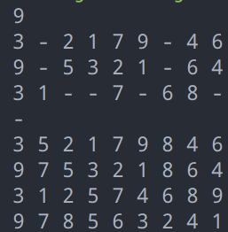
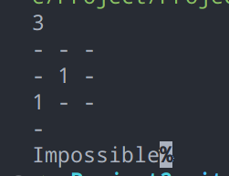

# Project 2 Normal Tree Traversals

> Name: YunfanLi
>
> ID: 3200102555
>
> Date: 2022-10-29


## Chapter 1: Introduction

> Given the partial results of a binary tree's traversals in in-order, pre-order, and post-order. You are supposed to output the complete results and the level order traversal sequence of the corresponding tree.
>
> Input Specification:
>
> Each input file contains one test case. For each case, a positive integer *N* (≤100) is given in the first line. Then three lines follow, containing the incomplete in-order, pre-order and post-order traversal sequences, respectively. It is assumed that the tree nodes are numbered from 1 to *N* and no number is given out of the range. A `-` represents a missing number.
>
> Output Specification:
>
> For each case, print in four lines the complete in-order, pre-order and post-order traversal sequences, together with the level order traversal sequence of the corresponding tree. The numbers must be separated by a space, and there must be no extra space at the beginning or the end of each line. If it is impossible to reconstruct the unique tree from the given information, simply print `Impossible`.

We access some partial traversals of the tree with the form of in-order, pre-order and post-order. We are going to recover the tree from the input information.

## Chapter 2: Algorithm Specification

The problem can be divided into two questions: 

First, how to judge if the input data can recover a unique tree and get it.

Second, how to print the tree in level-order

### 1 Judge and Recover

#### Judge

To optimize our algorithm, we can first rule out some apparently unlikely cases.

1. The number of missing numbers > 1

   If the number of missing numbers > 1, that is to say, in each of the 3 input lists, there are more than 2 `-`. It's obviously that we can't get a unique tree. Because the order of missing numbers is not sure, for example:
   ```
   3
   - - -
   - 1 -
   1 - -
   ```

    In this situation, there are many possible cases for the in-order traversal, so we can't get a unique tree from it.

2. The root is uncertain
   If the root is uncertain, we can't get a unique tree. The most common case is that the first number of the pre-order travresal and the last number of the post-order traversal are both unknown. In this case, we can hardly to know which number the root is, unless the missing number is the same number and can be reasoned out.
   For example: 

   ```
   9
   3 - 2 1 7 9 - 4 6
   - - 5 3 2 1 - 6 4
   3 1 - - 7 - 6 8 -
   
   ```

   In this case, we can never know the root is what, so it's impossible to get the tree.

3. The frequency is not reasonable
   If the frequency of a number is not reasonable, it's easily to be ruled out. For example, the number `1` appears 4 times in the 3 lists, it's impossible so we can rule it out.

So, we use an array `frequency[N]` to record the frequency of each number. After inputing, we calculate the frequency of each number, is the frequency of one number is `0`, the count number of missing numbers `miss` + 1. If `miss > 1`, we output `impossible`. And if the frequency of one number `> N`, we also output `impossible`.

#### Recover

First we need to know how to get a tree from its in-order traversal and one of pre-order/post-order traversal.

Assume we have such two lists:

```
in-order:	3 5 2 1 7 9 8 4 6
pre-order:	9 7 5 3 2 1 8 6 4
```

It's obviously that the root is `9` because pre-order traversal begins from the root. Then, we find `9` in in-order travresal.

```
in-order:	3 5 2 1 7 9 8 4 6
			- - - - - ↑ * * *
pre-order:	9 7 5 3 2 1 8 6 4
			↑ - - - - - * * *
```

Above we assign the left subtree with `-`, the right subtree with `*`, then we can do these steps recursively. 

```
left subtree
in-order:	3 5 2 1 7
			- - - - ↑
pre-order:	7 5 3 2 1
			↑ - - - -
```

Step by step, we can get the whole tree.

The code:

```c
//from the in list and pre list to make the tree
//h1 is the head of in list
//h2 is the head of pre list
//l is the length of list
tnode *makenode(int h1,int h2, int l)
{
    if(!l)
        return NULL;
    tnode *p= newnode(fpre[h2]);
    int i;
    for(i=h1;;i++)
        if(fin[i]==p->data)break;
    int l1=i-h1;
    int l2=l-1-l1;
    p->left=makenode(h1,h2+1,l1);
    p->right=makenode(i+1,h2+l1+1,l2);
    return p;
}
```

#### Completion

There is still a trouble: the given lists are partial! So we need to complete them. The algorithm is like follows:

1. We assume ` inorder[0]` is the root, and compare it with `preorder[0]` and `postorder[N]`.
2. If they don't equal, try the second, third, ... , N-th, until it matches.
3. If some numbers are missing, we record them as `missnum`. If `miss==1`, that is to say there is exactly one missing number, and it is the number we are finding, so put it in the final version of the 3 lists: `fin`, `fpre` and `fpost`.
4. If the three numbers all appears once in each traversal, put it in the corresponding location in `fin`, `fpre` and `fpost`.
5. Do these steps recursively until the 3 final lists are filled out.

The code:

```c
//test if test case in each order is valid
//h1 is the head of test case of in-order
//h2 is the head of test case of pre-order
//h3 is the head of test case of post-order
//l is the length of test case
int test(int h1,int h2,int h3,int l)
{
    if(l==0)    return 1;
    for(int l1=0;l1<l;l1++)
    {
        int l2=l-1-l1;
        int n1=0,n2=0,n3=0,cnt=0;
        if(in[h1+l1]>0)
            n1=in[h1+l1],cnt++;
        if(pre[h2]>0)
            n2=pre[h2],cnt++;
        if(post[h3+l-1]>0)
            n3=post[h3+l-1],cnt++;
        if((n1*n2!=0&&n1!=n2)||(n1*n3!=0&&n1!=n3)||(n2*n3!=0&&n2!=n3))
            continue;

        missnum=max(n1,n2,n3);
        if(cnt==0)//n1,n2,n3 is all '-'
        {
            if(miss==0)
                continue;
            if(miss==1)//n1,n2,n3 is exactly the missed number
            {
                fin[h1+l1]=missnum;
                fpre[h2]=missnum;
                fpost[h3+l-1]=missnum;
                miss--;
            }
        }
        else
        {
            if(cnt!=frequency[missnum-1])
                continue;
            fin[h1+l1]=missnum;
            fpre[h2]=missnum;
            fpost[h3+l-1]=missnum;
        }
        int flag1=test(h1,h2+1,h3,l1);
        int flag2=test(h1+l1+1,h2+l1+1,h3+l1,l2);
        if(!cnt)
            miss=1;
        if(flag1&&flag2)
            return 1;
    }
    return 0;
}
```

### 2 Print the Tree in Level-Order

To print the tree in level-order, we can use `queue`. The algorithm is:

1. If the root is `NULL`, return
2. If the root is not `NULL`
   1. push the root into the queue
   2. If the queue is not empty
      1. pop the head node of the queue
      2. if the head node has a left kid, push the left
      3. if the head node has a right kid, push the right

The code:

```c
//print a tree in level-order
void printlevel(tree t)
{
    int curcnt=0;
    int nextcnt=0;
    int cnt=0;
    struct queue* q=initqueue();
    push(q,t);
    curcnt++;
    tnode* p;
    while(p=pop(q))    
    {
        curcnt--;
        if(cnt<N-1)
        {
            cnt++;
            printf("%d ",p->data);
        }
        else
            printf("%d",p->data);
        if(p->left)
        {
            push(q,p->left);
            nextcnt++;
        }
        if(p->right)
        {
            push(q,p->right);
            nextcnt++;
        }
        if(curcnt==0)
        {
            curcnt=nextcnt;
            nextcnt=0;
        }
    }
}
```

## Chapter 3: Testing Results





## Chapter 4: Analysis and Comments

#### Time Complexity

To calculate the worst complexity, we ignore the optimization.

For the completion part, the time complexity in the first cycling part is O(N) and it's a recursive function with about 2*N times recursion, and the recursion calls a mini-version of the function. The whole time complexity is O(N+2NlogN)=O(NlogN).

For the print part, the time complexity is O(N*4)=O(N).

#### Space Complexity

With these simple data structures, it's easy to see the space complexity is O(N).