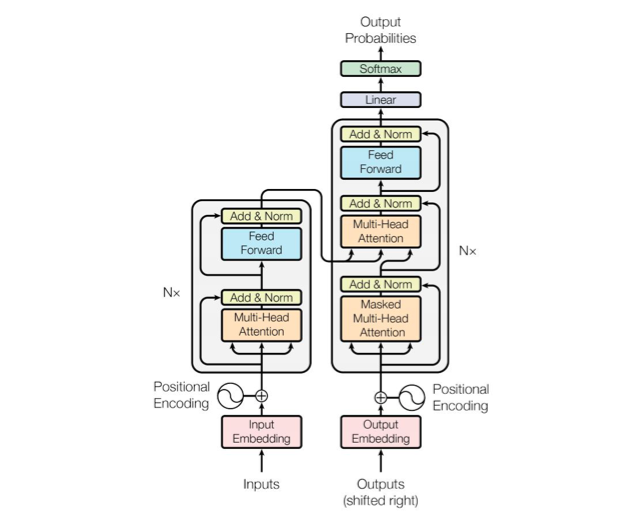
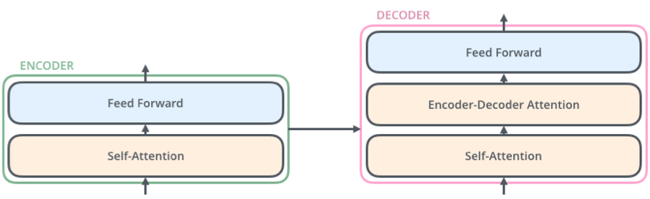
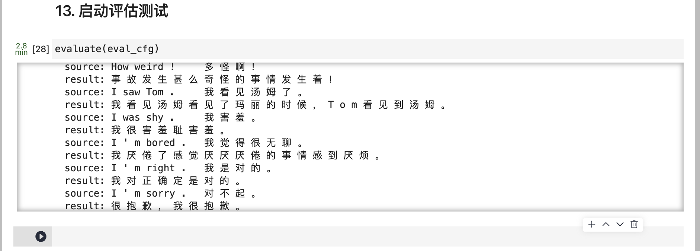

# Transformer 中英文翻译实验

> 学号：3200102555
>
> 专业班级：计科2006
>
> 姓名：李云帆
>
> 性别：男

## Project Introduction

### 选题

使用Transformer模型进行中英文翻译实验

### 工作简介

Transformer 是谷歌的研究人员提出的一种全新的模型，Transformer 在被提出之后，很快就席卷了整个自然语言处理领域。与循环神经网络等传统模型不同，Transformer 模型仅仅使 用一种被称作自注意力机制的方法和标准的前馈神经网络，完全不依赖任何循环单元或者卷积 操作。自注意力机制的优点在于可以直接对序列中任意两个单元之间的关系进行建模，这使得长距离依赖等问题可以更好地被求解。本节实验将探索 Transformer 在机器翻译任务中的应 用，实验将使用华为自研的 MindSpore 框架实现基于 Transformer 的中英文翻译。

### 开发环境

ModelArts Ascend Notebook 环境，MindSpore1.1.1

## Technical Details

### 理论知识

Transformer网络如下图所示, 左边为编码网络, 右边为解码网络

### 算法

每一个编码器在结构上都是一样的，但它们的权重参数是不同的。每一个编码器里面，可 以分为 2 层(Self-Attention 层、前馈神经网络)。输入编码器的文本数据，首先会经过一个 Self Attention 层，这个层处理一个词的时候，不仅会使用这个词本身的信息，也会使用句子 中其他词的信息(可以类比为:当我们翻译一个词的时候，不仅会只关注当前的词，也会关注 这个词的上下文的其他词的信息)。接下来，Self Attention 层的输出会经过前馈神经网络。 同理，解码器也具有这两层，但是这两层中间还插入了一个 Encoder-Decoder Attention 层， 这个层能帮助解码器聚焦于输入句子的相关部分(类似于 seq2seq 模型 中的 Attention)。

### 技术细节

1. 数据处理函数`data_prepare(cfg, eval_idx)`
    - `cfg`: 是一个配置对象，包含了数据准备过程中的各种设置和参数
    - `eval_idx`: 是一个表示评估样本索引的列表或集合，用于确定哪些样本将被用作评估数据，而不是训练数据。该列表或集合中的索引值与输入文件中的行数对应
2. 训练函数`train(cfg)`
    - 加载训练数据集，使用指定的批大小和数据文件路径。
    - 创建带有损失函数的 Transformer 网络对象 `netwithloss`，根据配置 `cfg` 和 Transformer 网络配置 `transformer_net_cfg` 进行初始化。
    - 如果指定了检查点路径 `cfg.checkpoint_path`，则加载检查点中的参数到 `netwithloss` 中。
    - 根据配置中的学习率调度表和训练数据集大小等参数，创建学习率张量 `lr`。
    - 创建 Adam 优化器对象 `optimizer`，并传入 `netwithloss` 中可训练的参数和学习率。
    - 定义回调函数列表 `callbacks`，其中包括 `TimeMonitor` 和 `LossCallBack`，用于监控训练时间和损失值。如果启用了保存检查点的功能 `cfg.enable_save_ckpt`，则还包括 `ModelCheckpoint` 回调用于保存检查点。
    - 如果启用了混合精度训练 `cfg.enable_lossscale`，则创建动态损失缩放管理器 `scale_manager`，并获取损失缩放更新算子 `update_cell`。将 `netwithloss` 和优化器 `optimizer` 传入 `TransformerTrainOneStepWithLossScaleCell`，并使用损失缩放更新算子初始化 `netwithgrads`。
    - 否则,  `netwithloss`和优化器 `optimizer` 传入 `TransformerTrainOneStepCell`，初始化 `netwithgrads`。
    - 将训练模式设置为 True，并使用 `netwithgrads` 创建模型对象 `model`。
    - 调用模型的 `train` 方法，传入训练的总轮数 `cfg.epoch_size`、训练数据集和回调函数列表 `callbacks`，并指定是否启用数据下沉模式 `cfg.enable_data_sink`。
    - 开始训练过程，模型会根据指定的轮数迭代训练数据集，并在每个轮次结束后执行回调函数来进行监控和保存检查点等操作。

## Experiment Result

## References

1. slides
2. 机器翻译实验手册

