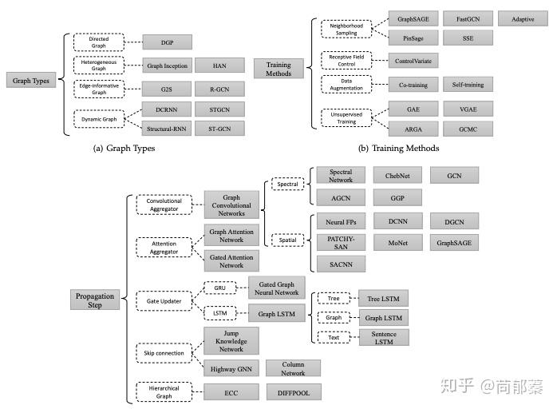
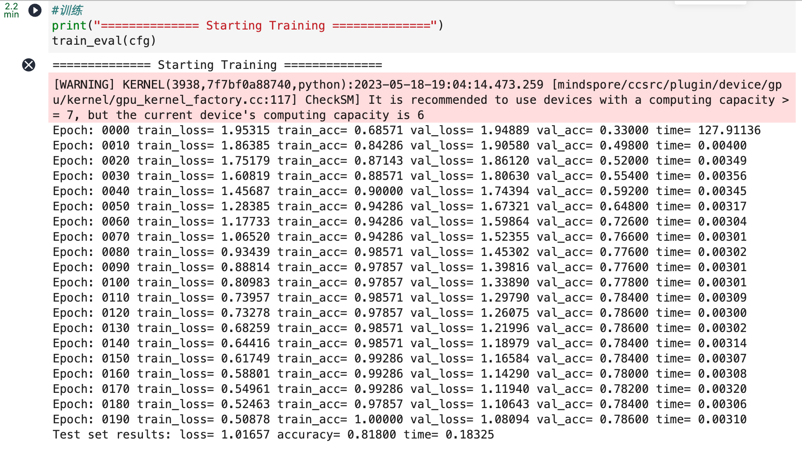

# 图神经网络实验

> 学号：3200102555
>
> 专业班级：计科2006
>
> 姓名：李云帆
>
> 性别：男

## Project Introduction

### 选题

- 了解图神经网络相关知识
- 了解如何使用MindSpore搭建并训练图神经网络

### 工作简介

图卷积网络(Graph Convolutional Network，GCN)是近年来逐渐流行的一种神经网络结构。 不同于只能用于网格结构(grid-based)数据的传统网络模型 LSTM 和 CNN，图卷积网络能够处理 具有广义拓扑图结构的数据，并深入发掘其特征和规律。

本实验主要介绍在下载的 Cora 和 Citeseer 数据集上使用 MindSpore 进行图卷积网络的训练。

### 开发环境

ModelArts Ascend Notebook 环境，MindSpore1.1.1

## Technical Details

### 理论知识

GCN 的本质目的就是用来提取拓扑图的空间特征。图卷积神经网络主要有两类，一类是基于 空间域(spatial domain)或顶点域(vertex domain)的，另一类则是基于频域或谱域(spectral domain)的。GCN 属于频域图卷积神经网络。

### 算法

空间域方法直接将卷积操作定义在每个结点的连接关系上，它跟传统的卷积神经网络中的卷积 更相似一些。在这个类别中比较有代表性的方法有 Message Passing Neural Networks(MPNN), GraphSage, Diffusion Convolution Neural Networks(DCNN), PATCHY-SAN 等。

频域方法希望借助图谱的理论来实现拓扑图上的卷积操作。从整个研究的时间进程来看:首先 研究 GSP(graph signal processing)的学者定义了 graph 上的傅里叶变化(Fourier Transformation)，进而定义了 graph 上的卷积，最后与深度学习结合提出了 Graph Convolutional Network(GCN)。

### 技术细节

- `train_eval(args_opt)`:
    - 接受包含各种超参数的对象`args_opt`
    - 首先设置随机数生成器的种子
    - 加载数据集的邻接矩阵, 特征矩阵和标签矩阵
    - 使用`get_mask()`函数将数据集分成训练, 验证和测试集
    - 使用给定的超参数初始化GCN模型
    - 将模型包装在`LossAccuracyWrapper`(计算模型在验证集和测试集上的损失和准确性)和`TrainNetWrapper`(在训练集训练模型)中
    - 然后, 训练模型一定数量的`epochs`并打印出各种信息

## Experiment Result

## References

1. [知乎-一文读懂图卷积GCN](https://zhuanlan.zhihu.com/p/89503068)
2. Slides on class
3. 图神经网络实验手册