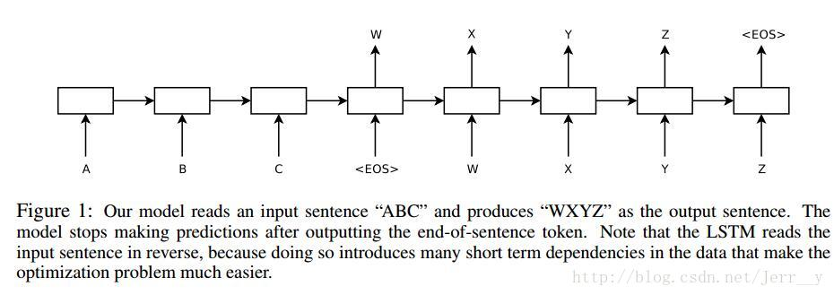
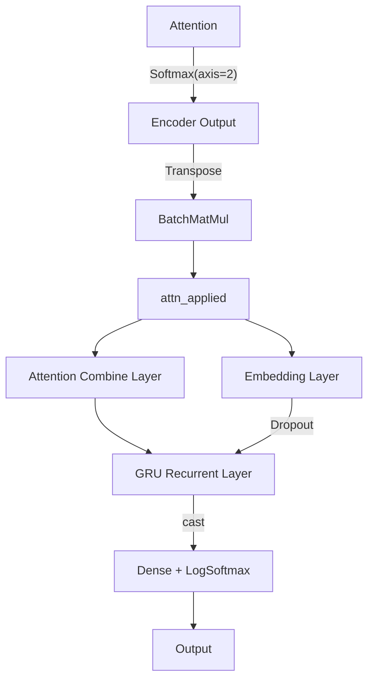
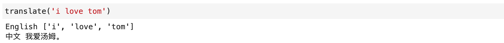

# 中英文翻译

> 学号：3200102555
>
> 专业班级：计科2006
>
> 姓名：李云帆
>
> 性别：男

## Project Introduction

### 选题

本实验选题为基于Seq2Seq编码器-解码器框架的简单中英文翻译

### 工作简介

GRU(门递归单元)是一种递归神经网络算法, RNN Encoder-Decoder由两个递归神经网络组成, 为了提高翻译任务的效果, 还参考了"神经网络的序列到序列学习"和"联合学习对齐和翻译的神经机器翻译".

### 开发环境

ModelArts Ascend Notebook

## Technical Details

### 理论知识

Seq2Seq解决问题的主要思路是通过深度神经网络模型(常用的是LSTM，长短记忆网络，一种循环神经网络). 将一个作为输入的序列映射为一个作为输出的序列，这一过程由编码（Encoder）输入与解码（Decoder）输出两个环节组成, 前者负责把序列编码成一个固定长度的向量，这个向量作为输入传给后者，输出可变长度的向量。

### 算法

由上图所示，在这个模型中每一时间的输入和输出是不一样的，比如对于序列数据就是将序列项依次传入，每个序列项再对应不同的输出。比如说我们现在有序列“A B C EOS” （其中EOS＝End of Sentence，句末标识符）作为输入，那么我们的目的就是将“A”，“B”，“C”，“EOS”依次传入模型后，把其映射为序列“W X Y Z EOS”作为输出。

### 技术细节

#### 思考题1

在这段代码中，3*hidden_size 表示每个门控单元内部的权重矩阵的列数，其中hidden_size是GRU单元中隐藏状态向量的维度。具体而言，GRU单元中有三个门控单元（更新门，重置门和新候选状态门），每个门控单元的内部包括一个输入权重矩阵和一个隐藏状态权重矩阵。因此，3*hidden_size是为了在每个门控单元中合并这两个权重矩阵。在该实现中，GRU单元的输入和输出维度都是hidden_size，因此输入权重矩阵和隐藏状态权重矩阵的列数都是3*hidden_size。

#### 思考题2

## Experiment Result

完成训练后, 能够成功翻译例句

## References

1. [基于seq2seq模型的自然语言处理应用](https://dataxujing.github.io/seq2seqlearn/)
2. Slides by NLP course

