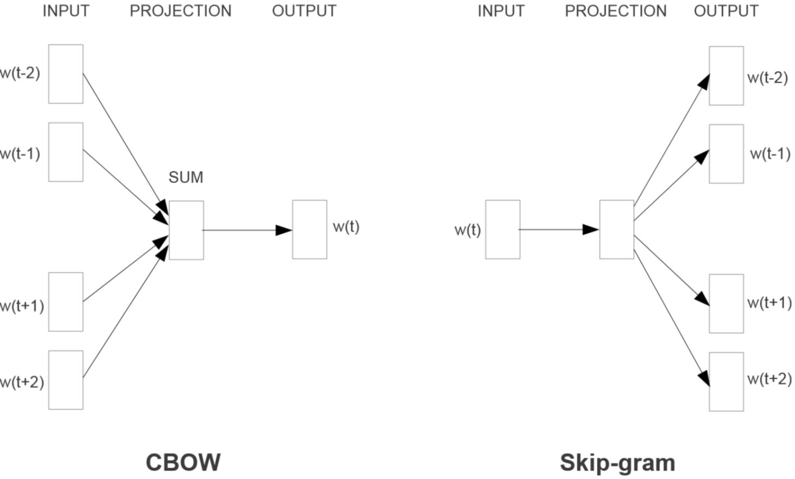
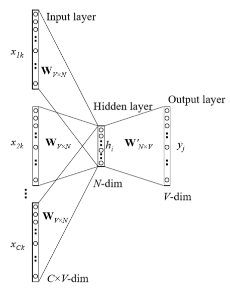
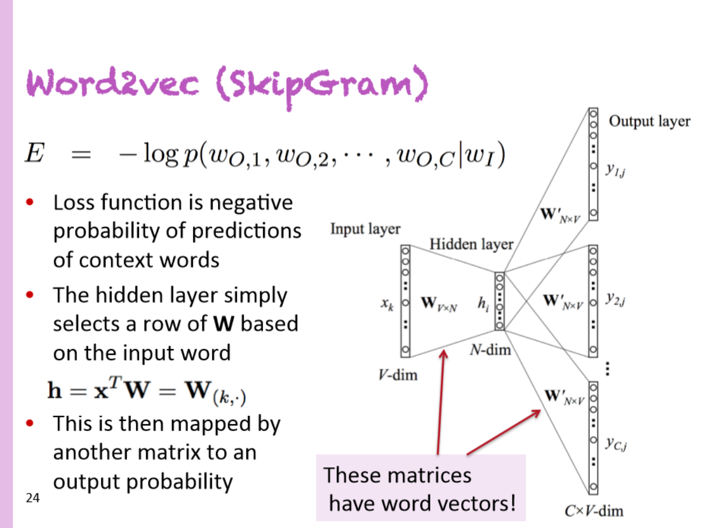
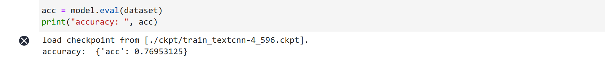
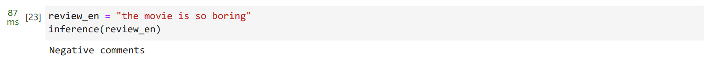

# 词向量和文本分类

> 学号：3200102555
>
> 专业班级：计科2006
>
> 姓名：李云帆
>
> 性别：男

## Project Introduction

### 选题

本实验选题为简单的词向量和文本分类

### 工作简介

#### 词向量

Word2vec是Google开源的一款词向量计算工具， 可以在百万数量级的词典和上亿的数据及上进行高效训练；该工具训练得到的词向量可以很好地度量词与词之间的相似性，其背后是一个浅层神经网络，包含CBWO和Skip-gram模型

#### 文本分类

文本分类指将一个文档归类到一个或多个类别中的自然语言处理任务。该实验将帮助我们理解文本分类的基本流程，理解CNN网络在文本任务中的用法，并掌握MindSpore搭建文本分类模型的方法。

### 开发环境

实验环境：ModelArts Ascend Notebook

实验镜像： mindspore1.2.0-openmpi2.1.1-ubuntu18.04

硬件规格：CPU 2核 8GB

## Technical Details

### 理论知识

#### 词向量

基于Word2Vec对文本进行训练以得到词向量，背后是一个包含CBWO和Skip-gram模型的浅层神经网络，避免了传统的one-hot编码导致的维数灾难



##### CBOW

- input layer输入的X是单词的one-hot representation（考虑一个词表V，里面的每一个词$\omega _i$都有一个编号i∈{1,...,|V|}，那么词$\omega _i$的one-hot表示就是一个维度为|V|的向量，其中第i个元素值非零，其余元素全为0，例如： $\omega _2=[0,1,0,...,0]^T$ ）；
- 输入层到隐藏层之间有一个权重矩阵W，隐藏层得到的值是由输入X乘上权重矩阵得到的（细心的人会发现，0-1向量乘上一个矩阵，就相当于选择了权重矩阵的某一行，如图：输入的向量X是[0，0，1，0，0，0]，W的转置乘上X就相当于从矩阵中选择第3行[2,1,3]作为隐藏层的值）;
- 隐藏层到输出层也有一个权重矩阵W'，因此，输出层向量y的每一个值，其实就是隐藏层的向量点乘权重向量W'的每一列，比如输出层的第一个数7，就是向量[2,1,3]和列向量[1，2，1]点乘之后的结果；
- 最终的输出需要经过softmax函数，将输出向量中的每一个元素归一化到0-1之间的概率，概率最大的，就是预测的词。

其目标函数为
$$
L=max\ log\ p(\omega|Context(\omega)) \\
=max\ log\ (y_j^*) \\
= max\ log(\frac{exp(u_j^*)}{\sum exp(u_k)})
$$
输出层通过softmax归一化，u代表的是输出层的原始结果。通过下面公式，我们的目标函数可以转化为现在这个形式
$$
a^{loga(N)}=N
$$

$$
max\ log(\frac{exp(u_j^*)}{\sum exp(u_k)})=max\ u_j^*-log\sum^V_{k=1}exp(u_k)
$$




##### Skip-gram

Skip-gram model是通过输入一个词去预测多个词的概率。输入层到隐藏层的原理和simple CBOW一样，不同的是隐藏层到输出层，损失函数变成了C个词损失函数的总和，权重矩阵W'还是共享的。



#### 文本分类

基于卷积神经网络的方法，对句子进行向量化，将问题转化成监督学习问题

### 算法

#### 词向量

主要是使用Word2Vec进行模型训练，训练完毕后利用得到的模型获取指定词语的词向量和与其相似词语，具体细节参考2.1.1节

#### 文本分类

分为数据预处理和CNN网络构建。先用`text2Vec()`函数将句子转化为向量，建立一个三层CNN网络，将向量与句子标签传入该网络进行训练，最后进行情感分类

### 技术细节

#### `Word2Vec()`

| 依赖库        | `gensim.models`                     |
| ------------- | ----------------------------------- |
| 基本功能      | 输入文本训练，返回单词对应的词向量  |
| **参数**      |                                     |
| `ventor_size` | 训练后词向量的维度                  |
| `window`      | 当前词语与预测词语的最大间隔        |
| `min_count`   | 忽略词频小于该参数的词语            |
| `wokers`      | 线程数量                            |
| `sg`          | `sg=0`表示CBOW，`sg=1`表示Skip-gram |

#### `learning_rate`参数设置(思考题)

使用了向下取整的函数并分成`warm_up`,`shrink`,`normal_run`三个阶段，比例基本为1：3：2

## Experiment Result

### 词向量

在训练完成之后，调用`word2vec_model['中国']`得到了如下词向量

```python
array([-3.8262066e-01,  3.6900055e-01,  1.7220733e-01, -6.2153381e-01,
        3.2340926e-01,  1.0257052e-01,  5.2909875e-01,  4.9314278e-01,
        6.0178035e-01, -2.0604615e-01, -8.0281913e-02, -3.5762420e-01,
       -1.0810469e+00, -1.8754329e-01, -2.7066544e-01,  1.9044794e-01,
        3.0754489e-01, -7.7079999e-01,  2.9866738e-02, -8.4611766e-02,
        4.4927716e-01, -2.0483971e-02,  5.2416819e-01, -4.2393988e-01,
       -7.4873960e-01, -1.0163812e-01, -2.1294914e-01,  1.6102780e-01,
        3.5855930e-02, -4.8191774e-01,  3.5703504e-01, -2.2510275e-01,
        3.3144853e-01, -2.2085534e-01, -5.5224989e-02,  7.8712635e-02,
        8.4850031e-01,  3.7615001e-01, -4.2020053e-01,  5.5271381e-01,
        5.5445760e-01, -4.6311289e-01, -2.6916564e-01, -2.9155161e-02,
        2.3412612e-01, -2.6824297e-02,  1.4858472e-02,  1.7548274e-01,
        3.0235067e-01,  6.1964488e-01,  5.7303224e-02,  9.5035592e-03,
       -1.6977894e-01, -1.3770676e-01, -5.8175641e-01, -4.3714720e-01,
        4.8753035e-01, -1.4316455e-01, -1.1012106e-01,  4.4568516e-02,
        2.7770680e-01, -2.3914053e-01,  1.5408207e-02,  4.3975726e-01,
       -3.4982836e-01,  4.3386871e-01, -1.5230513e-01,  2.3944563e-01,
       -3.7827155e-01,  2.4020717e-01, -4.0942264e-01, -1.8685220e-01,
        7.5519526e-01, -2.2482926e-01, -2.2941682e-01, -5.7356036e-03,
        6.1374331e-01, -1.5464538e-01,  3.9306182e-01, -4.2882764e-01,
       -2.6589611e-01,  4.6416649e-01,  9.4216049e-02, -4.7018465e-02,
       -3.6621952e-01, -4.0771365e-01,  3.2518011e-01,  1.1612503e-01,
        8.1811273e-01, -3.7903446e-01,  4.6865815e-01, -5.8988098e-04,
        7.4484932e-01,  5.5270058e-01,  5.3328156e-01, -3.2835022e-01,
       -1.2428906e-01,  1.3485001e-01,  3.5866502e-01,  1.8612376e-01],
      dtype=float32)
```

说明训练成功，得到了100维的词向量，进一步测试其他词语及其相似词语，输入

```python
testwords = ['金融','喜欢','中国','北京']
for word in testwords:
    res = word2vec_model.most_similar(word)
    print(word)
    print(res)
```

得到结果

```python
金融
[('金融市场', 0.7761741876602173), ('金融服务', 0.7731616497039795), ('信贷', 0.7720150947570801), ('房地产', 0.7634698748588562), ('证券期货', 0.7551789283752441), ('投资银行', 0.7546207308769226), ('国际贸易', 0.7539786696434021), ('银行学', 0.7482176423072815), ('期货交易', 0.745599627494812), ('国际金融', 0.7381957769393921)]
喜欢
[('讨厌', 0.7358648777008057), ('喝酒', 0.7056314945220947), ('吃喝', 0.7048804759979248), ('小孩子', 0.68824702501297), ('嗜好', 0.6878019571304321), ('精力充沛', 0.6816744208335876), ('抽烟', 0.6756998300552368), ('没够', 0.6752409934997559), ('多才多艺', 0.6742578744888306), ('打猎', 0.6728730201721191)]
中国
[('大陆', 0.6924487352371216), ('中华人民共和国', 0.640859067440033), ('越南政府', 0.6299550533294678), ('辛巴威', 0.6248103380203247), ('中国香港', 0.6192492246627808), ('布基纳法索', 0.6191232204437256), ('吉尔吉斯斯坦', 0.6186144351959229), ('肯尼亚', 0.6098217964172363), ('几内亚比绍', 0.6093594431877136), ('古巴共和国', 0.6083632707595825)]
北京
[('天津', 0.7791717648506165), ('上海', 0.7504433393478394), ('南京', 0.7466044425964355), ('沈阳', 0.6860700249671936), ('大连', 0.6607014536857605), ('佳兆业', 0.6456036567687988), ('淘宝', 0.644607424736023), ('毅腾', 0.6398069262504578), ('奥组委', 0.6394296288490295), ('河南建业', 0.6387919783592224)]
```

说明训练很成功

### 文本分类

训练完毕之后，准确率为0.76953125，使用例句`the movie is boring`进行测试，可以得到`Negative comments`的结论，训练成功





## References

1. [深入浅出Word2Vec原理解析 - Microstrong的文章 - 知乎]( https://zhuanlan.zhihu.com/p/114538417)
2. [Warmup预热学习率的使用-CSDN](https://blog.csdn.net/sinat_36618660/article/details/99650804)
3. Slides of nlp course