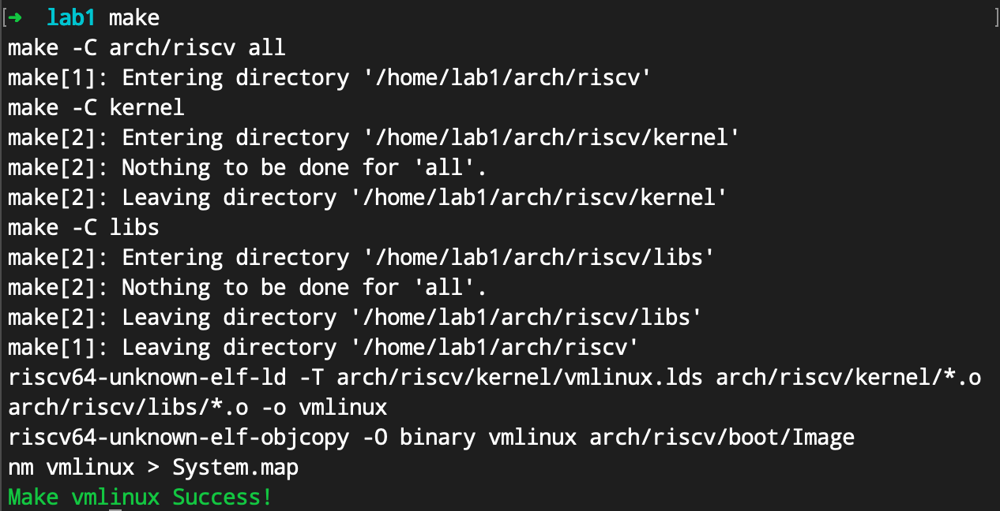
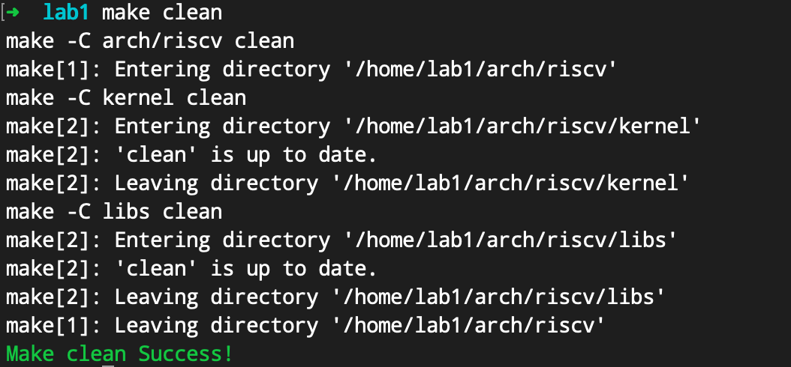

# Lab 1: RV64 内核引导

## 1 实验目的


学习 RISC-V 相关知识，了解 OpenSBI 平台，实现 sbi 调用函数，封装打印函数，并利用 Makefile 来完成对整个工程的管理。


## 2 实验内容及要求


- 阅读 RISC-V 中文手册，学习 RISC-V 相关知识

- 学习 Makefile 编写规则，补充 Makefile 文件使得项目成功运行

- 了解 OpenSBI 的运行原理，编写代码通过 sbi 调用实现字符串的打印

## 3 实验步骤

### 3.1 搭建实验环境（10%）

```
# 首先请在本地新建一个目录用作映射需要
$ mkdir lab1

# 创建新的容器，同时建立 volume 映射
$ docker run -it -v /path/to/your/local/dir:/home/oslab/lab1 oslab:2022 /bin/bash
oslab@3c1da3906541:~$
```


**请在此处添加一张你执行 Docker 映射的命令及结果截图：**


### 3.2 了解项目框架，编写 MakeFile（20%）


#### 3.2.1 编写 Makefile 文件


本实验提供的代码框架结构如图，你可以点击[📎lab1.zip](https://yuque.zju.edu.cn/attachments/yuque/0/2022/zip/25434/1662738216670-3405e47c-675f-41f7-bce5-e9b220450ad8.zip) 进行下载。


```
.
├── arch
│   └── riscv
│       ├── boot
│       ├── include
│       │   ├── print.h
│       │   ├── sbi.h
│       │   └── test.h
│       ├── kernel
│       │   ├── head.S
│       │   ├── main.c (需修改数字为学号)
│       │   ├── Makefile
│       │   ├── sbi.c (需通过内联汇编实现sbi调用)
│       │   ├── test.c
│       │   └── vmlinux.lds
│       ├── libs
│       │   ├── Makefile (需补充完整 Makefile 使项目正确编译)
│       │   └── print.c (需编写字符串打印函数及数字打印函数)
│       └── Makefile
├── include
│   └── defs.h
└── Makefile
```


1. 首先，请下载相关代码，并移动至你所建立的本地映射文件夹中。
2. 接下来请你参考【附录A.Makefile介绍】学习 Makefile 的基本知识。
3. 阅读项目中所有的 Makefile 文件，确保你理解了 Makefile 文件中每一行的作用（一些参数配置等不做要求）。


**注意：在** **`Lab1/Makefile`** **中已经帮助你预定义好了文件的** **`include`** **地址，编译参数等等，你再编写下面的 Makefile 的时候是需要用到的，如果不知道如何使用，请阅读代码框架里面所有的 Makefile 文件（有参考），仔细做了解。**

**
**

> Makefile 部分是需要大家自己学习的，请务必阅读附录部分提供的教程，这里简单讲一下本项目的 Makefile 结构，最外层的 Makefile 定义了一些基础变量以供使用，包括本项目使用的编译器，编译的参数，头文件所在路径，另外定义了一些基本的编译目标，如 all，vmlinux，run，debug，其中 vmlinux 就是编译出 vmlinux 这个本项目用的程序， run 则是编译出的基础上再运行，debug 则是编译出的基础上以 debug 模式运行（即 Lab 0 中介绍的调试内核部分）在编译 vmlinux 的时候，最外层 Makefile 会跳转到内层的一些 Makefile 去执行，内层的 Makefile 文件干的事情基本就是把各文件夹的 .c 文件编译成 .o 文件。都编译好再跳转回根目录的 Makefile ，然后把所有 .o 文件编译成一个整体的可执行文件。编译链接是什么请搜索 C 编译链接详解。实验不做要求，但实验对 Makefile 有要求。 


请补充完整 `./arch/riscv/libs/Makefile` 文件使得整个项目能够顺利编译，最后，将你的代码补充在下方的代码框中。

```makefile
C_SRC     = $(sort $(wildcard *.c))
OBJ		    = $(patsubst %.S,%.o,$(ASM_SRC)) $(patsubst %.c,%.o,$(C_SRC))
all: $(OBJ)

%.o:%.c
	$(CC) $(CFLAG) -c $<

clean:
	$(shell rm *.o 2>/dev/null)
```


**你需要确保** **`make`** **指令和** **`make clean`** **指令均可正常运行，如果运行成功会显示绿色的 Success 字样提示。**





### 3.3 学习 RISC-V 相关知识及特权架构


后续实验中将持续使用 RISC-V 指令集相关的内容，请参考【附录B.RISC-V指令集】了解相关知识，**下载并认真阅读 [RISC-V 手册](https://yuque.zju.edu.cn/os/lab/hrw3u8#MVG2f)，****掌握基础知识、基本命令及特权架构相关内容。**


### 3.4 通过 OpenSBI 接口实现字符串打印函数（60%）


#### 3.4.1 程序执行流介绍


对于本次实验，我们选择使用 OpenSBI 作为 bios 来进行机器启动时 m 模式下的硬件初始化与寄存器设置，并使用 OpenSBI 所提供的接口完成诸如字符打印等操作。


请参考【附录B.OpenSBI介绍】了解 OpenSBI 平台的功能及启动方式，参考【附录D. Linux Basic】了解`vmlinux.lds`、`vmlinux` 的作用，理解执行 `make run` 命令时程序的执行过程。


```
# make run 依赖 vmlinux
# 因此，他首先会编译目标 vmlinux 然后执行 lab1/Makefile 中的该行命令
@qemu-system-riscv64 -nographic --machine virt -bios default -device loader,file=vmlinux,addr=0x80200000 -D log
```


QEMU 模拟器完成从 ZSBL 到 OpenSBI 阶段的工作，本行指令使用 -bios default 选项将 OpenSBI 代码加载到 0x80000000 起始处，并在 OpenSBI 初始化完成后，跳转到 0x80200000 处。因此，我们还需要将自己编译出的 `vmlinux` 程序加载至地址 0x80200000 处。


`vmlinux.lds` 链接脚本就可以帮助我们完成这件事情。它指定了程序的内存布局，最先加载的 `.text.init` 段代码为 `head.S` 文件的内容，该部分代码会执行调用 `main()` 函数。`main()` 函数调用了两个打印函数，打印函数通过 `sbi_call()` 向 OpenSBI 发起调用，完成字符的打印。


#### 3.4.2 编写 sbi_call() 函数（20%）


当系统处于 m 模式时，对指定地址进行写操作便可实现字符的输出。但我们编写的内核运行在 s 模式**（因为我们使用了 OpenSBI 帮助我们初始化，所以初始化完成开始执行我们写好的代码的时候，已经处于 s 模式了）**，需要使用OpenSBI 提供的接口，让运行在 m 模式的 OpenSBI 帮助我们实现输出。即，运行在 s 模式的内核通过调用 `ecall`  指令（汇编级指令）发起 sbi 调用请求，接下来 RISC-V CPU 会从 s 态跳转到 m 态的 OpenSBI 固件中。


执行 `ecall` 前需要指定 sbi 调用的编号，传递的参数。一般而言：

- `a6` 为 SBI 调用 `Function ID` 编号
- `a7` 为 SBI 调用 `Extension ID` 编号
- `a0`、`a1` 、`a2` 、`a3` 、`a4` 、`a5` 寄存器存放 SBI 的调用参数，不同的函数对于传递参数要求也不同。


简单来讲，你可以认为我们需要填好 `a0` 到 `a7` 这些寄存器的值，调用 `ecall` 后，OpenSBI 会根据这些值做相应的处理。以下是一些常用的函数表。


| Function Name                        | Function ID | Extension ID |
| ------------------------------------ | ----------- | ------------ |
| sbi_set_timer （设置时钟相关寄存器） | 0           | 0x00         |
| sbi_console_putchar （打印字符）     | 0           | 0x01         |
| sbi_console_getchar （接收字符）     | 0           | 0x02         |
| sbi_shutdown （关机）                | 0           | 0x08         |


你需要编写内联汇编语句以使用 OpenSBI 接口，本实验给出的函数定义如下：（注意：本实验是 64 位 riscv 程序，这意味着我们使用的寄存器都是 64 位寄存器）


```
typedef unsigned long long uint64_t;
struct sbiret {
  uint64_t error;
  uint64_t value;
};

struct sbiret sbi_call(uint64_t ext, uint64_t fid, uint64_t arg0, uint64_t arg1,
                       uint64_t arg2, uint64_t arg3, uint64_t arg4,
                       uint64_t arg5);
```


在该函数中，你需要完成以下内容：


- 将 ext (Extension ID) 放入寄存器 a7 中，fid (Function ID) 放入寄存器 a6 中，将 arg0 ~ arg5 放入寄存器 a0 ~ a5 中。
- 使用 ecall 指令。ecall 之后系统会进入 M 模式，之后 OpenSBI 会完成相关操作。
- OpenSBI 的返回结果会存放在寄存器 a0 ， a1 中，其中 a0 为 error code， a1 为返回值， 我们用 sbiret  结构来接受这两个返回值。


请参考【附录C.内联汇编】相关知识，以内联汇编形式实现 `lab1/arch/riscv/kernel/sbi.c` 中的 `sbi_call()` 函数。

**
**

**注意：如果你在内联汇编中直接用到了某寄存器（比如本函数必然要直接使用 a0~a7 寄存器），那么你需要在内联汇编中指出，本段代码会影响该寄存器，如何指出请参考【附录C】，如果不加声明，编译器可能会将你声明的要放到寄存器里的变量，放到你直接使用的寄存器内，可能引发意想不到的错误**。


最后，请将你编写好的 `sbi_call` 函数复制到下面代码框内。


```c
// lab1/arch/riscv/kernel/sbi.c

#include "defs.h"

struct sbiret sbi_call(uint64_t ext, uint64_t fid, uint64_t arg0, uint64_t arg1,
                       uint64_t arg2, uint64_t arg3, uint64_t arg4,
                       uint64_t arg5) {
  struct sbiret ret;
   __asm__ volatile(
      "mv a7, %[ext]\n"
	    "mv a6, %[fid]\n"
      "mv a0, %[arg0]\n"
      "mv a1, %[arg1]\n"
	    "mv a2, %[arg2]\n"
      "mv a3, %[arg3]\n"
      "mv a4, %[arg4]\n"
      "mv a5, %[arg5]\n"
	    "ecall\n"
      "mv %[err_code], a0\n"
     	"mv %[ret_val], a1\n"
  	  : [ret_val] "=r" (ret.value),[err_code]"=r"(ret.error)
  	  : [ext] "r" (ext), [fid] "r" (fid),[arg0] "r" (arg0), [arg1] "r" (arg1), [arg2] "r" (arg2),[arg3] "r" (arg3),[arg4] "r" (arg4), [arg5] "r" (arg5)
  	  : "memory","a0","a1","a2","a3","a4","a5","a6","a7"
   );
  return ret;
}
```


#### 3.4.3 编写字符串打印函数（40%）


现在你已经有了一个 C 语言层面的 `sbi_call` 接口函数，因此，后面的代码中，你只需要调用这个接口函数即可，并不需要再写汇编代码。


本节，你需要在 `./arch/riscv/libs/print.c` 文件中通过调用 `sbi_call()` 实现字符串打印函数 `int puts(char* str)` 及数字打印函数 `int put_num(uint64_t n)`，后者可将数字转换为字符串后调用前者执行。（注意处理边界 n = 0 的情况）


提示：上节已经给出了你一个 OpenSBI 调用函数表，具体使用方法可参考[OpenSBI 文档](https://github.com/riscv/riscv-sbi-doc/blob/master/riscv-sbi.adoc#function-listing-1)。为了利用 OpenSBI 接口打印字符，我们需要向 `sbi_call()` 函数传入 `ext=1, fid=0` 以调用 `sbi_console_putchar(int ch)` 函数，之后，第一个参数 `arg0` 需要传入待打印字符的 ASCII 码，其余没有用到的参数可直接设为0。


最后，请将你编写好的函数复制到下面代码框内。


```c
#include "defs.h"
extern struct sbiret sbi_call(uint64_t ext, uint64_t fid, uint64_t arg0,
                              uint64_t arg1, uint64_t arg2, uint64_t arg3,
                              uint64_t arg4, uint64_t arg5);

int puts(char *str) {
  // your code
  do{
		sbi_call(1,0,(uint64_t)*str,0,0,0,0,0);
		str = str + 1;	
	}while (*str != '\0');
  return 0;
}

int put_num(uint64_t n) {
  // your code
  char str[100];
	char ustr[100];
	int m;
	int i = 0;
	int j = 0;
	do{
		m = n%10;
		n = n/10;
		ustr[i] = '0'+m;
		i++; 
	}while (n != 0);
	for (i = i - 1; i >= 0; i--){
		str[j] = ustr[i];
		j++;
	}
	str[j] = '\0';
	puts(str);
  return 0;
}
```


### 3.5 编译及测试


在 `lab1/arch/riscv/kernel/main.c` 中将 `21922192` 修改为你的学号，在项目最外层输入 `make run` 命令调用 Makefile 文件完成整个工程的编译及执行。


**如果编译失败，及时使用`make clean`命令清理文件后再重新编译。**

***\*默认的 Makefile 为你提供了\**** `***\*make debug\****` **命令，你可以用此命令以 debug 模式启动程序，此时程序会在入口停下，你可以参照 Lab 0 的方式使用 gdb + target remote :1234 的方式连接并进行调试。**


如果程序能够正常执行并打印出相应的字符串及你的学号，则实验成功。预期的实验结果如下。


【注意：由于代码最后有死循环，所以输出完成后整个进程不会自动退出，你需要手动 Ctrl+a，x 来退出 QEMU 模拟器】

请在此附上你的实验结果截图。


## 4 讨论和心得

1. 一开始对于内联汇编的形式不是很理解,后来经过对例子的学习和在网上进行资料查询之后,明白了内联汇编的使用方式及其优点
2. 对于makefile的书写, 发现其具有高度的对称性和统一性,在熟练掌握之后使用非常方便, 在大型工程的管理调试上具有很高的效率