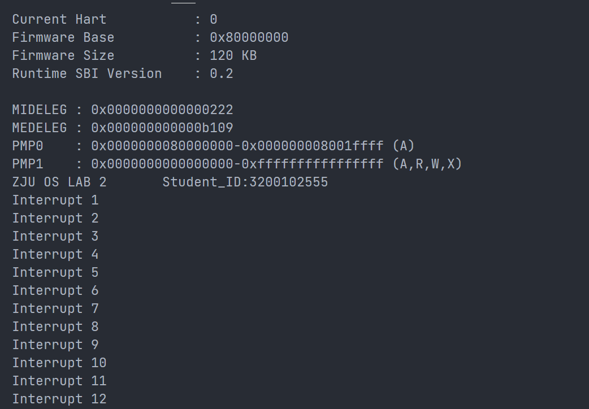

# Lab 2: RV64 时钟中断处理

## 1 实验目的


以时钟中断为例学习在 RISC-V 上的异常处理相关机制。


## 2 实验内容及要求


- 理解 RISC-V 异常委托与异常处理机制
- 利用 OpenSBI 平台的 SBI 调用触发时钟中断，并通过代码设计实现定时触发时钟中断的效果


请各小组独立完成实验，任何抄袭行为都将使本次实验判为0分。


**请跟随实验步骤完成实验并根据文档中的要求记录实验过程，最后删除文档末尾的附录部分**，并命名为“**学号1_姓名1_学号2_姓名2_lab2.pdf**"，你的代码请打包并命名为“**学号1_姓名1_学号2_姓名2_lab2**"，文件上传至学在浙大平台。


## 3 实验步骤


### 3.1 搭建实验环境，理解实验执行流程


请同学们认真阅读 [RISC-V中文手册](https://www.yuque.com/imm/XlE5Gl4VFTeHBxfAeUwUXA%3D%3D%7Ceq21wbOJYMaU%2BSwn87A5xTj8A6RrThodjzKMrnJRLDFJVQKSJ2nqQDYAWOiHBWWZqSVEOdpLf%2FWQOhlGuXDlLw%3D%3D?x-yuque-pt-cb=&x-yuque-pt-expires=1662886493767&x-yuque-pt-id=57390&x-yuque-pt-signature=Vkdo5QBS7YAuZzbmTF%2F32zKnp1Y%3D)** 中的【第十章 RV32/64 特权架构】**，对异常及特权模式进行一个系统性的了解，与本实验相关的内容已总结至附录中，可按顺序阅读。


本次实验的目标是**定时触发时钟中断并在相应的中断处理函数中输出相关信息**。


代码实现逻辑如下：


- 在初始化阶段，设置 CSR 寄存器以允许 S 模式的时钟中断发生，利用 SBI 调用触发第一次时钟中断。
- SBI 调用触发时钟中断后，OpenSBI 平台自动完成 M 模式时钟中断处理，并触发 S 模式下的时钟中断，接下来会进入程序设置好的（汇编级）中断函数中。中断函数保存寄存器现场后会调用（C 语言级）中断处理函数。
- 在中断处理函数中打印相关信息，并设置下一次时钟中断，从而实现定时（每隔一秒执行一次）触发时钟中断并打印相关信息的效果。函数返回后恢复寄存器现场，调用 S 模式异常返回指令 sret 回到发生中断的指令。


对应到程序流程中：

1. 各类 init 函数：允许中断，开启时钟中断，设置第一次时钟中断，设置中断处理函数的地址。
1. trap_s 函数：保存寄存器，进入 handler_s 函数处理中断
1. handler_s 函数：判断是否是时钟中断，是就设置下一次时钟中断并输出信息。
1. 下一次时钟中断触发，再次回到 2


为了完成实验，需要同学们在 `init.c` 中设置 CSR 寄存器允许时钟中断发生，在 `clock.c` 中写设置时钟中断开启和下一次时钟中断发生时间的函数，最后在 `entry.S` 及 `trap.c` 中编写中断处理函数。


#### 3.1.1 创建容器，映射文件夹


你可以复用 Lab 1 中映射好的文件夹，也可以重新创建一个容器做映射。


#### 3.1.2 理解组织文件结构


你可以点击 [Lab 2_ 代码.zip](https://yuque.zju.edu.cn/attachments/yuque/0/2022/zip/25434/1662827402220-aa8ee78b-2ded-4ade-8084-3c982ceb8cd6.zip?_lake_card=%7B%22uid%22%3A%221662827402043-0%22%2C%22src%22%3A%22https%3A%2F%2Fyuque.zju.edu.cn%2Fattachments%2Fyuque%2F0%2F2022%2Fzip%2F25434%2F1662827402220-aa8ee78b-2ded-4ade-8084-3c982ceb8cd6.zip%22%2C%22name%22%3A%22Lab+2_+%E4%BB%A3%E7%A0%81.zip%22%2C%22size%22%3A16103%2C%22type%22%3A%22application%2Fzip%22%2C%22ext%22%3A%22zip%22%2C%22progress%22%3A%7B%22percent%22%3A99%7D%2C%22status%22%3A%22done%22%2C%22percent%22%3A0%2C%22id%22%3A%22geip6%22%2C%22card%22%3A%22file%22%7D) 下载代码，项目代码结构如下所示。


```c
Lab2
├──  arch
│  └──  riscv
│     ├──  boot
│     ├──  kernel
│     │  ├──  clock.c
│     │  ├──  entry.S
│     │  ├──  head.S
│     │  ├──  init.c
│     │  ├──  main.c
│     │  ├──  Makefile
│     │  ├──  print.c
│     │  ├──  sbi.c
│     │  ├──  trap.c
│     │  └──  vmlinux.lds
│     └──  Makefile
├──  include
│  ├──  defs.h
│  ├──  riscv.h
│  └──  test.h
└──  Makefile
```


**首先请同学们参照自己 Lab 1 中写的代码补充完整 `print.c` 以及 `sbi.c` 中的 `sbi_call()` 函数。**


#### 3.3.3 修改必要文件


裸机程序从 `.text` 段起始位置执行，所以需要利用 `vmlinux.lds` 中 `.text` 段的定义来确保 `head.S` 中的 `.text` 段被放置在其他 `.text` 段之前。这可以通过重命名来解决。


首先将 `head.S` 中的 `.text` 命名为 `.text.init`：


```asm
<<<<< before
.section .text
============
.section .text.init
>>>>> after
```


接下来将 `entry.S` 中的 `.text` 命名为 `.text.entry`：


```asm
<<<<< before
.section .text
============
.section .text.entry
>>>>> after
```


然后修改 `vmlinux.lds` 文件中的 `.text` 展开方式：


```asm
<<<<< before 
.text : {
		*(.text)
		*(.text.*)
	 }
============
.text : {
		*(.text.init)
		*(.text.entry)
		*(.text)
		*(.text.*)
	 }
>>>>> after
```


**如果你没有理解这段代码为什么这样修改，请重新阅读 Lab 1 文档中【附录 D】部分的说明。**
**
### 3.2 编写 init.c 中的相关函数（20%）


首先，我们需要开启 S 模式下的中断总开关，需要对以下寄存器进行设置：


1. 设置 `stvec` 寄存器。`stvec` 寄存器中存储着 S 模式下发生中断时跳转的地址，我们需要编写相关的中断处理函数，并将地址存入 `stvec` 中。
1. 将 `sstatus` 寄存器中的 `sie` 位打开。`sstatus[sie]` 位为 S 模式下的中断总开关，这一位为 1 时，才能响应中断。


#### 3.2.1 编写 `intr_enable()`/`intr_disable()`


这两个函数的作用如下注释。你需要使用 CSR 命令设置 `sstatus[sie]` 的值。本实验中在 `riscv.h` 文件中为你提供了一些宏定义，可以方便的使用 CSR 指令。当然，你也可以自行通过内联汇编实现。


> 提示：你需要根据 [RISC-V中文手册](https://www.yuque.com/imm/XlE5Gl4VFTeHBxfAeUwUXA%3D%3D%7Ceq21wbOJYMaU%2BSwn87A5xTj8A6RrThodjzKMrnJRLDFJVQKSJ2nqQDYAWOiHBWWZqSVEOdpLf%2FWQOhlGuXDlLw%3D%3D?x-yuque-pt-cb=&x-yuque-pt-expires=1662886493767&x-yuque-pt-id=57390&x-yuque-pt-signature=Vkdo5QBS7YAuZzbmTF%2F32zKnp1Y%3D)** 中的【第十章 RV32/64 特权架构】**中的内容确定 sstatus 寄存器的 sie 位是第几位，从而为该位赋 1。


**请在下方代码框中补充完整你的代码：**


```c
void intr_enable(void) {
  // 设置 sstatus[sie] = 1, 打开 s 模式的中断开关
  // your code
  write_csr(sstatus, 2);
}

void intr_disable(void) {
  // 设置 sstatus[sie] = 0, 关闭 s 模式的中断开关
  // your code
  clear_csr(sstatus,2);
}
```

**请对你的代码做简要解释：**
答：sstatus[2]为sie位, 于是要将 0b00...010写入sstatus, 即sstatus=2; 要关闭中断开关, 需要设置其为0, 即status&= (~2)


#### 3.2.2 编写 `idt_init()`


该函数需要你向 `stvec` 寄存器中写入中断处理后跳转函数的地址，在本实验中，我们的中断处理函数是 `trap_s` 这个函数。


> 提示：C 语言中，可以使用取地址符和函数名，获取函数的地址。


**请在下方代码框中补充完整你的代码：
**


```c
void idt_init(void) {
  extern void trap_s(void);
  // 向 stvec 寄存器中写入中断处理后跳转函数的地址
  // your code
  write_csr(stvec,&trap_s);
}
```


### 3.3 编写 `clock.c` 中的相关函数（30%）


我们的时钟中断需要利用 OpenSBI 提供的 `sbi_set_timer()` 接口触发，**向该函数传入一个时刻，OpenSBI 在那个时刻将会触发一次时钟中断**。


我们需要“**每隔若干时间就发生一次时钟中断**”，但是 OpenSBI 提供的接口一次只能设置一个时钟中断事件。本实验采用的方式是：一开始设置一个时钟中断，之后每次发生时钟中断的时候，在相应的中断处理函数中设置下一次的时钟中断。这样就达到了每隔一段时间发生一次时钟中断的目的。


对于代码而言，在文件 `clock.c` 中：

- `clock_init()` 函数将会启用时钟中断并设置第一个时钟中断
- `clock_set_next_event()` 用于调用 OpenSBI 函数 `set_sbi_timer()` 设置下一次的时钟中断时间。
- `get_cycles()` 函数是已经为你提供好的函数。其通过 `rdtime` 伪指令读取一个叫做 `time` 的 CSR 寄存器数值，表示 CPU 启动之后经过的真实时间。


#### 3.3.1 修改时钟中断间隔


QEMU 中外设晶振的频率为 10mhz，即每秒钟 `time` 的值将会增大 。我们可以据此来计算每次 `time` 的增加量，以控制时钟中断的间隔。**

为了使得每次时钟中断的间隔为 1 秒，`timebase`（即`time`的增加量）需要设置为？
答：10000000


#### 3.3.2 编写 `clock_init()`

**请根据注释在下方代码框中补充完整你的代码：**


```c
void clock_init(void) {
  puts("ZJU OS LAB 2       Student_ID:3200102555\n");
  write_csr(sie,0b100000);
  // 设置第一个时钟中断
  // sbi_set_timer(get_cycles());
  ticks++;
  sbi_call(0,0, get_cycles(),0,0,0,0,0);
 
}
```


#### 3.3.3 编写 `clock_set_next_event()`


> 提示：你需要调用 OpenSBI 提供的接口 `sbi_set_timer()` ，你需要通过 Lab 1 中编写好的 sbi_call 函数调用他。该函数对应的 Function ID 为 0，Extension ID 也为 0，接收一个参数 (arg0)，表示触发时钟中断的时间点。


**请根据注释在下方代码框中补充完整你的代码：**


```c
void clock_set_next_event(void) {
  // 获取当前 cpu cycles 数并计算下一个时钟中断的发生时刻
  // 通过调用 OpenSBI 提供的函数设置下一次的时钟中断时间
  // your code
  ticks++;
  sbi_call(0,0, get_cycles()+timebase,0,0,0,0,0);
}

```


### 3.4 编写并调用中断处理函数（50%）


#### 3.4.1 在 `entry.S` 中编写中断处理函数（30%）


在【3.1】中，我们向 `stvec` 寄存器存入了中断处理函数的地址，中断发生后将自动进行硬件状态转换，程序将读取 `stvec` 的地址并进行跳转，运行 `trap_s` 函数。该函数该函数需要在栈中保存 `caller saved register` 及 `sepc` 寄存器，读取 `scause` 这个 CSR 寄存器并作为参数传递给 `handle_s` 函数进行中断处理，调用返回后需要恢复寄存器并使用 `sret` 命令回到发生中断的指令。


> **提示**：你可以参考 [RISC-V中文手册](https://www.yuque.com/imm/XlE5Gl4VFTeHBxfAeUwUXA%3D%3D%7Ceq21wbOJYMaU%2BSwn87A5xTj8A6RrThodjzKMrnJRLDFJVQKSJ2nqQDYAWOiHBWWZqSVEOdpLf%2FWQOhlGuXDlLw%3D%3D?x-yuque-pt-cb=&x-yuque-pt-expires=1662886493767&x-yuque-pt-id=57390&x-yuque-pt-signature=Vkdo5QBS7YAuZzbmTF%2F32zKnp1Y%3D) 3.2 节相关内容完成实验；本实验中寄存器大小为 8 字节；需要使用 CSR 命令操作 CSR 寄存器；若不清楚 `caller saved register` ，也可将寄存器全都保存；对汇编语言不是特别了解的建议把中文手册读一遍，或在网上自行学习汇编语言基本的函数调用约定知识。


**请根据注释在下方代码框中补充完整你的代码：**


```c
trap_s:
	#save caller-saved registers and spec
	addi sp, sp, -256
    sd x1, 0(sp)
    sd x2, 8(sp)
    sd x3, 16(sp)
    sd x4, 24(sp)
    sd x5, 32(sp)
    sd x6, 40(sp)
    sd x7, 48(sp)
    sd x8, 56(sp)
    sd x9, 64(sp)
    sd x10, 72(sp)
    sd x11, 80(sp)
    sd x12, 88(sp)
    sd x13, 96(sp)
    sd x14, 104(sp)
    sd x15, 112(sp)
    sd x16, 120(sp)
    sd x17, 128(sp)
	sd x18, 136(sp)
	sd x19, 144(sp)
	sd x20, 152(sp)
	sd x21, 160(sp)
	sd x22, 168(sp)
	sd x23, 176(sp)
	sd x24, 184(sp)
	sd x25, 192(sp)
	sd x26, 200(sp)
	sd x27, 208(sp)
	sd x28, 216(sp)
	sd x29, 224(sp)
	sd x30, 232(sp)
	sd x31, 240(sp)
   	csrr t0, sepc
    sd t0, 248(sp)

	# call handler_s(scause)
	csrr a0, scause
    call handler_s
	
	# load sepc and callee-saved registers
    ld t0, 248(sp)
    csrw sepc, t0
    ld x1, 0(sp)
    ld x2, 8(sp)
    ld x3, 16(sp)
    ld x4, 24(sp)
    ld x5, 32(sp)
    ld x6, 40(sp)
    ld x7, 48(sp)
    ld x8, 56(sp)
    ld x9, 64(sp)
    ld x10, 72(sp)
    ld x11, 80(sp)
    ld x12, 88(sp)
    ld x13, 96(sp)
    ld x14, 104(sp)
    ld x15, 112(sp)
    ld x16, 120(sp)
	ld x17, 128(sp)
	ld x18, 136(sp)
	ld x19, 144(sp)
	ld x20, 152(sp)
	ld x21, 160(sp)
	ld x22, 168(sp)
	ld x23, 176(sp)
	ld x24, 184(sp)
	ld x25, 192(sp)
	ld x26, 200(sp)
	ld x27, 208(sp)
	ld x28, 216(sp)
	ld x29, 224(sp)
	ld x30, 232(sp)
	ld x31, 240(sp)
    addi sp, sp, 256
	sret
```

**为什么需要保存 sepc 寄存器：**
答：发生中断时的PC被存入spec, 这样在中断完成之后可以返回中断之前的指令位置


#### 3.4.2 在 `trap.c` 中编写中断处理函数（20%）


正常情况下，异常处理函数需要根据 `[m|s]cause` 寄存器的值判断异常的种类后分别处理不同类型的异常，但在本次实验中简化为只判断并处理时钟中断。


【3.3】中提到，为了实现"定时触发中断"，我们需要在该函数中继续设置下一次的时钟中断。此外，为了进行测试，中断处理函数中还需要打印时钟中断发生的次数，你需要在 `clock.c` 中利用 `ticks` 变量进行统计，请更新【3.3】中相关代码，每设置一次时钟中断，便给 `ticks` 变量加一。


本函数的流程如下：

- 判断是否是中断（可能是中断，可能是异常）
- 判断是否是时钟中断
   - 如果是
      - 设置下一次时钟中断的时间点
      - 打印已经触发过的中断次数


**触发时钟中断时，****`scause`****寄存器的值是？据此填写代码中的条件判断语句：**
答：0x8000000000000005, 最高有效位置1, 低位置5


**请根据注释在下方代码框中补充完整你的代码：**


```c
void handler_s(uint64_t cause) {
  // interrupt
  unsigned long interrupt = 1ll<<63;
  if (cause & interrupt) {
    // supervisor timer interrupt
    if ((cause^interrupt) == 0x5) {
      puts("Interrupt ");
			put_num(ticks);
      puts("\n");
			clock_set_next_event();
      // 设置下一个时钟中断，打印当前的中断数目。
      // your code
    }
  }
}
```

**【同步异常与中断的区别】当处理同步异常时应该在退出前给 `epc` 寄存器+4（一条指令的长度），当处理中断时则不需要，请解释为什么要这样做。（请阅读附录内容）**
答：`mepc`存放着中断或者异常发生时的地址, 处理完同步异常之后应该返回到需要执行的地方实际是下一条指令, 而处理中断时`mepc`已经存储了下一条指令的地址, 故不需要增加


### 3.5 编译及测试


请修改 `clock.c` 中的 `ID:123456`，确保输出自己的学号。仿照 Lab 1 进行运行测试，预期的实验结果为开始时会打印 OSLAB 和 学号，**之后每隔一秒触发一次时钟中断，打印一次时钟中断发生的次数**。

请在此附上你的运行结果截图。
答：

## 4 讨论和心得


在做实验的过程中, 一开始都很顺利, 编译也能正常通过,但是运行的时候一直无法正常输出, 我百思不得其解, 使用gdb调试之后发现程序卡在entry.S中无法跳出,  反而一直循环, 我以为是entry.S出了问题, 因为即使使用ni逐个指令执行, 程序在执行过程中也不曾成功发起调用, 但是后来经过反复尝试我才发现原来是trap.c中的位运算出了问题, 这也是在使用gdb时的一些比较疑惑的地方.
