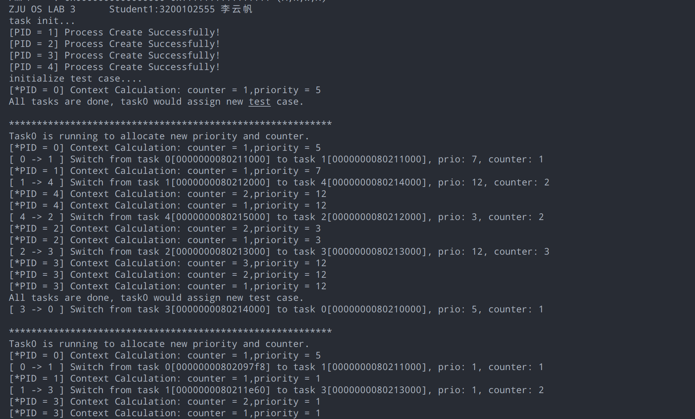

# Lab 3: RV64 进程调度模拟

## 1 实验目的


结合课堂所学习的相关内容，在上一实验实现时钟中断的基础上进一步实现简单的进程调度。


## 2 实验内容及要求


- 理解进程调度与进程切换过程
- 利用时钟中断模拟进程调度实验，实现优先级抢占式算法和短作业优先非抢占式算法


请各小组独立完成实验，任何抄袭行为都将使本次实验判为0分。


**请跟随实验步骤完成实验并根据文档中的要求记录实验过程，最后删除文档末尾的附录部分**，并命名为“**学号1_姓名1_学号2_姓名2_lab3.pdf**"，你的代码请打包并命名为“**学号1_姓名1_学号2_姓名2_lab3**"，文件上传至学在浙大平台。


本实验以双人组队的方式进行，**仅需一人提交实验，**默认平均分配两人的得分（若原始打分为X，则可分配分数为2X，平均分配后每人得到X分）。如果有特殊情况请单独向助教反应，出示两人对于分数的钉钉聊天记录截图。单人完成实验者的得分为原始打分。


| 姓名 | 学号 | 分工 | 分配分数 |
| --- | --- | --- | --- |
| 李云帆 | 3200102555 | solo | 100% |


## 3 实验步骤


### 3.1 环境搭建


#### 3.1.1 建立映射


你可以复用上一次实验中映射好的文件夹，也可以重新创建一个容器做映射。


#### 3.1.2 组织文件结构


你可以从 [Lab 3_ 代码.zip](https://yuque.zju.edu.cn/attachments/yuque/0/2022/zip/25434/1663207909637-335c3985-0ea1-431a-be30-20155aa7fe8f.zip?_lake_card=%7B%22uid%22%3A%221663207909350-0%22%2C%22src%22%3A%22https%3A%2F%2Fyuque.zju.edu.cn%2Fattachments%2Fyuque%2F0%2F2022%2Fzip%2F25434%2F1663207909637-335c3985-0ea1-431a-be30-20155aa7fe8f.zip%22%2C%22name%22%3A%22Lab+3_+%E4%BB%A3%E7%A0%81.zip%22%2C%22size%22%3A22230%2C%22type%22%3A%22application%2Fzip%22%2C%22ext%22%3A%22zip%22%2C%22progress%22%3A%7B%22percent%22%3A99%7D%2C%22status%22%3A%22done%22%2C%22percent%22%3A0%2C%22id%22%3A%22pvYz7%22%2C%22card%22%3A%22file%22%7D) 下载本实验提供好的代码。


```
lab3
├── arch
│   └── riscv
│       ├── kernel
│       │   ├── clock.c
│       │   ├── entry.S
│       │   ├── head.S
│       │   ├── init.c
│       │   ├── main.c
│       │   ├── Makefile
│       │   ├── print.c
│       │   ├── sbi.c
│       │   ├── sched.c
│       │   ├── test.c
│       │   ├── trap.c
│       │   └── vmlinux.lds
│       └── Makefile
├── include
│   ├── defs.h
│   ├── riscv.h
│   ├── sched.h
│   ├── stddef.h
│   ├── stdio.h
│   └── test.h
└── Makefile
```


**首先请阅读【附录A.进程】确保对实验相关知识有基本的了解。**


本实验意在模拟操作系统中的进程调度，实验中将定义结构体模拟进程的资源，利用时钟中断模拟 CPU 时间片以触发调度算法。 程序执行时，首先将 `task[1-4]` 的剩余运行时间设为 0，通过时钟中断处理函数引起第一次调度，`task0` 使用一个时间片运行 `init_test_case()` 函数，根据 `counter_priority` 数组为进程分配相应的时间片与优先级，随后进行进程调度，根据运行结果观察调度算法实现正确性。


代码的总体框架工程文件均已给出，需要修改的部分均已进行了标注，主要包括：


- `entry.s`：
   - `__init_epc`：将 `sepc` 寄存器置为 `test()` 函数。
   - `trap_s`：首先保存当前的寄存器，随后调用 `handle_s` 函数，最后恢复寄存器。
   - `__swtich_to`：需要保存当前进程的执行上下文，再将下一个执行进程的上下文载入到相关寄存器中。
- `sched.c`：
   - `task_init()`：对 `task0`、`task[1-4]` 进行初始化，设置 `current` 变量指示当前执行的进程。
   - `do_timer()`： 在时钟中断处理中被调用，首先会将当前进程的剩余运行时间减少一个单位，之后根据调度算法来确定是继续运行还是调度其他进程来执行。
   - `schedule()`：根据调度算法，考虑所有可运行的进程的优先级和剩余运行时间，按照一定规则选出下一个执行的进程。如果与当前进程不一致，则需要进行进程切换操作。如果当前进程均已执行完毕，为`task0` 新增一个时间片以重新分配优先级和运行时间。
   - `switch_to`：进程切换，更新 `current` 变量，调用 `__switch_to` 函数切换进程的执行上下文。


此外，代码中有部分内容涉及 Lab 2、Lab 1 的内容，这里没有给出具体实现，需要同学们根据之前的代码自行替换，注意文件内容有部分更新，请不要直接替换文件：`init.c` 的 `init()` 函数中有新增 `task_init()` 的调用；`trap.c` 中有更改，中断处理函数中调用了 `do_timer()` 模拟CPU时间片运行；`clock.c` 中 `timebase` 设为 `100000` 以快速获得实验结果。


#### 3.1.3 总体执行流程

1. 打开时钟中断开关，设置中断函数处理地址，设置第一次时钟中断时间，初始化任务的内存空间和结构体。
1. main 函数执行 test 函数，因为此时 current 进程是 task[0]，也就是 pid = 0，test 函数内会设置其他任务的优先级和时间片等等。然后就会死循环，假装在 do some work。
1. 时钟中断发生，进入 trap_s 中断处理函数
1. trap_s 中断处理函数保护寄存器，然后进入 handler_s 处理函数
1. handler_s 判断是否是时钟中断，是的话进入 do_timer
1. do_timer 函数中，任务时间片减减
1. 如果时间片变成0，执行 schedule，选择出来下一个要执行的任务
1. switch_to 函数，更新 current 变量，然后调用 __switch_to 函数，做实际切换操作。
1. __switch_to 函数把当前进程的一些寄存器保存到进程的结构体中，然后读取要切换到的进程的寄存器。
1. 通过 ra 寄存器跳转到目标进程的执行位置处，开始正常执行下一个任务。


### 3.2 sched.c进程调度功能实现（60%）


#### 3.2.1 调度算法切换


本实验需要实现两种调度算法，可以通过宏定义及编译选项`gcc –D`进行控制。


- 修改 `lab3/Makefile` 中的 `CFLAG = ${CF} ${INCLUDE} -DSJF / -DPRIORITY` 以控制实验所采用的调度算法。
   - -DSJF （短作业优先式）。
   - -DPRIORITY （优先级抢占式）。
- 在 `sched.c` 中使用 `#ifdef`，`#endif` 语句来控制进程调度的代码实现。


#### 3.2.2 实现 task_init()（10%）


进程和进程之间，栈是不共用的（否则一切换程序，栈就乱了）。所以每个进程都要有属于自己的栈，每个进程都有一个结构体 `task_struct` 来描述这个进程的一些元信息。这个结构体也要存在一个地方，以免混乱。最后程序需要执行代码，代码也要放到内存的某个地方存放。


因此在本实验中，我们是这样对物理内存区域进行划分的（看下图）。此次实验中我们手动做内存分配，把物理地址空间划分成多个帧(frame)。即，从 `0x80210000` 地址开始，连续地给此次实验的 4 个 Task [1-4] 以及内核栈 Task[0] 做内存分配，我们以 `4KB` 为粒度，按照每个 Task 一帧的形式进行分配，并将 `task_struct` 存放在该帧的低地址部分， 将栈指针 `sp` 指向该帧的高地址。**（请同学按照下图的内存空间分配地址，不要随意修改，否则有可能影响到最终的实验结果）**
**
> 提示：task 数组是一个存储 task_struct 结构体指针的数组，在一般的 C 语言程序编写中会使用 malloc （操作系统或标准库提供） 来分配空间进行存储。但在本实验中，我们直接指定这个 task_struct 的存储位置为 0x80210000，0x80211000.......等对应进程分配好的空间内。


```shell
---------------------------------------------------------------------------
|             |   Task0   |   Task1   |   Task2   |   Task3   |   Task4   |
|   Kernel    |           |           |           |           |           |
|             |   Space   |   Space   |   Space   |   Space   |   Space   |
---------------------------------------------------------------------------
^             ^           ^           ^           ^           ^
0x80200000    0x80210000  0x80211000  0x80212000  0x80213000  0x80214000
```


可将 Task [1-4] 看作是从 0 号进程 (Task [0]) fork 出的子进程，后续实验的实现将主要考虑如何对这四个子进程进行调度。为方便起见，我们将 Task [1-4] 进程均设为 `dead_loop()`（见 `test.c` ），也就是说每个 Task 执行的代码是一样的，这段代码的汇编被放到上图中 Kernel 里面了。


在 `task_init()` 函数中对实验中的进程进行初始化设置：


- 初始化 `current` 与 `task[0]`
   - 设置 `current` 指向 `Task0 Space` 的基地址。
- 设置 `task[0]` 为 `current`。
   - 初始化 `task[0]` 中的成员变量：`state` = TASK_RUNNING；`counter` = 1；`priority` = 5；`blocked` = 0；`pid` = 0。
   - 设置 `task[0]` 的 `thread` 中的 `sp` 指针为 Task0 Space 基地址 + 4KB的偏移。
- 参照 `task[0]` 的设置，对 `task[1-4]` 的成员变量完成初始化设置
   - `counter` =  0
   - `priority` = 5
- 在初始化时，我们需要将 `thread` 中的 `ra` 指向一个初始化函数 `__init_sepc` (entry.S)，在该函数中我们将 `test` 函数地址赋值给 `sepc` 寄存器，详见【3.3.1】。


**请在下方代码框中补充完整你的代码：**


```c
void task_init(void) {
  puts("task init...\n");

  // initialize task[0]
  current = (struct task_struct*)Kernel_Page;
  current->state = TASK_RUNNING;
  current->counter = 0;
  current->priority = 5;
  current->blocked = 0;
  current->pid = 0;
  task[0] = current;
  task[0]->thread.sp = (unsigned long long)task[0] + TASK_SIZE;

  // set other 4 tasks
  for (int i = 1; i <= LAB_TEST_NUM; ++i) {
    /* your code */
    task[i]=(struct task_struct*)(Kernel_Page + i*TASK_SIZE);
    task[i]->state = TASK_RUNNING;
    task[i]->counter=0;
    task[i]->priority=5;
    task[i]->blocked=0;
    task[i]->pid=i;
    task[i]->thread.sp = (unsigned long long) task[i] + TASK_SIZE;
    task[i]->thread.ra = &__init_sepc;

    printf("[PID = %d] Process Create Successfully!\n", task[i]->pid);
  }
  task_init_done = 1;
}
```


#### 3.2.3 短作业优先非抢占式算法实现（20%）


- `do_timer()`
   - 将当前所运行进程的剩余运行时间减少一个单位（`counter--`）
   - 如果当前进程剩余运行时间已经用完，则进行调度，选择新的进程来运行，否则继续执行当前进程。
- `schedule()`
   - 遍历进程指针数组 `task`，从 `LAST_TASK` 至 `FIRST_TASK` (不包括 `FIRST_TASK`，即 task[0])，在所有运行状态(TASK_RUNNING)下的进程剩余运行时间最小的进程作为下一个执行的进程。若剩余运行时间相同，则按照遍历的顺序优先选择。**【注意， 测试代码只赋值了 4 个任务，但 `LAST_TASK` 是 64，遍历的时候注意先判断指针是否为空】**
   - 如果所有运行状态下的进程剩余运行时间都为0，给 `task 0` 分配一个时间片，由其通过`init_test_case()` 函数为其余进程分配剩余运行时间与优先级，重新开始调度。


**请在下方代码框中补充完整你的代码：**


```c
#ifdef SJF
// simulate the cpu timeslice, which measn a short time frame that gets assigned
// to process for CPU execution
void do_timer(void) {
  if (!task_init_done) return;
  if (task_test_done) return;
  printf("[*PID = %d] Context Calculation: counter = %d,priority = %d\n",
         current->pid, current->counter, current->priority);
  // current process's counter -1, judge whether to schedule or go on.
  /* your code */
  current->counter--;
  if(current->counter <= 0)
    schedule();
}

// Select the next task to run. If all tasks are done(counter=0), set task0's
// counter to 1 and it would assign new test case.
void schedule(void) {
  unsigned char next;
  /* your code */
   _Bool allzero = 1;
    next = LAB_TEST_NUM;
    for(int i = LAB_TEST_NUM; i > 0; i--){
        if(task[i]->state == TASK_RUNNING){
            if(task[i]->counter > 0) allzero = 0;
            if((task[next]->counter <= 0 && task[i]->counter > 0) || 
                (task[i]->counter > 0 && task[i]->counter < task[next]->counter))
                next = i;
        }
    }

    if(allzero){
      printf("Current Setting is done, use task0 to initialize a new setting.\n");
      task[0]->counter = 1;
      next = 0;
    } 

  if (current->pid != task[next]->pid) {
    printf(
        "[ %d -> %d ] Switch from task %d[%lx] to task %d[%lx], prio: %d, "
        "counter: %d\n",
        current->pid, task[next]->pid, current->pid,
        (unsigned long)current->thread.sp, task[next]->pid,
        (unsigned long)task[next], task[next]->priority, task[next]->counter);
  }
  switch_to(task[next]);
}

#endif
```


#### 3.2.4 优先级抢占式算法实现（20%）


- `do_timer()`
   - 将当前所运行进程的剩余运行时间减少一个单位（`counter--`）
   - 每次 `do_timer()` 都进行一次抢占式优先级调度。
- `schedule()`
   - 遍历进程指针数组 `task`，从 `LAST_TASK` 至 `FIRST_TASK`(不包括 `FIRST_TASK`)，调度规则如下：
      - 高优先级的进程，优先被运行。
      - 若优先级相同，则选择剩余运行时间少的进程（若剩余运行时间也相同，则按照遍历的顺序优先选择）。
   - 如果所有运行状态下的进程剩余运行时间都为 0，给 `task 0` 分配一个时间片，由其通过 `init_test_case()` 函数为其余进程分配剩余运行时间与优先级，重新开始调度。


**请在下方代码框中补充完整你的代码：**


```c
#ifdef PRIORITY

// simulate the cpu timeslice, which measn a short time frame that gets assigned
// to process for CPU execution
void do_timer(void) {
  if (!task_init_done) return;
  if (task_test_done) return;
  printf("[*PID = %d] Context Calculation: counter = %d,priority = %d\n",
         current->pid, current->counter, current->priority);
  // current process's counter -1, judge whether to schedule or go on.
  /* your code */
  current->counter--;
  schedule();
}

// Select the next task to run. If all tasks are done(counter=0), set task0's
// counter to 1 and it would assign new test case.
void schedule(void) {
  unsigned char next;
  /* your code */
  _Bool allzero = 1;
  next = LAB_TEST_NUM;
  for(int i = LAB_TEST_NUM; i > 0; i--){
      if(task[i]->state == TASK_RUNNING){
          if(task[i]->counter > 0) allzero = 0;
          if(task[i]->priority < task[next]->priority && task[i]->counter > 0) next = i;
    else if((task[next]->counter <= 0 && task[i]->counter > 0)|| (task[i]->priority == task[next]->priority && task[i]->counter < task[next]->counter && task[i]->counter > 0))
              next = i;
      }
  }

  if(allzero){
    printf("Current Setting is done, use task0 to initialize a new setting.\n");
    task[0]->counter = 1;
    next = 0;
  }

  if (current->pid != task[next]->pid) {
    printf(
        "[ %d -> %d ] Switch from task %d[%lx] to task %d[%lx], prio: %d, "
        "counter: %d\n",
        current->pid, task[next]->pid, current->pid,
        (unsigned long)current->thread.sp, task[next]->pid,
        (unsigned long)task[next], task[next]->priority, task[next]->counter);
  }
  switch_to(task[next]);
}

#endif

```


#### 3.2.5 实现 switch_to(struct task_struct* next)（10%）


- 判断下一个执行的进程 `next` 与当前的进程 `current` 是否为同一个进程，如果是同一个进程，则无需做任何处理。如果不一致，则更新 `current` 变量，并调用 `__switch_to(struct task_struct* prev,struct task_struct* next)`(`entry.S`)。


**请在下方代码框中补充完整你的代码：**


```c
#sched.c
//If next==current,do nothing; else update current and call __switch_to.
void switch_to(struct task_struct* next) {
    /*your code*/
    if(next->pid != current->pid){
        struct task_struct* prev = current;
        current = next;
        __switch_to(prev, next);
    }

}
```


### 3.3 实现 entry.s（20%）


#### 3.3.1 在 trap_s 中断处理中添加保存 epc 的指令


当异常发生时，`epc` 寄存器会保存当前的异常返回地址，该地址是与当前 task 相关的。由于 task 会在异常处理中发生调度，所以我们需要在中断处理时保存当前的 `epc`，当中断处理完成之后再载入 `epc`。本实验发生在S 模式，因此使用的是 `sepc` 寄存器，实现同 Lab 2。


#### 3.3.2  实现 __switch_to 函数（10%）


实现切换进程的过程，`a0` 参数为 `struct task_struct* prev`，即切换前进程的地址。 `a1` 参数为 `struct task_struct* next` ，即切换后进程的地址。


> 如果你不知道为什么 `a0` 寄存器和 `a1` 寄存器存储的是这两个参数的话，请参考 [RISC-V中文手册](https://www.yuque.com/imm/XlE5Gl4VFTeHBxfAeUwUXA%3D%3D%7Ceq21wbOJYMaU%2BSwn87A5xTj8A6RrThodjzKMrnJRLDFJVQKSJ2nqQDYAWOiHBWWZqSVEOdpLf%2FWQOhlGuXDlLw%3D%3D?x-yuque-pt-cb=&x-yuque-pt-expires=1662886493767&x-yuque-pt-id=57390&x-yuque-pt-signature=Vkdo5QBS7YAuZzbmTF%2F32zKnp1Y%3D) 第 3.2 节。


该函数需要做以下事情。

- 保存当前的 `ra`， `sp`，`s0~s11` 寄存器到当前进程的 `thread_struct` 结构体中。
- 将下一个进程的 `thread_struct` 的数据载入到 `ra`，`sp`，`s0~s11` 中。


**请在下方代码框中补充完整你的代码：
**


```c
# entry.S
__switch_to:
	li    a4,  40 
	add   a3, a0, a4
	add   a4, a1, a4
	# Save context into prev->thread
	# your code
        sd ra, 0(a3)
        sd sp, 8(a3)
        sd s0, 16(a3)
        sd s1, 24(a3)
        sd s2, 32(a3)
        sd s3, 40(a3)
        sd s4, 48(a3)
        sd s5, 56(a3)
        sd s6, 64(a3)
        sd s7, 72(a3)
        sd s8, 80(a3)
        sd s9, 88(a3)
        sd s10, 96(a3)
        sd s11, 104(a3)

	# Restore context from next->thread
	# your code
        ld ra,0(a4)
		ld sp, 8(a4)
         ld s0, 16(a4)
         ld s1, 24(a4)
         ld s2, 32(a4)
         ld s3, 40(a4)
         ld s4, 48(a4)
         ld s5, 56(a4)
         ld s6, 64(a4)
         ld s7, 72(a4)
         ld s8, 80(a4)
         ld s9, 88(a4)
         ld s10, 96(a4)
         ld s11, 104(a4)
	# return to ra
		ret
```

**为什么要设置前三行汇编指令？**
答：`tast_struct` 的size是 40 bytes ，40也就是成员变量相对于结构体指针的地址偏移。将`a0，a1`加上40便于 修改成员变量。


#### 3.3.3 __init_epc（10%）


```asm
.globl __init_sepc
__init_sepc:
	la  t0, test
	csrw sepc, t0
	sret
```


为什么本实验需要为 Task[0-4] 的 ra 寄存器指定为该函数地址，而不直接指定为 `test` 函数地址呢？这是因为，运行中的进程遇到时钟中断后，需要将当前运行线程的上下文环境保存在自己线程的栈上 ( 本实验中每个进程都有自己的栈，这也是为什么要保存 `sp` 寄存器的原因 )，当线程再次被调度时，再将上下文从栈上恢复。但是对于新创建的、初次被进行调度的任务 ，其栈上还没有可以被 `trap_s` 函数用来恢复上下文的寄存器信息，所以需要为其第一次调度提供一个特殊的返回函数，让他跳过恢复上下文的过程。


具体的方法是，将其任务结构体中的 `ra` 寄存器填写为 `__init_epc` 的地址，这样，在 `__switch_to` 函数返回的时候，就会直接跳转到 `__init_epc` 函数中。而该函数在 `sret` 时返回到 `test()` 函数，也就是进程实际的工作函数中。【相当于我们使用这个函数，在进程第一次被调度时，跳过了时钟中断处理恢复上下文的部分】


这一部分比较绕，需要同学们理解。


**请使用 gdb 调试观察，说明第一个测试用例中，****`task1`**** ****切****换到 ****`task2`****，****`task2`**** ****初****次被调度时的每个函数的运行内容及函数间的跳转过程，并填写完整下面的函数跳转流程。**


答：

- `test` ：task 1 执行中，时钟中断触发
- `trap_s` ：调用时钟中断，保存task1的上下文                     
- `handler_s`：时钟中断处理，进入 do_timer 函数                     _____
- `do_timer`：counter--并根据调度算法和counter进行调度
- `schedule` 找到下一个`TASK_RUNNING`的task，并调用`switch_to`
- `switch_to` -> `__switch_to`: 调用_switch_to保存task1进程，载入下一个task的数据                         
- `__init_sepc`：将 sepc 设置为 test 函数的地址，sret 打开时钟中断，进入 test 函数。
- `trap_s`：又一次时钟中断，保存 task 2 的上下文
- `handler_s`：return                  
- `trap_s`：恢复上下文              
- `test`：task 2 继续执行


### 3.5 编译及测试（20%）


仿照 Lab2 进行编译测试，请对 `main.c` 做修改，确保输出本组成员的学号与姓名。


#### 3.5.1 运行截图（10%）


请使用本实验默认设置的第一个测试用例，使用你的代码运行，并截图。其中，截图必须截到打印的第一行内容，即本组成员的学号与姓名。


请在此附上你的代码运行结果截图。
##### 短作业优先非抢占式算法
答：


##### 优先级抢占式算法
答：


#### 3.5.2 测试用例（10%）


实验验收时将修改 `test.c` 中的 `counter_priority` 数组改变进程的优先级及剩余运行时间，确保代码在不同运行情况下的正确性。


同学们可以自行设置测试用例进行实验以确保代码在边界情况的准确性，请将测试用例按照格式补充在表格中。


##### 短作业优先非抢占式算法


| 测试目标 | 测试用例(counter_priority) | 预期结果 | 实际结果 |
| --- | --- | --- | --- |
| 随机1 | {1,4},{2,5},{3,2},{4,1} | 1>2>3>4 | 1>2>3>4 |
| 随机2 | {5,1},{3,3},{4,1},{2,1} | 4>2>3>1 | 4>2>3>1 |
| 相同剩余运行时间，以遍历顺序执行 | {1,1},{1,1},{1,1},{1,1} | 4>3>2>1 | 4>3>2>1 |
| 剩余运⾏时间为0 | {0,1},{0,1},{0,1},{0,1} | -- | -- |


##### 优先级抢占式算法


| 测试情况 | 测试用例(counter_priority) | 预期结果 | 实际结果 |
| --- | --- | --- | --- |
| 随机1 | {1，4}，{2，5}，{3，2}，{4，1} | 4>1>3>2 | 4>3>1>2 |
| 随机2 | {5,1},{3,3},{4,1},{2,1} | 4>3>1>2 | 4>3>1>2 |
| 存在相同优先级 | {1,1},{3,2},{2,2},{1,2} | 1>4>3>2 | 1>4>3>2 |
| 剩余运⾏时间为0 | {0,1},{0,2},{0,3},{0,4} | -- | -- |


## 4 讨论和心得


请在此处填写实验过程中遇到的问题及相应的解决方式。


由于本实验为新实验，可能存在不足之处，欢迎同学们对本实验提出建议。

