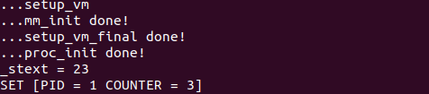

# Lab 4: RV64 虚拟内存管理

## 1 实验目的
* 学习虚拟内存的相关知识，实现物理地址到虚拟地址的切换。
* 了解 RISC-V 架构中 SV39 分页模式，实现虚拟地址到物理地址的映射，并对不同的段进行相应的权限设置。

## 2 实验环境

* Environment in previous labs

## 3 背景知识

### 3.0 前言
在 lab3 中我们赋予了 OS 对多个线程调度以及并发执行的能力，由于目前这些线程都是内核线程，因此他们可以共享运行空间，即运行不同线程对空间的修改是相互可见的。但是如果我们需要线程相互**隔离**，以及在多线程的情况下更加**高效**的使用内存，就必须引入`虚拟内存`这个概念。

虚拟内存可以为正在运行的进程提供独立的内存空间，制造一种每个进程的内存都是独立的假象。同时虚拟内存到物理内存的映射也包含了对内存的访问权限，方便 Kernel 完成权限检查。

在本次实验中，我们需要关注 OS 如何**开启虚拟地址**以及通过设置页表来实现**地址映射**和**权限控制**。

### 3.1 Kernel 的虚拟内存布局

```
start_address           end_address
    0x0                 0x3fffffffff
     │                       │
┌────┘                 ┌─────┘
↓        256G          ↓                                
┌───────────────────────┬──────────┬────────────────┐
│      User Space       │    ...   │  Kernel Space  │
└───────────────────────┴──────────┴────────────────┘
                                    ↑    256G      ↑
                      ┌─────────────┘              │ 
                      │                            │
              0xffffffc000000000          0xffffffffffffffff
                start_address                 end_address
```
通过上图我们可以看到 RV64 将 `0x0000004000000000` 以下的虚拟空间作为 `user space`。将 `0xffffffc000000000` 及以上的虚拟空间作为 `kernel space`。由于我们还未引入用户态程序，目前我们只需要关注 `kernel space`。

具体的虚拟内存布局可以[参考这里](https://elixir.bootlin.com/linux/v5.15/source/Documentation/riscv/vm-layout.rst)。

> 在 `RISC-V Linux Kernel Space` 中有一段区域被称为 `direct mapping area`，为了方便 kernel 可以高效率的访问 RAM，kernel 会预先把所有物理内存都映射至这一块区域 ( PA + OFFSET == VA )， 这种映射也被称为 `linear mapping`。在 RISC-V Linux Kernel 中这一段区域为 `0xffffffe000000000 ~ 0xffffffff00000000`, 共 124 GB 。


### 3.2 RISC-V Virtual-Memory System (Sv39)
#### 3.2.1 `satp` Register（Supervisor Address Translation and Protection Register）
```c
 63      60 59                  44 43                                0
 ---------------------------------------------------------------------
|   MODE   |         ASID         |                PPN                |
 ---------------------------------------------------------------------
```

* MODE 字段的取值如下图：
```c
                             RV 64
     ----------------------------------------------------------
    |  Value  |  Name  |  Description                          |
    |----------------------------------------------------------|
    |    0    | Bare   | No translation or protection          |
    |  1 - 7  | ---    | Reserved for standard use             |
    |    8    | Sv39   | Page-based 39 bit virtual addressing  | <-- 我们使用的mode
    |    9    | Sv48   | Page-based 48 bit virtual addressing  |
    |    10   | Sv57   | Page-based 57 bit virtual addressing  |
    |    11   | Sv64   | Page-based 64 bit virtual addressing  |
    | 12 - 13 | ---    | Reserved for standard use             |
    | 14 - 15 | ---    | Reserved for standard use             |
     -----------------------------------------------------------
```
* ASID ( Address Space Identifier ) ： 此次实验中直接置 0 即可。
* PPN ( Physical Page Number ) ：顶级页表的物理页号。我们的物理页的大小为 4KB， PA >> 12 == PPN。
* 具体介绍请阅读 [RISC-V Privileged Spec 4.1.10](https://www.five-embeddev.com/riscv-isa-manual/latest/supervisor.html#sec:satp) 。

#### 3.2.2 RISC-V Sv39 Virtual Address and Physical Address
```c
     38        30 29        21 20        12 11                           0
     ---------------------------------------------------------------------
    |   VPN[2]   |   VPN[1]   |   VPN[0]   |          page offset         |
     ---------------------------------------------------------------------
                            Sv39 virtual address

```

```c
 55                30 29        21 20        12 11                           0
 -----------------------------------------------------------------------------
|       PPN[2]       |   PPN[1]   |   PPN[0]   |          page offset         |
 -----------------------------------------------------------------------------
                            Sv39 physical address

```
* Sv39 模式定义物理地址有 56 位，虚拟地址有 64 位。但是，虚拟地址的 64 位只有低 39 位有效。通过虚拟内存布局图我们可以发现，其 63-39 位为 0 时代表 user space address， 为 1 时 代表 kernel space address。
* Sv39 支持三级页表结构，VPN[2-0](Virtual Page Number)分别代表每级页表的`虚拟页号`，PPN[2-0](Physical Page Number)分别代表每级页表的`物理页号`。物理地址和虚拟地址的低12位表示页内偏移（page offset）。
* 具体介绍请阅读 [RISC-V Privileged Spec 4.4.1](https://www.five-embeddev.com/riscv-isa-manual/latest/supervisor.html#sec:sv39) 。


#### 3.2.3 RISC-V Sv39 Page Table Entry
```c
 63      54 53        28 27        19 18        10 9   8 7 6 5 4 3 2 1 0
 -----------------------------------------------------------------------
| Reserved |   PPN[2]   |   PPN[1]   |   PPN[0]   | RSW |D|A|G|U|X|W|R|V|
 -----------------------------------------------------------------------
                                                     |   | | | | | | | |
                                                     |   | | | | | | | `---- V - Valid
                                                     |   | | | | | | `------ R - Readable
                                                     |   | | | | | `-------- W - Writable
                                                     |   | | | | `---------- X - Executable
                                                     |   | | | `------------ U - User
                                                     |   | | `-------------- G - Global
                                                     |   | `---------------- A - Accessed
                                                     |   `------------------ D - Dirty (0 in page directory)
                                                     `---------------------- Reserved for supervisor software
```

* 0 ～ 9 bit: protection bits
    * V : 有效位，当 V = 0, 访问该 PTE 会产生 Pagefault。
    * R : R = 1 该页可读。
    * W : W = 1 该页可写。
    * X : X = 1 该页可执行。
    * U , G , A , D , RSW 本次实验中设置为 0 即可。
* 具体介绍请阅读 [RISC-V Privileged Spec 4.4.1](https://www.five-embeddev.com/riscv-isa-manual/latest/supervisor.html#sec:sv39)


#### 3.2.4 RISC-V Address Translation
虚拟地址转化为物理地址流程图如下，具体描述见 [RISC-V Privileged Spec 4.3.2](https://www.five-embeddev.com/riscv-isa-manual/latest/supervisor.html#sv32algorithm) :
```text
                                Virtual Address                                     Physical Address

                          9             9            9              12          55        12 11       0
   ┌────────────────┬────────────┬────────────┬─────────────┬────────────────┐ ┌────────────┬──────────┐
   │                │   VPN[2]   │   VPN[1]   │   VPN[0]    │     OFFSET     │ │     PPN    │  OFFSET  │
   └────────────────┴────┬───────┴─────┬──────┴──────┬──────┴───────┬────────┘ └────────────┴──────────┘
                         │             │             │              │                 ▲          ▲
                         │             │             │              │                 │          │
                         │             │             │              │                 │          │
┌────────────────────────┘             │             │              │                 │          │
│                                      │             │              │                 │          │
│                                      │             │              └─────────────────┼──────────┘
│    ┌─────────────────┐               │             │                                │
│511 │                 │  ┌────────────┘             │                                │
│    │                 │  │                          │                                │
│    │                 │  │     ┌─────────────────┐  │                                │
│    │                 │  │ 511 │                 │  │                                │
│    │                 │  │     │                 │  │                                │
│    │                 │  │     │                 │  │     ┌─────────────────┐        │
│    │   44       10   │  │     │                 │  │ 511 │                 │        │
│    ├────────┬────────┤  │     │                 │  │     │                 │        │
└───►│   PPN  │  flags │  │     │                 │  │     │                 │        │
     ├────┬───┴────────┤  │     │   44       10   │  │     │                 │        │
     │    │            │  │     ├────────┬────────┤  │     │                 │        │
     │    │            │  └────►│   PPN  │  flags │  │     │                 │        │
     │    │            │        ├────┬───┴────────┤  │     │   44       10   │        │
     │    │            │        │    │            │  │     ├────────┬────────┤        │
   1 │    │            │        │    │            │  └────►│   PPN  │  flags │        │
     │    │            │        │    │            │        ├────┬───┴────────┤        │
   0 │    │            │        │    │            │        │    │            │        │
     └────┼────────────┘      1 │    │            │        │    │            │        │
     ▲    │                     │    │            │        │    └────────────┼────────┘
     │    │                   0 │    │            │        │                 │
     │    └────────────────────►└────┼────────────┘      1 │                 │
     │                               │                     │                 │
 ┌───┴────┐                          │                   0 │                 │
 │  satp  │                          └────────────────────►└─────────────────┘
 └────────┘
```

## 4 实验步骤
### 4.1 准备工程
* 此次实验基于 lab3 同学所实现的代码进行。
* 需要修改 `defs.h`, 在 `defs.h` **添加**如下内容：
    ```c
    #define OPENSBI_SIZE (0x200000)
    
    #define VM_START (0xffffffe000000000)
    #define VM_END   (0xffffffff00000000)
    #define VM_SIZE  (VM_END - VM_START)
    
    #define PA2VA_OFFSET (VM_START - PHY_START)
    ```
* 从 `repo` 同步以下代码: `vmlinux.lds.S`, `Makefile`。并按照以下步骤将这些文件正确放置。
    ```
    .
    └── arch
        └── riscv
            └── kernel
                ├── Makefile
                └── vmlinux.lds.S
    ```
    这里我们通过 `vmlinux.lds.S` 模版生成 `vmlinux.lds`文件。链接脚本中的 `ramv` 代表 `VMA ( Virtual Memory Address )` 即虚拟地址，`ram` 则代表 `LMA ( Load Memory Address )`, 即我们 OS image 被 load 的地址，可以理解为物理地址。使用以上的 vmlinux.lds 进行编译之后，得到的 `System.map` 以及 `vmlinux` 采用的都是虚拟地址，方便之后 Debug。

### 4.2 开启虚拟内存映射。
在 RISC-V 中开启虚拟地址被分为了两步：`setup_vm` 以及 `setup_vm_final`，下面将介绍相关的具体实现。

#### 4.2.1 `setup_vm` 的实现
* 将 0x80000000 开始的 1GB 区域进行两次映射，其中一次是等值映射 ( PA == VA ) ，另一次是将其映射至高地址 ( PA + PV2VA_OFFSET == VA )。如下图所示：
  ```text
  Physical Address
  -------------------------------------------
                       | OpenSBI | Kernel |
  -------------------------------------------
                       ^
                  0x80000000
                       ├───────────────────────────────────────────────────┐
                       |                                                   |
  Virtual Address      ↓                                                   ↓
  -----------------------------------------------------------------------------------------------
                       | OpenSBI | Kernel |                                | OpenSBI | Kernel |
  -----------------------------------------------------------------------------------------------
                       ^                                                   ^
                  0x80000000                                       0xffffffe000000000
  ```
* 完成上述映射之后，通过 `relocate` 函数，完成对 `satp` 的设置，以及跳转到对应的虚拟地址。
* 至此我们已经完成了虚拟地址的开启，之后我们运行的代码也都将在虚拟地址上运行。
```c
// arch/riscv/kernel/vm.c

/* early_pgtbl: 用于 setup_vm 进行 1GB 的 映射。 */
unsigned long  early_pgtbl[512] __attribute__((__aligned__(0x1000)));

void setup_vm(void) {
    /* 
    1. 由于是进行 1GB 的映射 这里不需要使用多级页表 
    2. 将 va 的 64bit 作为如下划分： | high bit | 9 bit | 30 bit |
        high bit 可以忽略
        中间9 bit 作为 early_pgtbl 的 index
        低 30 bit 作为 页内偏移 这里注意到 30 = 9 + 9 + 12， 即我们只使用根页表， 根页表的每个 entry 都对应 1GB 的区域。 
    3. Page Table Entry 的权限 V | R | W | X 位设置为 1
    */
    // virtual address = 0x80000000 => VPN[2] = 2
    early_pgtbl[2] = (uint64)(0 | 0x20000000U | 15U);
    // virtual address = 0xffffffe000000000 => VPN[2] = 384
    early_pgtbl[384] = (uint64)(0 | 0x20000000U | 15U);
    printk("...setup_vm done!\n");
}
```
```asm
# head.S

_start:

    call setup_vm
    call relocate

    ...

    j start_kernel

relocate:
    # set ra = ra + PA2VA_OFFSET
    # set sp = sp + PA2VA_OFFSET (If you have set the sp before)

    ###################### 
    #   YOUR CODE HERE   #
    ######################

    # calculate 0xffffffdf80000000 (PA2VA_OFFSET) in t0
    # first turn t0 -> 0x80000000
    addi t0, x0, 1
    slli t0, t0, 31
    # turn t1 -> 0xffffffdf00000000
    lui t1, 0xfffff
    # addi t1, t1, 0xfdf
    addi t1, t1, 0x7ef
    addi t1, t1, 0x7f0
    slli t1, t1, 31
    slli t1, t1, 1
    # t0 = 0xffffffdf00000000 + 0x80000000
    add t0, t0, t1

    add ra, ra, t0 # set ra = ra + PA2VA_OFFSET
    add sp, sp, t0 # set sp = sp + PA2VA_OFFSET

    # set satp with early_pgtbl
    la t2, early_pgtbl
    sub t2, t2, t0
    add t1, x0, t2
    srli t1, t1, 12
    # MODE field = 8
    addi t0, x0, 8
    slli t0, t0, 20
    slli t0, t0, 20
    slli t0, t0, 20
    or t1, t1, t0
    csrw satp, t1

    ###################### 
    #   YOUR CODE HERE   #
    ######################

    # flush tlb
    sfence.vma zero, zero

    ret

    .section .bss.stack
    .globl boot_stack
boot_stack:
    ...
```


> Hint 1: `sfence.vma` 指令用于刷新 TLB
>
> Hint 2: `fence.i` 指令用于刷新 icache
>
> Hint 3: 在 set satp 前，我们只可以使用**物理地址**来打断点。设置 satp 之后，才可以使用虚拟地址打断点，同时之前设置的物理地址断点也会失效，需要删除


#### 4.2.2 `setup_vm_final` 的实现
* 由于 setup_vm_final 中需要申请页面的接口， 应该在其之前完成内存管理初始化， 可能需要修改 mm.c 中的代码，mm.c 中初始化的函数接收的起始结束地址需要调整为虚拟地址。
* 对 所有物理内存 (128M) 进行映射，并设置正确的权限。
  ```text
  Physical Address
       PHY_START                           PHY_END
           ↓                                  ↓
  --------------------------------------------------------
           | OpenSBI | Kernel |               |
  --------------------------------------------------------
           ^                                  ^
      0x80000000                              └───────────────────────────────────────────────────┐
           └───────────────────────────────────────────────────┐                                  |
                                                               |                                  |
                                                            VM_START                              |
  Virtual Address                                              ↓                                  ↓
  ----------------------------------------------------------------------------------------------------
                                                               | OpenSBI | Kernel |               |
  -----------------------------------------------------------------------------------------------------
                                                               ^
                                                       0xffffffe000000000
  ```


* 不再需要进行等值映射
* 不再需要将 OpenSBI 的映射至高地址，因为 OpenSBI 运行在 M 态， 直接使用的物理地址。
* 采用三级页表映射。
* 在 head.S 中 适当的位置调用 setup_vm_final 。
```c
// arch/riscv/kernel/vm.c 

/* swapper_pg_dir: kernel pagetable 根目录， 在 setup_vm_final 进行映射。 */
unsigned long  swapper_pg_dir[512] __attribute__((__aligned__(0x1000)));

void setup_vm_final(void) {
    memset(swapper_pg_dir, 0x0, PGSIZE);

    // No OpenSBI mapping required

    // mapping kernel text X|-|R|V
    create_mapping(...);

    // mapping kernel rodata -|-|R|V
    create_mapping(...);
    
    // mapping other memory -|W|R|V
    create_mapping(...);
    
    // set satp with swapper_pg_dir

    uint64 new_satp = (((uint64)swapper_pg_dir - PA2VA_OFFSET) >> 12);
    new_satp |= 0x8000000000000000;
    // set satp with swapper_pg_dir
    __asm__ volatile("csrw satp, %[base]":: [base] "r" (new_satp):);

    // flush TLB
    asm volatile("sfence.vma zero, zero");
  
    // flush icache
    asm volatile("fence.i")
    return;
}


/* 创建多级页表映射关系 */
create_mapping(uint64 *pgtbl, uint64 va, uint64 pa, uint64 sz, int perm) {
    /*
    pgtbl 为根页表的基地址
    va, pa 为需要映射的虚拟地址、物理地址
    sz 为映射的大小
    perm 为映射的读写权限

    创建多级页表的时候可以使用 kalloc() 来获取一页作为页表目录
    可以使用 V bit 来判断页表项是否存在
    */
        while (sz--) {
        uint64 vpn2 = ((va & 0x7fc0000000) >> 30);
        uint64 vpn1 = ((va & 0x3fe00000) >> 21);
        uint64 vpn0 = ((va & 0x1ff000) >> 12);

        // the second level page (next to root)
        uint64 *pgtbl1;
        if (!(pgtbl[vpn2] & 1)) {
            pgtbl1 = (uint64*)kalloc();
            pgtbl[vpn2] |= (1 | (((uint64)pgtbl1 - PA2VA_OFFSET) >> 2));
        }
        else pgtbl1 = (uint64*)(PA2VA_OFFSET + ((pgtbl[vpn2] & 0x3ffffffffffffc00) << 2));

        // the third level page
        uint64 *pgtbl0;
        if (!(pgtbl1[vpn1] & 1)) {
            pgtbl0 = (uint64*)kalloc();
            pgtbl1[vpn1] |= (1 | (((uint64)pgtbl0 - PA2VA_OFFSET) >> 2));
        }
        else pgtbl0 = (uint64*)(PA2VA_OFFSET + ((pgtbl1[vpn1] & 0x3ffffffffffffc00) << 2));

        // the physical page
        if (!(pgtbl0[vpn0] & 1)) {
            // note the perm only contains infomation about XWR (no V)
            pgtbl0[vpn0] |= (1 | (perm << 1) | (pa >> 2));
        }

        va += 0x1000, pa += 0x1000;
    }
}
```
### 4.3 编译及测试


## 思考题
1. 验证 `.text`, `.rodata` 段的属性是否成功设置，给出截图。
   

   尝试写操作

   ```c
   printk("_stext = %ld\n", *_stext);
   *_stext = 0;
   printk("_srodata = %ld\n", *_srodata);
   ```

   

2. 为什么我们在 `setup_vm` 中需要做等值映射?
   建立三级页表的时候需要在页表里读取页号, 转换成物理地址, 再去访问下一级页表, 如果不等值映射就会内存访问错误

3. 在 Linux 中，是不需要做等值映射的。请探索一下不在 `setup_vm` 中做等值映射的方法。
   ```c
   //setup_vm
   asmlinkage void __init setup_vm(uintptr_t dtb_pa)
   {
       dtb_early_va = (void *)dtb_pa;
       dtb_early_pa = dtb_pa;
   }
   ```

   看源码中的setup_vm_final的实现, 发现映射前将虚拟地址转换为了物理地址

   ```c
   	for_each_mem_range(i, &start, &end){
           if (start >= end)
               end;
           if (start <= __pa(PAGE_OFFSET)&&
              	__pa(PAGE_OFFSET)<end)
               start = __pa(PAGE_OFFSET);
           if (end >= __pa(PAGE_OFFSET) + memory_limit)
               end = __pa(PAGE_OFFSET) + memory_limit;
           
           map_size = best_map_size(start, end - start);
           for (pa = start; pa < end; pa += map_size){
               va = (uintptr_t)__va(pa);
               
               create_pgd_mapping(swapper_pg_dir, va, pa, map_size, pgprot_from_va(va));
           }
       }
   ```

   以此类推, 若在第一次setup_vm时不进行等值映射, 需要在setup_vm_final中涉及最高级页表时转换为虚拟地址

## 作业提交
同学需要提交实验报告以及整个工程代码，在提交前请使用 `make clean` 清除所有构建产物。
